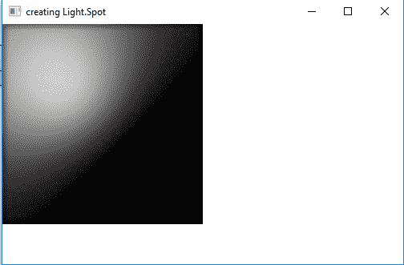
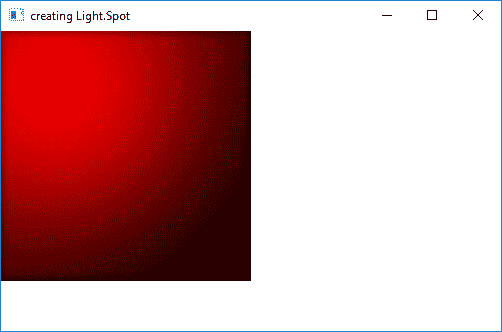

# JavaFX | Light。现货类

> 原文:[https://www.geeksforgeeks.org/javafx-light-spot-class/](https://www.geeksforgeeks.org/javafx-light-spot-class/)

光。Spot 类是 JavaFX 的一部分。光。聚光灯类用于创建一个聚光灯，该聚光灯具有可配置的三维空间中的灯光方向向量、焦点和颜色值。光。光点类继承 **[光。](https://www.geeksforgeeks.org/javafx-light-point-class/)点**班。

**类的构造函数:**

1.  **聚光灯()**:使用默认值创建聚光灯
2.  **聚光灯(双 x，双 y，双 z，双 s，颜色 c)** :创建具有指定的 x，y，z 值，镜面成分和灯光颜色的聚光灯

**常用方法:**

| 方法 | 说明 |
| --- | --- |
| getPointsAtX() | 返回光线方向向量的 x 坐标。 |
| getPointsAtY() | 返回光线方向向量的 y 坐标。 |
| getPointsAtZ() | 返回光线方向向量的 z 坐标。 |
| get 镜象组件() | 返回镜象组件的值。 |
| setPointsAtX(双 v) | 设置光线方向向量的 x 坐标值。 |
| setPointsAtY（double v） | 设置光线方向向量的 y 坐标值。 |
| set point set(double v) | 设置光线方向向量的 z 坐标值。 |
| set 镜象组件(双 v) | 设置镜象组件的值。 |

下面的程序说明了光的使用。现货类别:

1.  **Java Program to create a Spot light and add it to a rectangle:** In this program we will create a Rectangle named *rectangle* with specified height and width. We will also create a *Light.Spot object* named *light*. We will set the x, y, z values using *setX()*, *setY()* and *setZ()* function. Now create a lighting object and add the light object to lighting using *setLight()* function. We will set the Lighting effect to the Rectangle and add it to the scene and add the scene to the stage and call the show function to display the results.

    ```
    // Java Program to create a Spot light
    // and add it to a rectangle
    import javafx.application.Application;
    import javafx.scene.Scene;
    import javafx.scene.shape.Rectangle;
    import javafx.scene.control.*;
    import javafx.stage.Stage;
    import javafx.scene.Group;
    import javafx.scene.effect.Light.*;
    import javafx.scene.effect.*;
    import javafx.scene.paint.Color;

    public class Spot_1 extends Application {

        // launch the application
        public void start(Stage stage)
        {

            // set title for the stage
            stage.setTitle("creating Light.Spot");

            // create Spot Light object
            Light.Spot light = new Light.Spot();

            // set coordinates
            light.setX(100);
            light.setY(100);
            light.setZ(100);

            // create a lighting
            Lighting lighting = new Lighting();

            // set Light of lighting
            lighting.setLight(light);

            // create a rectangle
            Rectangle rect = new Rectangle(250, 250);

            // set fill
            rect.setFill(Color.WHITE);

            // set effect
            rect.setEffect(lighting);

            // create a Group
            Group group = new Group(rect);

            // create a scene
            Scene scene = new Scene(group, 500, 300);

            // set the scene
            stage.setScene(scene);

            stage.show();
        }

        // Main Method
        public static void main(String args[])
        {

            // launch the application
            launch(args);
        }
    }
    ```

    **输出:**

    

2.  **Java Program to create a Spotlight and add it to a rectangle and set the coordinates of the direction vector of light and color of light:** In this program we will create a Rectangle named *rectangle* with specified height and width. We will also create a *Light.Spot object* named *light*. We will set the x, y, z values using *setX()*, *setY()* and *setZ()* function. The coordinate of the direction vector of light is set using *setPointsAtX()*, *setPointsAtY()* and *setPointsAtX()*, and specify the value of color using *setColor()* function Now create a lighting object and add the light object to lighting using *setLight()* function. We will set the Lighting effect to the Rectangle and add it to the scene and add the scene to the stage and call the show function to display the results.

    ```
    // Java Program to create a Spot light
    // and add it to a rectangle and set the
    // coordinates of direction vector of 
    // light and color of light
    import javafx.application.Application;
    import javafx.scene.Scene;
    import javafx.scene.shape.Rectangle;
    import javafx.scene.control.*;
    import javafx.stage.Stage;
    import javafx.scene.Group;
    import javafx.scene.effect.Light.*;
    import javafx.scene.effect.*;
    import javafx.scene.paint.Color;

    public class Spot_2 extends Application {

        // launch the application
        public void start(Stage stage)
        {

            // set title for the stage
            stage.setTitle("creating Light.Spot");

            // create Spot Light object
            Light.Spot light = new Light.Spot();

            // set coordinate of direction
            // the vector of this light
            light.setPointsAtX(0);
            light.setPointsAtY(0);
            light.setPointsAtZ(-60);

            // set specular exponent
            light.setSpecularExponent(2);

            // set color of light
            light.setColor(Color.RED);

            // set coordinates
            light.setX(100);
            light.setY(100);
            light.setZ(200);

            // create a lighting
            Lighting lighting = new Lighting();

            // set Light of lighting
            lighting.setLight(light);

            // create a rectangle
            Rectangle rect = new Rectangle(250, 250);

            // set fill
            rect.setFill(Color.WHITE);

            // set effect
            rect.setEffect(lighting);

            // create a Group
            Group group = new Group(rect);

            // create a scene
            Scene scene = new Scene(group, 500, 300);

            // set the scene
            stage.setScene(scene);

            stage.show();
        }

        // Main Method
        public static void main(String args[])
        {

            // launch the application
            launch(args);
        }
    }
    ```

    **输出:**

    

**注意:**上述程序可能无法在在线 IDE 中运行。请使用离线编译器。

**参考:**[https://docs . Oracle . com/javase/8/JavaFX/API/JavaFX/场景/效果/Light。Spot.html](https://docs.oracle.com/javase/8/javafx/api/javafx/scene/effect/Light.Spot.html)