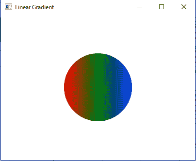
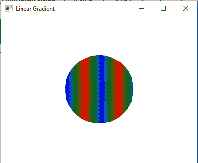

# JavaFX |线性渐变类

> 原文:[https://www.geeksforgeeks.org/javafx-lineargradient-class/](https://www.geeksforgeeks.org/javafx-lineargradient-class/)

LinearGradient 类是 JavaFX 的一部分。线性渐变类用线性颜色渐变图案填充形状。用户可以指定一个以上的线性渐变模式，系统将提供颜色之间的插值。

**类的构造函数:**

1.  **LinearGradient(double sX，double sY，double eX，double eY，布尔 prop，CycleMethod c，List s)** :创建一个新的 LinearGradient 对象。
2.  **线性渐变(double sX，double sY，double eX，double eY，布尔 prop，CycleMethod c，Stop… s)** :创建一个新的线性渐变对象。

**常用方法:**

| 方法 | 说明 |
| --- | --- |
| 等于(对象 0) | 返回线性渐变对象是否相等。 |
| getCycleMethod() | 返回线性渐变对象的循环方法。 |
| getEndX() | 返回线性渐变端点的 x 坐标。 |
| getEndY() | 返回线性渐变终点的 y 坐标。 |
| getStartX() | 返回线性渐变起点的 x 坐标。 |
| getStartY() | 返回线性渐变起点的 y 坐标。 |
| getStops() | 返回线性渐变的停止点。 |
| 异戊二烯() | 返回线性渐变是否不透明。 |
| isProportional() | 返回线性渐变是否成比例。 |
| valueOf(字符串 v) | 从字符串表示形式创建线性渐变值。 |

下面的程序说明了线性渐变类的使用:

1.  **Java program to create a LinearGradient object and add stops to it and apply it to the circle:** In this program we will create an array of Stop objects with their offset values ranging from 0 to 1\. Create a LinearGradient object with specified stops. Now create a circle with specified x, y positions, and radius and add the linear gradient to it. Then create a VBox and set the alignment of it. Add the circle to the *vbox* and add the *vbox* to the scene and add the scene to the stage and call the *show()* function to display the results.

    ```java
    // Java program to create a LinearGradient 
    // object and add stops to it and apply it
    // to the circle
    import javafx.application.Application;
    import javafx.scene.Scene;
    import javafx.scene.control.*;
    import javafx.scene.layout.*;
    import javafx.stage.Stage;
    import javafx.scene.layout.*;
    import javafx.scene.paint.*;
    import javafx.scene.text.*;
    import javafx.geometry.*;
    import javafx.scene.layout.*;
    import javafx.scene.shape.*;
    import javafx.scene.paint.*;

    public class Linear_Gradient_1 extends Application {

    // launch the application
    public void start(Stage stage)
    {

        try {

            // set title for the stage
            stage.setTitle("Linear Gradient");

            // create stops
            Stop[] stop = {new Stop(0, Color.RED), 
                           new Stop(0.5, Color.GREEN), 
                           new Stop(1, Color.BLUE)};

            // create a Linear gradient object
            LinearGradient linear_gradient = new LinearGradient(0, 0,
                              1, 0, true, CycleMethod.NO_CYCLE, stop);

            // create a circle
            Circle circle = new Circle(100, 100, 70);

            // set fill
            circle.setFill(linear_gradient);

            // create VBox
            VBox vbox = new VBox(circle);

            // ste Alignment
            vbox.setAlignment(Pos.CENTER);

            // create a scene
            Scene scene = new Scene(vbox, 400, 300);

            // set the scene
            stage.setScene(scene);

            stage.show();
        }

        catch (Exception e) {

            System.out.println(e.getMessage());
        }
    }

    // Main Method
    public static void main(String args[])
    {

        // launch the application
        launch(args);
    }
    }
    ```

    **输出:**

    

2.  **Java program to create a LinearGradient object and add stops to it and set the CycleMethod to reflect and set proportional to false and apply it to the circle:** In this program we will create an array of Stop objects with their offset values ranging from 0 to 1\. Then create a LinearGradient object with specified stops. Set the *CycleMethod to reflect* and set proportional to false. Create a circle with specified x, y positions, and radius and add the linear gradient to it. Then create a VBox and set the alignment of it. Add the circle to the *vbox* and add the *vbox* to the scene and add the scene to the stage and call the *show()* function to display the results.

    ```java
    // Java program to create a LinearGradient object 
    // and add stops to it and set the CycleMethod to
    // reflect and set proportional to false and 
    // apply it to the circle
    import javafx.application.Application;
    import javafx.scene.Scene;
    import javafx.scene.control.*;
    import javafx.scene.layout.*;
    import javafx.stage.Stage;
    import javafx.scene.layout.*;
    import javafx.scene.paint.*;
    import javafx.scene.text.*;
    import javafx.geometry.*;
    import javafx.scene.layout.*;
    import javafx.scene.shape.*;
    import javafx.scene.paint.*;

    public class Linear_Gradient_2 extends Application {

        // launch the application
        public void start(Stage stage)
        {

            try {

                // set title for the stage
                stage.setTitle("Linear Gradient");

                // create stops
                Stop[] stop = {new Stop(0, Color.RED), new Stop(0.5, 
                             Color.GREEN), new Stop(1, Color.BLUE)};

                // create a Linear gradient object
                LinearGradient linear_gradient = new LinearGradient(0, 0, 
                                35, 0, false, CycleMethod.REFLECT, stop);

                // create a circle
                Circle circle = new Circle(100, 100, 70);

                // set fill
                circle.setFill(linear_gradient);

                // create VBox
                VBox vbox = new VBox(circle);

                // ste Alignment
                vbox.setAlignment(Pos.CENTER);

                // create a scene
                Scene scene = new Scene(vbox, 400, 300);

                // set the scene
                stage.setScene(scene);

                stage.show();
            }

            catch (Exception e) {

                System.out.println(e.getMessage());
            }
        }

        // Main Method
        public static void main(String args[])
        {

            // launch the application
            launch(args);
        }
    }
    ```

    **输出:**

    

**注意:**上述程序可能无法在联机 IDE 中运行，请使用脱机编译器。

**参考:**[https://docs . Oracle . com/javase/8/JavaFX/API/JavaFX/scene/paint/linegradient . html](https://docs.oracle.com/javase/8/javafx/api/javafx/scene/paint/LinearGradient.html)