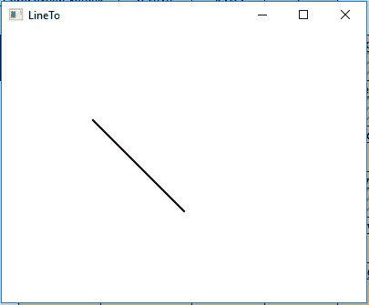
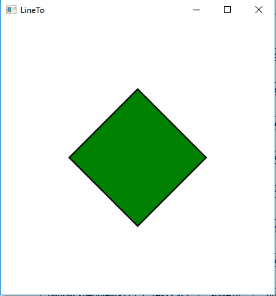

# JavaFX | LineTo 类

> 原文:[https://www.geeksforgeeks.org/javafx-lineto-class/](https://www.geeksforgeeks.org/javafx-lineto-class/)

LineTo 类是 JavaFX 的一部分。LineTo 类绘制一条从当前位置到指定 x 和 y 坐标的直线。LineTo 类继承了 *PathElement* 类。

**该类的构造函数:**

1.  **LineTo()** :创建一个新的 LineTo 对象。
2.  **LineTo(双 x，双 y)** :用指定的 x，y 坐标创建一个新的 LineTo 对象。

**常用方法:**

| 方法 | 说明 |
| --- | --- |
| getX（） | 返回 X 坐标的值。 |
| 盖蒂（） | 返回 Y 坐标的值。 |
| setX(双 v) | 设置 X 坐标的值。 |
| setY(双 v) | 设置 Y 坐标的值。 |
| xProperty() | 定义 X 坐标。 |
| yProperty() | 定义 Y 坐标。 |

下面的程序说明了 LineTo 类的使用:

1.  **Java program to create a path and add LineTo object to it and display it:**
    *   在这个程序中，我们将创建一个名为*路径*的路径对象。
    *   用指定的 X 和 Y 坐标创建一个 [HLineTo](https://www.geeksforgeeks.org/javafx-hlineto-class/) 对象。
    *   然后创建一个名为*移动到*的移动到对象。
    *   现在将“移动到”和“线到”对象添加到路径中。
    *   将此路径添加到 group 对象并将 Group 对象添加到场景并将场景添加到舞台并调用 *show()* 函数显示最终结果。

    ```java
    // Java program to create a path and
    // add LineTo object to it and display it
    import javafx.application.Application;
    import javafx.scene.Scene;
    import javafx.scene.control.*;
    import javafx.scene.layout.*;
    import javafx.stage.Stage;
    import javafx.scene.layout.*;
    import javafx.scene.paint.*;
    import javafx.scene.text.*;
    import javafx.geometry.*;
    import javafx.scene.layout.*;
    import javafx.scene.shape.*;
    import javafx.scene.paint.*;
    import javafx.scene.*;

    public class LineTo_1 extends Application {

        // launch the application
        public void start(Stage stage)
        {

            try {

                // set title for the stage
                stage.setTitle("LineTo");

                // create LineTo
                LineTo Lineto = new LineTo(200, 200);

                // create moveto
                MoveTo moveto = new MoveTo(100, 100);

                // create a Path
                Path path = new Path(moveto, Lineto);

                // set fill for path
                path.setFill(Color.BLACK);

                // set stroke width
                path.setStrokeWidth(2);

                // create a Group
                Group group = new Group(path);

                // create a scene
                Scene scene = new Scene(group, 400, 300);

                // set the scene
                stage.setScene(scene);

                stage.show();
            }

            catch (Exception e) {

                System.out.println(e.getMessage());
            }
        }

        // Main Method
        public static void main(String args[])
        {

            // launch the application
            launch(args);
        }
    }
    ```

    **输出:**

    

2.  **Java program to create a path and add multiple LineTo objects to it and display it:**
    *   在这个程序中，我们将创建一个名为*路径*的路径对象。
    *   用指定的 X 和 Y 坐标名称创建四个 LineTo 对象 *Lineto* 、 *Lineto1* 、 *Lineto2* 、 *Lineto3* 。
    *   然后创建一个名为*移动到*的移动到对象。
    *   现在将“移动到”和“线条到”对象添加到路径中。
    *   将此路径添加到 group 对象并将 Group 对象添加到场景并将场景添加到舞台并调用 *show()* 函数显示最终结果。

    ```java
    // Java program to create a path and
    // add  multiple LineTo objects to it
    // and display it
    import javafx.application.Application;
    import javafx.scene.Scene;
    import javafx.scene.control.*;
    import javafx.scene.layout.*;
    import javafx.stage.Stage;
    import javafx.scene.layout.*;
    import javafx.scene.paint.*;
    import javafx.scene.text.*;
    import javafx.geometry.*;
    import javafx.scene.layout.*;
    import javafx.scene.shape.*;
    import javafx.scene.paint.*;
    import javafx.scene.*;

    public class LineTo_2 extends Application {

        // launch the application
        public void start(Stage stage)
        {

            try {

                // set title for the stage
                stage.setTitle("LineTo");

                // create LineTo
                LineTo Lineto = new LineTo(300, 200);
                LineTo Lineto1 = new LineTo(200, 300);
                LineTo Lineto2 = new LineTo(100, 200);
                LineTo Lineto3 = new LineTo(200, 100);

                // create moveto
                MoveTo moveto = new MoveTo(200, 100);

                // create a Path
                Path path = new Path(moveto, Lineto, 
                         Lineto1, Lineto2, Lineto3);

                // set fill for path
                path.setFill(Color.GREEN);

                // set stroke width
                path.setStrokeWidth(2);

                // create a Group
                Group group = new Group(path);

                // create a scene
                Scene scene = new Scene(group, 400, 400);

                // set the scene
                stage.setScene(scene);

                stage.show();
            }

            catch (Exception e) {

                System.out.println(e.getMessage());
            }
        }

        // Main Method
        public static void main(String args[])
        {

            // launch the application
            launch(args);
        }
    }
    ```

    **输出:**

    

**注意:**上述程序可能无法在联机 IDE 中运行，请使用脱机编译器。

**参考:**[https://docs . Oracle . com/javase/8/JavaFX/API/JavaFX/scene/shape/line to . html](https://docs.oracle.com/javase/8/javafx/api/javafx/scene/shape/LineTo.html)