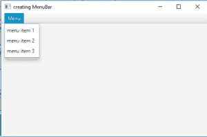
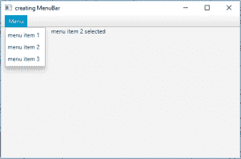

# JavaFX |菜单栏和菜单

> 原文:[https://www.geeksforgeeks.org/javafx-menubar-and-menu/](https://www.geeksforgeeks.org/javafx-menubar-and-menu/)

**菜单**是一个包含多个菜单项的弹出菜单，当用户单击一个菜单时会显示这些菜单项。用户可以选择菜单项，之后菜单进入隐藏状态。

**菜单栏**通常位于包含多个菜单的屏幕顶部。JavaFX 菜单栏通常是菜单栏的实现。

**菜单栏类的构造函数有:**

1.  **菜单栏()**:创建一个新的空菜单栏。
2.  **菜单栏(Menu… m)** :用给定的一组菜单创建一个新的菜单栏。

**菜单类的构造函数为:**

1.  **菜单()**:创建一个空菜单
2.  **菜单(字符串)**:创建一个以字符串为标签的菜单
3.  **菜单(字符串 s，节点 n)** :构造一个菜单，用指定的文本设置显示文本，并将图形节点设置为给定的节点。
4.  **菜单(字符串 s，节点 n，MenuItem… i)** :构造一个菜单，用指定的文本设置显示文本，将图形节点设置到给定的节点，并将给定的项目插入到项目列表中。

**常用方法:**

| 方法 | 说明 |
| --- | --- |
| **【getitem()** | 返回菜单项目 |
| **隐藏()** | 隐藏菜单 |
| **显示()** | 显示菜单 |
| **get results()** | 要在此菜单栏中显示的菜单。 |
| **IsUseSystemMenuBar（）** | 获取 useSystemMenuBar 属性的值 |
| **七个系统云栏(boolean v)** | 设置 useSystemMenuBar 属性的值。 |
| **setOnHidden(event handler v)** | 设置“开”属性的值。 |
| **setOnHiding(event handler v)** | 设置属性的值。 |
| **设置暂停(事件处理程序 v)** | 设置上属性的值。 |
| **濑户内(EventHandler v** | 设置向下属性的值。 |

下面的程序说明了菜单栏和菜单类:

1.  **Java program to create a menu bar and add menu to it and also add menuitems to the menu:** This program creates a menubar indicated by the name *mb*. A menu will be created by name *m* and 3 menuitems *m1*, *m2*, *m3* will be added to the menu *m* and the menu *m* will be added to menubar *mb*. The menubar will be created inside a scene, which in turn will be hosted inside a stage. The function setTitle() is used to provide title to the stage. Then a VBox is created, on which addChildren() method is called to attach the menubar inside the scene. Finally, the show() method is called to display the final results.

    ```
    // Java program to create a menu bar and add
    // menu to it and also add menuitems to menu
    import javafx.application.Application;
    import javafx.scene.Scene;
    import javafx.scene.control.Button;
    import javafx.scene.layout.*;
    import javafx.event.ActionEvent;
    import javafx.event.EventHandler;
    import javafx.scene.control.*;
    import javafx.stage.Stage;
    import javafx.scene.control.Alert.AlertType;
    import java.time.LocalDate;
    public class MenuBar_1 extends Application {

        // launch the application
        public void start(Stage s)
        {
            // set title for the stage
            s.setTitle("creating MenuBar");

            // create a menu
            Menu m = new Menu("Menu");

            // create menuitems
            MenuItem m1 = new MenuItem("menu item 1");
            MenuItem m2 = new MenuItem("menu item 2");
            MenuItem m3 = new MenuItem("menu item 3");

            // add menu items to menu
            m.getItems().add(m1);
            m.getItems().add(m2);
            m.getItems().add(m3);

            // create a menubar
            MenuBar mb = new MenuBar();

            // add menu to menubar
            mb.getMenus().add(m);

            // create a VBox
            VBox vb = new VBox(mb);

            // create a scene
            Scene sc = new Scene(vb, 500, 300);

            // set the scene
            s.setScene(sc);

            s.show();
        }

        public static void main(String args[])
        {
            // launch the application
            launch(args);
        }
    }
    ```

    **输出** :
    

2.  **Java program to create a menu bar and add a menu to it and also add menu items to menu and also add an event listener to handle the events:** This program creates a menubar indicated by the name *mb*. A menu will be created by name *m* and 3 menuitems *m1*, *m2*, *m3* will be added to the menu *m* and the menu *m* will be added to the menubar *mb*. The menubar will be created inside a scene, which in turn will be hosted inside a stage. The function setTitle() is used to provide title to the stage. Then a VBox is created, on which addChildren() method is called to attach the menubar inside the scene. Finally, the show() method is called to display the final results. A label will also be created that will show which menuitem is selected. An action event will be created to process the action when the menu item is clicked by the user.

    ```
    // Java program to create a menu bar and add menu to
    // it and also add menuitems to menu and also add
    // an event listener to handle the events
    import javafx.application.Application;
    import javafx.scene.Scene;
    import javafx.scene.control.Button;
    import javafx.scene.layout.*;
    import javafx.event.ActionEvent;
    import javafx.event.EventHandler;
    import javafx.scene.control.*;
    import javafx.stage.Stage;
    import javafx.scene.control.Alert.AlertType;
    import java.time.LocalDate;
    public class MenuBar_2 extends Application {

        // launch the application
        public void start(Stage s)
        {
            // set title for the stage
            s.setTitle("creating MenuBar");

            // create a menu
            Menu m = new Menu("Menu");

            // create menuitems
            MenuItem m1 = new MenuItem("menu item 1");
            MenuItem m2 = new MenuItem("menu item 2");
            MenuItem m3 = new MenuItem("menu item 3");

            // add menu items to menu
            m.getItems().add(m1);
            m.getItems().add(m2);
            m.getItems().add(m3);

            // label to display events
            Label l = new Label("\t\t\t\t"
                                + "no menu item selected");

            // create events for menu items
            // action event
            EventHandler<ActionEvent> event = new EventHandler<ActionEvent>() {
                public void handle(ActionEvent e)
                {
                    l.setText("\t\t\t\t" + ((MenuItem)e.getSource()).getText() + 
                                                                   " selected");
                }
            };

            // add event
            m1.setOnAction(event);
            m2.setOnAction(event);
            m3.setOnAction(event);

            // create a menubar
            MenuBar mb = new MenuBar();

            // add menu to menubar
            mb.getMenus().add(m);

            // create a VBox
            VBox vb = new VBox(mb, l);

            // create a scene
            Scene sc = new Scene(vb, 500, 300);

            // set the scene
            s.setScene(sc);

            s.show();
        }

        public static void main(String args[])
        {
            // launch the application
            launch(args);
        }
    }
    ```

    **输出** :
    

    **注意:**上述程序可能无法在联机 IDE 中运行，请使用脱机转换器。

    **参考:**

    *   [https://docs . Oracle . com/javase/8/JavaFX/API/JavaFX/scene/control/menu . html](https://docs.oracle.com/javase/8/javafx/api/javafx/scene/control/Menu.html)
    *   [https://docs . Oracle . com/javase/8/JavaFX/API/JavaFX/scene/control/menubar . html](https://docs.oracle.com/javase/8/javafx/api/javafx/scene/control/MenuBar.html)