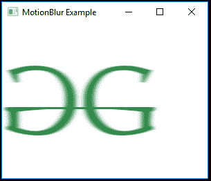
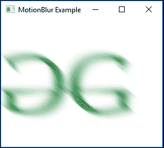

# JavaFX |运动模糊类

> 原文:[https://www.geeksforgeeks.org/javafx-motionblur-class/](https://www.geeksforgeeks.org/javafx-motionblur-class/)

MotionBlur 是 JavaFX 的一部分。运动模糊类使用高斯卷积核实现运动模糊效果，具有可配置的半径和角度。运动模糊类继承*效果*类。

**类的构造函数:**

1.  **运动模糊()**:创建一个运动模糊的新对象。
2.  **运动模糊(双 a，双 r)** :用指定的角度和半径创建一个新的运动模糊对象。

**常用方法:**

| 方法 | 说明 |
| --- | --- |
| getAngle() | 返回运动模糊对象的角度 |
| 跟踪半径() | 返回运动模糊对象的半径 |
| getInput() | 返回运动模糊对象的输入 |
| 设置角度(双 v) | 设置运动模糊对象的角度 |
| 轨迹半径(双 v) | 设置运动模糊对象的半径 |
| 设置输入(效果五) | 设置运动模糊对象的输入 |

下面的程序说明了运动模糊类的使用:

1.  **Java program to import an image and add Motion Blur effect to it:** In this program a *FileInputStream* is created and an image is taken as input from a file. Image named *image* is created using the input from the file input stream. From the image, an *image view object* is created and it is added to the *VBox*. The *VBox* is then added to the scene and the scene is added to the stage. A *MotionBlur* effect is created with a specified level passed as parameters and the effect is set to the image view using *setEffect()* function.

    ```
    // Java program to import an image and
    // add Motion Blur effect to it
    import javafx.application.Application;
    import javafx.scene.Scene;
    import javafx.scene.control.*;
    import javafx.scene.layout.*;
    import javafx.stage.Stage;
    import javafx.scene.image.*;
    import javafx.scene.effect.*;
    import java.io.*;
    import javafx.event.ActionEvent;
    import javafx.event.EventHandler;
    import javafx.scene.Group;

    public class motion_blur_1 extends Application {

        // launch the application
        public void start(Stage stage) throws Exception
        {

            // set title for the stage
            stage.setTitle("MotionBlur Example");

            // create a input stream
            FileInputStream input = new FileInputStream("D:\\GFG.png");

            // create a image
            Image image = new Image(input);

            // create a image View
            ImageView imageview = new ImageView(image);

            // create a Motion blur effect
            MotionBlur motion_blur = new MotionBlur();

            // set effect
            imageview.setEffect(motion_blur);

            // create a VBox
            VBox vbox = new VBox(imageview);

            // create a scene
            Scene scene = new Scene(vbox, 200, 200);

            // set the scene
            stage.setScene(scene);

            stage.show();
        }

        // Main Method
        public static void main(String args[])
        {

            // launch the application
            launch(args);
        }
    }
    ```

    **输入图像:**

    [](https://media.geeksforgeeks.org/wp-content/uploads/GFG-14.png)

    **输出:**
    [](https://media.geeksforgeeks.org/wp-content/uploads/motion_1.png)

2.  **Java program to import an image and add Motion Blur effect to it with specified angle and radius:** In this program a *FileInputStream* is created and an image is taken as input from a file. Image named *image* is created using the input from the file input stream. From the image, an *image view object* is created and it is added to the *VBox*. The *VBox* is then added to the scene and the scene is added to the stage. A *MotionBlur* effect is created with a specified level passed as parameters and the effect is set to the image view using *setEffect()* function. The radius and the angle for the motion blur is specified using the *setRadius()* and *setAngle()* function.

    ```
    // Java program to import an image and
    // add Motion Blur effect to it with 
    // specified angle and radius
    import javafx.application.Application;
    import javafx.scene.Scene;
    import javafx.scene.control.*;
    import javafx.scene.layout.*;
    import javafx.stage.Stage;
    import javafx.scene.image.*;
    import javafx.scene.effect.*;
    import java.io.*;
    import javafx.event.ActionEvent;
    import javafx.event.EventHandler;
    import javafx.scene.Group;

    public class motion_blur_2 extends Application {

        // launch the application
        public void start(Stage stage) throws Exception
        {

            // set title for the stage
            stage.setTitle("MotionBlur Example");

            // create a input stream
            FileInputStream input = new FileInputStream("D:\\GFG.png");

            // create a image
            Image image = new Image(input);

            // create a image View
            ImageView imageview = new ImageView(image);

            // create a Motion blur effect
            MotionBlur motion_blur = new MotionBlur();

            // set Radius
            motion_blur.setRadius(25.0f);

            // set angle
            motion_blur.setAngle(400.0f);

            // set effect
            imageview.setEffect(motion_blur);

            // create a VBox
            VBox vbox = new VBox(imageview);

            // create a scene
            Scene scene = new Scene(vbox, 200, 200);

            // set the scene
            stage.setScene(scene);

            stage.show();
        }

        // Main Method
        public static void main(String args[])
        {

            // launch the application
            launch(args);
        }
    }
    ```

    **输入图像:**

    [](https://media.geeksforgeeks.org/wp-content/uploads/GFG-14.png)

    **输出:**
    [](https://media.geeksforgeeks.org/wp-content/uploads/motion_2.png)

**注意:**上述程序可能无法在在线 IDE 中运行。请使用离线编译器。

**参考:**[https://docs . Oracle . com/javase/8/JavaFX/API/JavaFX/场景/效果/MotionBlur.html](https://docs.oracle.com/javase/8/javafx/api/javafx/scene/effect/MotionBlur.html)