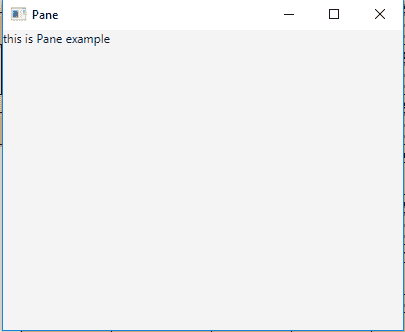

# JavaFX |窗格类

> 原文:[https://www.geeksforgeeks.org/javafx-pane-class/](https://www.geeksforgeeks.org/javafx-pane-class/)

窗格类是 JavaFX 的一部分。窗格类充当所有布局窗格的基类。基本上，它满足了公开子列表的需求，这样子类的用户就可以自由地添加/删除子列表。窗格类继承*区域*类。*如果应用程序需要子级与父级保持一致，则必须使用 StackPane* 。此类调整每个托管子级的大小，而不考虑子级的可见属性值。

**该类的构造函数:**

1.  **窗格()**:创建新的窗格对象。
2.  **窗格(节点… c)** :用指定的节点创建新的窗格布局。

**常用方法:**

| 方法 | 说明 |
| --- | --- |
| getChildren() | 返回窗格的子级。 |
| setLayoutX(双 v) | 设置属性 layoutX 的值。 |
| setlayouty(双 v) | 设置属性 layoutY 的值。 |
| getLayoutX() | 返回属性 layoutX 的值。 |
| getLayoutY() | 返回属性 layoutY 的值。 |
| 设定尺寸(双倍宽度，双倍高度) | 设置窗格的首选大小。 |
| 重新定位(双 x，双 y) | 将对象重新定位到指定的坐标。 |

以下程序说明了窗格类的使用:

1.  **Java Program to create a Pane and add label to the Pane and add it to the stage:** In this program we are creating a Pane named *pane* and a Label named *label*. Now add this label to the pane by passing it as an argument of the constructor of the *pane*. Then add the pane to the Scene and the scene to the stage. Call the *show()* function to display the final results.

    ```java
    // Java Program to create a Pane
    // and add label to the Pane
    // and add it to the stage
    import javafx.application.Application;
    import javafx.scene.Scene;
    import javafx.scene.control.*;
    import javafx.scene.layout.*;
    import javafx.stage.Stage;
    import javafx.event.ActionEvent;
    import javafx.event.EventHandler;
    import javafx.scene.canvas.*;
    import javafx.scene.web.*;
    import javafx.scene.layout.Pane;
    import javafx.scene.shape.*;

    public class Pane_0 extends Application {

        // launch the application
        public void start(Stage stage)
        {

            try {

                // set title for the stage
                stage.setTitle("Pane");

                // create a label
                Label label = new Label("this is Pane example");

                // create a Pane
                Pane pane = new Pane(label);

                // create a scene
                Scene scene = new Scene(pane, 400, 300);

                // set the scene
                stage.setScene(scene);

                stage.show();
            }

            catch (Exception e) {

                System.out.println(e.getMessage());
            }
        }

        // Main Method
        public static void main(String args[])
        {

            // launch the application
            launch(args);
        }
    }
    ```

    **输出:**

    

2.  **Java Program to create a Pane and add labels and buttons to the pane and relocate them to specific positions and add it to the stage:** In this program we will create a Pane named *pane* and a Label named *label*. Add this label to the pane by passing it as an argument of the constructor of the *pane*. Then create the five buttons and add them to the *pane*. Relocate the label and buttons to specified position using *relocate()* function. Add the pane to the Scene and add the scene to the stage. Call the *show()* function to display the final results.

    ```java
    // Java Program to create a Pane
    // and add labels and buttons to the pane
    // and relocate them to specific positions
    // and add it to the stage
    import javafx.application.Application;
    import javafx.scene.Scene;
    import javafx.scene.control.*;
    import javafx.scene.layout.*;
    import javafx.stage.Stage;
    import javafx.event.ActionEvent;
    import javafx.event.EventHandler;
    import javafx.scene.canvas.*;
    import javafx.scene.web.*;
    import javafx.scene.layout.Pane;
    import javafx.scene.shape.*;

    public class Pane_1 extends Application {

        // launch the application
        public void start(Stage stage)
        {

            try {

                // set title for the stage
                stage.setTitle("Pane");

                // create a label
                Label label = new Label("this is Pane example");

                // relocate label
                label.relocate(100, 10);

                // create a Pane
                Pane pane = new Pane(label);

                // add buttons
                for (int i = 0; i < 5; i++) {

                    // create button
                    Button button = new Button("Button " + (int)(i + 1));

                    // add button
                    pane.getChildren().add(button);

                    // relocate button
                    button.relocate(100, 50 + 40 * i);
                }

                // create a scene
                Scene scene = new Scene(pane, 400, 300);

                // set the scene
                stage.setScene(scene);

                stage.show();
            }

            catch (Exception e) {

                System.out.println(e.getMessage());
            }
        }

        // Main Method
        public static void main(String args[])
        {

            // launch the application
            launch(args);
        }
    }
    ```

    **输出:**

    

**注意:**上述程序可能无法在联机 IDE 中运行，请使用脱机编译器。

**参考:**[https://docs . Oracle . com/javase/8/JavaFX/API/JavaFX/scene/layout/pane . html](https://docs.oracle.com/javase/8/javafx/api/javafx/scene/layout/Pane.html)