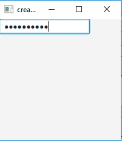
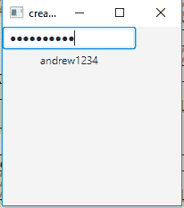

# JavaFx | PasswordField

> 原文:[https://www.geeksforgeeks.org/javafx-passwordfield/](https://www.geeksforgeeks.org/javafx-passwordfield/)

PasswordField 类是 JavaFX 包的一部分。它是一个文本字段，用于屏蔽输入的字符(输入的字符不会显示给用户)。它允许用户输入单行的无格式文本，因此不允许多行输入。

**密码字段类的构造函数:**

1.  **密码字段()**:创建新的密码字段

(PasswordField 继承了 TextField，所以 TextField 的所有方法都可以在这里使用。密码字段没有单独的方法，都是从文本字段继承的。)

下面的程序说明了密码字段类的使用:

1.  **Java program to create a Password field**: This program creates a PasswordField indicated by the name b. The PasswordField will be created inside a scene, which in turn will be hosted inside a stage (which is the top level JavaFX container). The function setTitle() is used to provide title to the stage. Then a Title-pane is created, on which addChildren() method is called to attach the PasswordField inside the scene, along with the resolution specified by (200, 200) in the code. Finally, the show() method is called to display the final results.

    ```java
    // Java program to create a passwordfield
    import javafx.application.Application;
    import javafx.scene.Scene;
    import javafx.scene.control.*;
    import javafx.scene.layout.*;
    import javafx.event.ActionEvent;
    import javafx.event.EventHandler;
    import javafx.scene.control.Label;
    import javafx.stage.Stage;
    public class Passwordfield extends Application
    {

        // launch the application
        public void start(Stage s)
        {
            // set title for the stage
            s.setTitle("creating Passwordfield");

            // create a Passwordfield
            PasswordField b =new PasswordField();

            // create a tile pane
            TilePane r = new TilePane();

            // add password field
            r.getChildren().add(b);

            // create a scene
            Scene sc =new Scene(r,200,200);

            // set the scene
            s.setScene(sc);

            s.show();

        }

        public static void main(String args[])
        {
            // launch the application
           launch(args);
        }
    }
    ```

    **输出** :
    

2.  **Java program to create a passwordfield and add a event handler:** This program creates a PasswordField indicated by the name b. We will create a label which will display the password when the enter key is pressed. We will create an event handler that will handle the event of the password field and the event handler would be added to the passwordfield using setOnAction() method. The PasswordField will be created inside a scene, which in turn will be hosted inside a stage (which is the top level JavaFX container). The function setTitle() is used to provide title to the stage. Then a Title-pane is created, on which addChildren() method is called to attach the PasswordField and a label inside the scene, along with the resolution specified by (200, 200) in the code. Finally, the show() method is called to display the final results.

    ```java
    // Java program to create a passwordfield and add
    // a event handler to handle the event of Passwordfield
    import javafx.application.Application;
    import javafx.scene.Scene;
    import javafx.scene.control.*;
    import javafx.scene.layout.*;
    import javafx.event.ActionEvent;
    import javafx.event.EventHandler;
    import javafx.scene.control.Label;
    import javafx.stage.Stage;
    public class Passwordfield_1 extends Application
    {

        // launch the application
        public void start(Stage s)
        {
            // set title for the stage
            s.setTitle("creating Passwordfield");

            // create a Passwordfield
            PasswordField b =new PasswordField();

            // create a tile pane
            TilePane r = new TilePane();

            // create a label
            Label l = new Label("no Password");

            // action event
            EventHandler<ActionEvent> event = new EventHandler<ActionEvent>(){
            public void handle(ActionEvent e)
            {
                l.setText(b.getText());
            }
            };

            // when enter is pressed
            b.setOnAction(event);

            // add password field
            r.getChildren().add(b);
            r.getChildren().add(l);

            // create a scene
            Scene sc =new Scene(r,200,200);

            // set the scene
            s.setScene(sc);

            s.show();

        }

        public static void main(String args[])
        {
            //launch the application
           launch(args);
        }
    }
    ```

    **输出** :
    

**注意:**上述程序可能无法在联机 IDE 中运行，请使用脱机编译器。

**参考**:[https://docs . Oracle . com/javase/8/JavaFX/API/JavaFX/scene/control/passwordfield . html](https://docs.oracle.com/javase/8/javafx/api/javafx/scene/control/PasswordField.html)