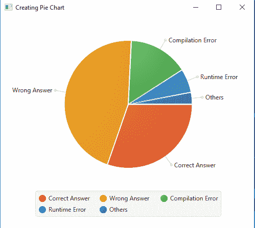
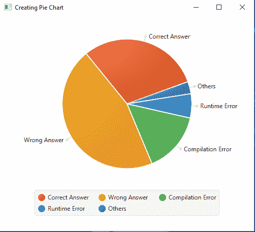

# JavaFX | PieChart 类

> 原文:[https://www.geeksforgeeks.org/javafx-piechart-class/](https://www.geeksforgeeks.org/javafx-piechart-class/)

PieChart 类是 JavaFX 的一部分。PieChart 类用于创建饼图。图表内容由基于饼图数据集的饼图切片填充。默认情况下，饼图的布局设置为顺时针。饼图继承了图表类。

**该类的构造函数为:**

1.  **饼图()**:创建饼图的空实例。
2.  **饼图(观察列表数据)**:用给定的数据创建饼图实例。

**常用方法:**

| 方法 | 说明 |
| --- | --- |
| getData() | 返回饼图的数据 |
| getLabelLineLength() | 返回饼图的标签长度 |
| getLabelsVisible() | 指示是否绘制饼图切片标签 |
| getStartAngle() | 返回饼图的起始角度 |
| isClockwise() | 返回饼图是顺时针还是逆时针 |
| 设置顺时针(布尔 v) | 传递真值时，将饼图方向设置为顺时针 |
| 设置数据(观察列表数据) | 设置属性数据的值。 |
| setLabelLineLength(double v) | 设置饼图的标签线长度。 |
| setLabelsVisible（boolean v） | 设置标签可见属性的值。 |
| setStartAngle(双 v) | 设置饼图的开始角度 |

下面的程序将说明 PieChart 类的使用:

1.  **Java program to create a pie chart with some specified data:** This program creates a PieChart. A *PieChart.Data* will be created that will be added to the pie chart as an observable list.T he PieChart will be created inside a scene, which in turn will be hosted inside a stage. The function *setTitle()* is used to provide title to the stage. Then a Group is created, and the pie chart is attached. The group is attached to the scene. Finally, the *show()* method is called to display the final results.

    ```java
    // Java program to create a pie chart 
    // with some specified data
    import javafx.application.Application;
    import javafx.scene.Scene;
    import javafx.scene.chart.PieChart;
    import javafx.scene.layout.*;
    import javafx.event.ActionEvent;
    import javafx.scene.AmbientLight;
    import javafx.scene.shape.Sphere;
    import javafx.scene.control.*;
    import javafx.stage.Stage;
    import javafx.scene.Group;
    import javafx.scene.PerspectiveCamera;
    import javafx.scene.paint.Color;
    import javafx.event.ActionEvent;
    import javafx.event.EventHandler;
    import javafx.collections.FXCollections;

    public class pie_chart_1 extends Application {

        // launch the application
        public void start(Stage stage)
        {
            // set title for the stage
            stage.setTitle("Creating Pie Chart");

            // piechart data
            PieChart.Data data[] = new PieChart.Data[5];

            // string and integer data
            String status[] = {"Correct Answer", "Wrong Answer", 
                               "Compilation Error", "Runtime Error",
                               "Others" };

            int values[] = {20, 30, 10, 4, 2};

            for (int i = 0; i < 5; i++) {
                data[i] = new PieChart.Data(status[i], values[i]);
            }

            // create a pie chart
            PieChart pie_chart = new
                    PieChart(FXCollections.observableArrayList(data));

            // create a Group
            Group group = new Group(pie_chart);

            // create a scene
            Scene scene = new Scene(group, 500, 300);

            // set the scene
            stage.setScene(scene);

            stage.show();
        }

        // Main Method
        public static void main(String args[])
        {

            // launch the application
            launch(args);
        }
    }
    ```

    **输出:**

    [](https://media.geeksforgeeks.org/wp-content/uploads/Pie_1.png)

2.  **Java program to create a pie chart with some specified data, with visible labels and a defined start angle, and ordered in anticlockwise direction:** This program creates a PieChart. A *PieChart.Data* will be created that will be added to the pie chart as an observable list. The PieChart will be created inside a scene, which in turn will be hosted inside a stage. The function setTitle() is used to provide title to the stage. Then a Group is created, and the pie chart is attached. The group is attached to the scene. Finally, the *show()* method is called to display the final results.we will set label line length of pie chart using *setLabelLineLength()* function, we will set the start angle and the clockwise orientation using *setStartAngle()* and *setClockwise()* function respectively . we can make the labels visible using setLabelsVisible() function.

    ```java
    // Java program to create a pie chart with
    // some specified data, with visible labels
    // and a defined start angle, and ordered 
    // in anticlockwise direction
    import javafx.application.Application;
    import javafx.scene.Scene;
    import javafx.scene.chart.PieChart;
    import javafx.scene.layout.*;
    import javafx.event.ActionEvent;
    import javafx.scene.AmbientLight;
    import javafx.scene.shape.Sphere;
    import javafx.scene.control.*;
    import javafx.stage.Stage;
    import javafx.scene.Group;
    import javafx.scene.PerspectiveCamera;
    import javafx.scene.paint.Color;
    import javafx.event.ActionEvent;
    import javafx.event.EventHandler;
    import javafx.collections.FXCollections;

    public class pie_chart_2 extends Application {

        // launch the application
        public void start(Stage stage)
        {
            // set title for the stage
            stage.setTitle("Creating Pie Chart");

            // piechart data
            PieChart.Data data[] = new PieChart.Data[5];

            // string and integer data
            String status[] = {"Correct Answer", "Wrong Answer", 
                               "Compilation Error", "Runtime Error", 
                               "Others"};

            int values[] = {20, 30, 10, 4, 2};

            for (int i = 0; i < 5; i++) {
                data[i] = new PieChart.Data(status[i], values[i]);
            }

            // create a pie chart
            PieChart pie_chart = new
                    PieChart(FXCollections.observableArrayList(data));

            // set line length of label
            pie_chart.setLabelLineLength(10.0f);

            // make labels visible
            pie_chart.setLabelsVisible(true);

            // set start angle
            pie_chart.setStartAngle(20.0f);

            // set anticlockwise
            pie_chart.setClockwise(false);

            // create a Group
            Group group = new Group(pie_chart);

            // create a scene
            Scene scene = new Scene(group, 500, 500);

            // set the scene
            stage.setScene(scene);

            stage.show();
        }

        // Main Method
        public static void main(String args[])
        {

            // launch the application
            launch(args);
        }
    }
    ```

    **输出:**

    [](https://media.geeksforgeeks.org/wp-content/uploads/Pie_2.png)

**注意:**上述程序可能无法在在线 IDE 中运行。请使用离线编译器。

**参考:**[https://docs . Oracle . com/javase/8/JavaFX/API/JavaFX/scene/chart/piechart . html](https://docs.oracle.com/javase/8/javafx/api/javafx/scene/chart/PieChart.html)