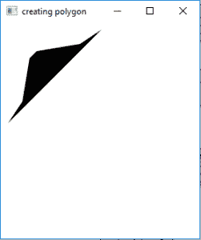
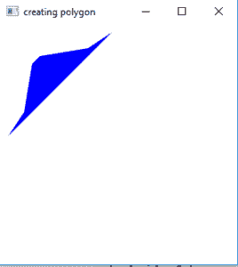

# JavaFX |带示例的多边形

> 原文:[https://www.geeksforgeeks.org/javafx-polygon-with-examples/](https://www.geeksforgeeks.org/javafx-polygon-with-examples/)

多边形是 JavaFX 库的一部分。多边形类用给定的一组 x 和 y 坐标创建一个多边形。多边形类继承了形状类。

**类的构造函数有:**

1.  **多边形()**:创建一个空多边形，没有一组定义的点(顶点)坐标
2.  **多边形(双点[])** 用一组定义的点(顶点)坐标创建多边形

**常用方法:**

| 方法 | 说明 |
| --- | --- |
| **getPoints()** | 获取多边形顶点的坐标。 |
| **设置填充(油漆 p)** | 设置多边形的填充 |

下面的程序将说明 JavaFX 的多边形类:

1.  **Program to create a polygon with a given set of vertices**: This program creates a Polygon indicated by the name polygon. The coordinates for the vertices of the polygon are passed as arguments. The Polygon will be created inside a scene, which in turn will be hosted inside a stage. The function setTitle() is used to provide title to the stage. Then a Group is created, and the polygon is attached. The group is attached to the scene. Finally, the show() method is called to display the final results.

    ```java
    // Java Program to create a polygon with a given set of vertices
    import javafx.application.Application;
    import javafx.scene.Scene;
    import javafx.scene.control.Button;
    import javafx.scene.layout.*;
    import javafx.scene.paint.Color;
    import javafx.scene.shape.Polygon;
    import javafx.scene.control.*;
    import javafx.stage.Stage;

    import javafx.scene.Group;
    public class polygon_0 extends Application {

        // launch the application
        public void start(Stage stage)
        {
            // set title for the stage
            stage.setTitle("creating polygon");

            // coordinates of the points of polygon
            double points[] = { 10.0d, 140.0d, 30.0d, 110.0d, 40.0d,
              50.0d, 50.0d, 40.0d, 110.0d, 30.0d, 140.0d, 10.0d };

            // create a polygon
            Polygon polygon = new Polygon(points);

            // create a Group
            Group group = new Group(polygon);

            // create a scene
            Scene scene = new Scene(group, 500, 300);

            // set the scene
            stage.setScene(scene);

            stage.show();
        }

        public static void main(String args[])
        {
            // launch the application
            launch(args);
        }
    }
    ```

    **输出:**
    

2.  **Program to create a polygon with a given set of vertices and specified fill**: This program creates a Polygon indicated by the name polygon. The coordinates for the vertices of the polygon are passed as arguments. The function set Fill() is used to set the fill of the polygon. The Polygon will be created inside a scene, which in turn will be hosted inside a stage. The function setTitle() is used to provide title to the stage. Then a Group is created, and the polygon is attached. The group is attached to the scene. Finally, the show() method is called to display the final results.

    ```java
    // Java Program to create a polygon with a
    // given set of vertices and specified fill
    import javafx.application.Application;
    import javafx.scene.Scene;
    import javafx.scene.control.Button;
    import javafx.scene.layout.*;
    import javafx.scene.paint.Color;
    import javafx.scene.shape.Polygon;
    import javafx.scene.control.*;
    import javafx.stage.Stage;

    import javafx.scene.Group;
    public class polygon_1 extends Application {

        // launch the application
        public void start(Stage stage)
        {
            // set title for the stage
            stage.setTitle("creating polygon");

            // coordinates of the points of polygon
            double points[] = { 10.0d, 140.0d, 30.0d, 110.0d, 40.0d,
                50.0d, 50.0d, 40.0d, 110.0d, 30.0d, 140.0d, 10.0d };

            // create a polygon
            Polygon polygon = new Polygon(points);

            // set fill for the polygon
            polygon.setFill(Color.BLUE);

            // create a Group
            Group group = new Group(polygon);

            // create a scene
            Scene scene = new Scene(group, 500, 300);

            // set the scene
            stage.setScene(scene);

            stage.show();
        }

        public static void main(String args[])
        {
            // launch the application
            launch(args);
        }
    }
    ```

    **输出:**
    

    **注意:**上述程序可能无法在联机 IDE 中运行，请使用脱机 IDE。

    **参考:**[https://docs . Oracle . com/javase/8/JavaFX/API/JavaFX/scene/shape/polygon . html](https://docs.oracle.com/javase/8/javafx/api/javafx/scene/shape/Polygon.html)