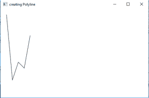
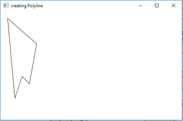

# JavaFX |折线示例

> 原文:[https://www . geesforgeks . org/JavaFX-折线-带示例/](https://www.geeksforgeeks.org/javafx-polyline-with-examples/)

折线是 JavaFX 库的一部分。折线是一组连接点。虽然折线几乎类似于多边形类，但唯一的区别是多边形形成封闭区域，而折线可以形成封闭和开放区域。另外，折线类扩展了形状类。

**类的构造函数为:**

1.  **折线()**:创建折线的空实例。
2.  **多段线(双…点)**:用给定点创建多段线的新实例

**常用方法:**

| 方法 | 说明 |
| --- | --- |
| **getPoints()** | 获取折线线段的点 |
| **toString()** | 返回此折线对象的字符串表示形式。 |

以下程序说明了折线的使用:

1.  **Program to create an open area of connected segments using polyline:** This program creates a Polyline indicated by the name polyline( the coordinates of the points of the line segments to create an open area). The Polyline will be created inside a scene, which in turn will be hosted inside a stage. The function setTitle() is used to provide title to the stage. Then a Group is created, and the polyline is attached. The group is attached to the scene. Finally, the show() method is called to display the final results.

    ```
    // Java Program to create a open area
    // of connected segments using polyline
    import javafx.application.Application;
    import javafx.scene.Scene;
    import javafx.scene.control.Button;
    import javafx.scene.layout.*;
    import javafx.scene.paint.Color;
    import javafx.scene.shape.Polyline;
    import javafx.scene.control.*;
    import javafx.stage.Stage;
    import javafx.scene.Group;
    public class Polyline_0 extends Application {

        // launch the application
        public void start(Stage stage)
        {
            // set title for the stage
            stage.setTitle("creating Polyline");

            // points
            double points[] = { 20.0d, 20.0d, 40.0d, 240.0d, 60.0d,
                              180.0d, 80.0d, 200.0d, 100.0d, 90.0d };

            // create a polyline
            Polyline polyline = new Polyline(points);

            // create a Group
            Group group = new Group(polyline);

            // create a scene
            Scene scene = new Scene(group, 500, 300);

            // set the scene
            stage.setScene(scene);

            stage.show();
        }

        public static void main(String args[])
        {
            // launch the application
            launch(args);
        }
    }
    ```

    **输出:**
    

2.  **Program to create a closed area of connected segments using polyline:** This program creates a Polyline indicated by the name polyline( the coordinates of the points of the line segments to create a closed area). The Polyline will be created inside a scene, which in turn will be hosted inside a stage. The function setTitle() is used to provide title to the stage. Then a Group is created, and the polyline is attached. The group is attached to the scene. Finally, the show() method is called to display the final results.

    ```
    // Java Program to create a closed area
    // of connected segments using polyline
    import javafx.application.Application;
    import javafx.scene.Scene;
    import javafx.scene.control.Button;
    import javafx.scene.layout.*;
    import javafx.scene.paint.Color;
    import javafx.scene.shape.Polyline;
    import javafx.scene.control.*;
    import javafx.stage.Stage;
    import javafx.scene.Group;
    public class Polyline_1 extends Application {

        // launch the application
        public void start(Stage stage)
        {
            // set title for the stage
            stage.setTitle("creating Polyline");

            // points
            double points[] = { 20.0d, 20.0d, 40.0d, 240.0d, 60.0d,
                 180.0d, 80.0d, 200.0d, 100.0d, 90.0d, 20.0d, 20.0d };

            // create a polyline
            Polyline polyline = new Polyline(points);

            // create a Group
            Group group = new Group(polyline);

            // create a scene
            Scene scene = new Scene(group, 500, 300);

            // set the scene
            stage.setScene(scene);

            stage.show();
        }

        public static void main(String args[])
        {
            // launch the application
            launch(args);
        }
    }
    ```

    **输出:**
    

    **注意:**上述程序可能无法在联机 IDE 中运行，请使用脱机转换器。
    **参考:**[https://docs . Oracle . com/javase/8/JavaFX/API/JavaFX/场景/形状/折线. html](https://docs.oracle.com/javase/8/javafx/api/javafx/scene/shape/Polyline.html)