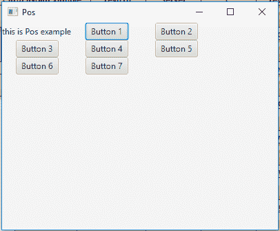

# JavaFX | Pos 类

> 原文:[https://www.geeksforgeeks.org/javafx-pos-class/](https://www.geeksforgeeks.org/javafx-pos-class/)

Pos 类是 JavaFX 的一部分。Pos 类包含表示水平和垂直定位或对齐的值。Pos 类继承*枚举*类。

**常用方法:**

| 方法 | 说明 |
| --- | --- |
| getHpos() | 返回水平对齐方式。 |
| getVpos() | 返回垂直对齐方式。 |
| valueOf(字符串 n) | 返回名称为指定字符串的 Pos 对象。 |
| 值() | 返回包含所有 Pos 值的数组。 |

以下程序说明了位置类的使用:

1.  **Java Program to create a tilepane and add a specified Pos value as its alignment:** In this program we will create a TilePane named *tile_pane*. Add Label named *label* and some buttons to the *tile_pane*. Set the Alignment of the *tile_pane* using the *setAlignment()* function. Set the alignment of the *tile_pane* to the Pos value *TOP_LEFT*. Add the *tile_pane* to the scene and add the scene to the stage and call the *show()* function to display the final results.

    ```
    // Java Program to create a tilepane and add
    // a specified Pos value as its alignment
    import javafx.application.Application;
    import javafx.scene.Scene;
    import javafx.scene.control.*;
    import javafx.scene.layout.*;
    import javafx.stage.Stage;
    import javafx.geometry.*;
    import javafx.scene.paint.*;
    import javafx.scene.canvas.*;
    import javafx.scene.text.*;
    import javafx.scene.Group;
    import javafx.scene.shape.*;

    public class Pos_1 extends Application {

        // launch the application
        public void start(Stage stage)
        {

            try {

                // set title for the stage
                stage.setTitle("Pos");

                // create a label
                Label label = new Label("this is Pos example");

                // create a Tile pane
                TilePane tile_pane = new TilePane(label);

                // create and add buttons to tilepane
                for (int i = 1; i <= 7; i++) {
                    tile_pane.getChildren().add(new Button("Button " + i));
                }

                // set Alignment of pane
                tile_pane.setAlignment(Pos.TOP_LEFT);

                // create a scene
                Scene scene = new Scene(tile_pane, 400, 300);

                // set the scene
                stage.setScene(scene);

                stage.show();
            }

            catch (Exception e) {

                System.out.println(e.getMessage());
            }
        }

        // Main Method
        public static void main(String args[])
        {

            // launch the application
            launch(args);
        }
    }
    ```

    **输出:**

    

2.  **Java Program to create a TilePane and a combobox that contains different values of Pos:** In this program we will create a TilePane named *tile_pane*. Add Label named label and some buttons to the *tile_pane*. Set the Alignment of the *tile_pane* using the *setAlignment()* function. We will set the alignment of the *tile_pane* to the Pos value *BASELINE_CENTER*. Store all the names of Pos values in a String array. Now create a combobox which will contain the names of Pos values and also cranate a Action Event to handle the combobox events. The Event handler will set the Alignment of the tilepane to the chosen pos value. Now create a VBox and add the tilepane and the combo box to vbox. Finally, add the *vbox* to the scene and add the scene to the stage and call the *show()* function to display the final results.

    ```
    // Java Program to create a TilePane and 
    // a combobox that contains different 
    // values of Pos
    import javafx.application.Application;
    import javafx.scene.Scene;
    import javafx.scene.control.*;
    import javafx.scene.layout.*;
    import javafx.stage.Stage;
    import javafx.geometry.*;
    import javafx.scene.paint.*;
    import javafx.scene.canvas.*;
    import javafx.scene.text.*;
    import javafx.scene.Group;
    import javafx.scene.shape.*;
    import javafx.event.ActionEvent;
    import javafx.event.EventHandler;
    import javafx.collections.*;

    public class Pos_2 extends Application {

    // launch the application
    public void start(Stage stage)
    {

        try {

            // set title for the stage
            stage.setTitle("Pos Class");

            // create a label
            Label label = new Label("This is Pos Class Example");

            // create a Tile pane
            TilePane tile_pane = new TilePane(label);

            // create and add buttons to tilepane
            for (int i = 1; i <= 7; i++) {

                tile_pane.getChildren().add(new Button("Button " + i));
            }

            // set Alignment of pane
            tile_pane.setAlignment(Pos.BASELINE_CENTER);

            // pos names
            String pos_name[] = {"BASELINE_CENTER", "BASELINE_LEFT",
                                 "BASELINE_RIGHT", "BOTTOM_CENTER", 
                                 "BOTTOM_LEFT", "BOTTOM_RIGHT", 
                                 "CENTER", "CENTER_LEFT", "CENTER_RIGHT",
                                 "TOP_CENTER", "TOP_LEFT", "TOP_RIGHT"};

            // Create a combo box
            ComboBox combo_box = 
              new ComboBox(FXCollections.observableArrayList(pos_name));

            // Create action event
            EventHandler<ActionEvent> event =
            new EventHandler<ActionEvent>() {

                public void handle(ActionEvent e)
                {

                    // set Alignement of the TilePane
                    tile_pane.setAlignment(Pos.valueOf(
                         (String)combo_box.getValue()));
                }
            };

            // Set on action
            combo_box.setOnAction(event);

            // create a VBox
            VBox vbox = new VBox(30, combo_box, tile_pane);

            // set Alignemnet
            vbox.setAlignment(Pos.CENTER);

            // create a scene
            Scene scene = new Scene(vbox, 400, 300);

            // set the scene
            stage.setScene(scene);

            stage.show();
        }

        catch (Exception e) {

            System.out.println(e.getMessage());
        }
    }

    // Main Method
    public static void main(String args[])
    {

        // launch the application
        launch(args);
    }
    }
    ```

    **输出:**

    <video class="wp-video-shortcode" id="video-225746-1" width="640" height="360" preload="metadata" controls=""><source type="video/mp4" src="https://media.geeksforgeeks.org/wp-content/uploads/Pos_2.mp4?_=1">[https://media.geeksforgeeks.org/wp-content/uploads/Pos_2.mp4](https://media.geeksforgeeks.org/wp-content/uploads/Pos_2.mp4)</video>

**注意:**上述程序可能无法在联机 IDE 中运行，请使用脱机编译器。

**参考:**[https://docs . Oracle . com/javase/8/JavaFX/API/JavaFX/geometry/pos . html](https://docs.oracle.com/javase/8/javafx/api/javafx/geometry/Pos.html)