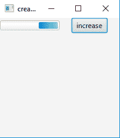
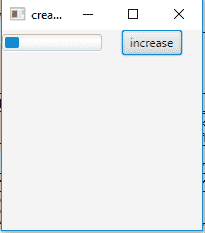
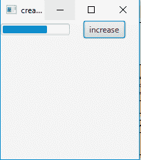

# JavaFX | ProgressBar

> 原文:[https://www.geeksforgeeks.org/javafx-progressbar/](https://www.geeksforgeeks.org/javafx-progressbar/)

ProgressBar 是 JavaFX 包的一部分。它是用横条表示的累进指示器的专门化。进度条通常显示任务的完成量。

ProgressBar 类的构造函数有:

1.  **进度条()**:新建一个中间进度条。
2.  **ProgressBar(双 p)** :创建指定进度的 ProgressBar。

**常用方法**:

| 方法 | 说明 |
| --- | --- |
| **Isincrement()** | 获取不确定属性的值。 |
| **获取进展（）** | 获取属性进度的值。 |
| **设定程序(双 v)** | 设置属性进度的值 |

**以下程序说明进度条:**

该程序创建一个进度条，由名称 *pb* 表示。进度指示器将在场景中创建，而场景又将托管在舞台(顶级 JavaFX 容器)中。函数 setTitle()用于为舞台提供标题。然后创建一个平铺窗格，在该窗格上调用 addChildren()方法来附加场景内的进度指示器和按钮，以及代码中由(200，200)指定的分辨率。最后调用 show()方法显示最终结果。

```java
// Java program to illustrate the use of progressbar
import javafx.application.Application;
import javafx.scene.Scene;
import javafx.scene.control.*;
import javafx.scene.layout.*;
import java.io.*;
import javafx.event.ActionEvent;
import javafx.event.EventHandler;
import javafx.scene.control.Label;
import javafx.stage.Stage;
import java.net.*;
public class progress extends Application {

    static double ii = 0;

    // launch the application
    public void start(Stage s) throws Exception
    {
        // set title for the stage
        s.setTitle("creating progressbar");

        // create a progressbar
        ProgressBar pb = new ProgressBar();

        // create a tile pane
        TilePane r = new TilePane();

        // action event
        EventHandler<ActionEvent> event = new EventHandler<ActionEvent>() {
            public void handle(ActionEvent e)
            {
                // set progress to different level of progressbar
                ii += 0.1;
                pb.setProgress(ii);
            }

        };

        // creating button
        Button b = new Button("increase");

        // set on action
        b.setOnAction(event);

        // add button
        r.getChildren().add(pb);
        r.getChildren().add(b);

        // create a scene
        Scene sc = new Scene(r, 200, 200);

        // set the scene
        s.setScene(sc);

        s.show();
    }

    public static void main(String args[])
    {
        // launch the application
        launch(args);
    }
}
```

**输出** :





**注意:**以下程序可能无法在联机 IDE 中运行，请使用脱机编译器。
**参考:**[https://docs . Oracle . com/javase/8/JavaFX/API/JavaFX/scene/control/progress bar . html](https://docs.oracle.com/javase/8/javafx/api/javafx/scene/control/ProgressBar.html)