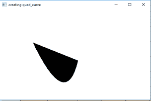
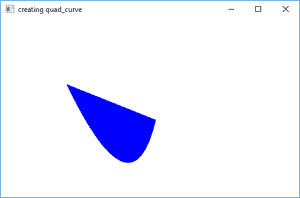

# JavaFX |带示例的四次曲线

> 原文:[https://www . geesforgeks . org/JavaFX-quad curve-with-examples/](https://www.geeksforgeeks.org/javafx-quadcurve-with-examples/)

四次曲线是 JavaFX 的一部分。四次曲线类定义了(x，y)坐标空间中的二次贝塞尔参数曲线段。曲线穿过起点和终点以及控制点。指定的控制点用作贝塞尔控制点。
 **类建造师有:** 

1.  **四次曲线()**:创建四次曲线的空实例
2.  **四次曲线(double sX、double sY、double cX、double cY、double eX、double eY)** :创建具有指定起点、终点和控制点的四次曲线的新实例。

**常用方法**

| 方法 | 说明 |
| --- | --- |
| getControlX() | 返回控制点的 x 坐标 |
| getControlY() | 返回控制点的 y 坐标 |
| getEndX() | 返回终点的 x 坐标 |
| getEndY() | 返回终点的 y 坐标 |
| getStartX() | 返回起点的 x 坐标 |
| getStartY() | 返回起点的 y 坐标 |
| setcontrolx(双值) | 设置控制点的 x 坐标 |
| 设置控制(双精度值) | 设置控制点的 y 坐标 |
| setEndX(双精度值) | 设置终点的 x 坐标 |
| setEndY(双值) | 设置终点的 y 坐标 |
| setStartX（双精度值） | 设置起点的 x 坐标 |
| 设置开始时间(双精度值) | 设置起点的 y 坐标 |

 **以下程序将举例说明使用** 
**Java 程序创建四元曲线**
该程序创建一条由名称 quad_curve 指示的四元曲线(控制点、起点和终点作为参数传递)。
四曲线将在场景中创建，而场景又将托管在舞台中。函数 setTitle()用于为舞台提供标题。然后创建一个组，并附加四元曲线。这个小组附属于现场。最后，调用 show()方法显示最终结果。

```
// Java program to create a quad curve
import javafx.application.Application;
import javafx.scene.Scene;
import javafx.scene.shape.DrawMode;
import javafx.scene.layout.*;
import javafx.event.ActionEvent;
import javafx.scene.shape.QuadCurve;
import javafx.scene.control.*;
import javafx.stage.Stage;
import javafx.scene.Group;
public class quad_curve_0 extends Application {

    // launch the application
    public void start(Stage stage)
    {
        // set title for the stage
        stage.setTitle("creating quad_curve");

        // create a quad_curve
        QuadCurve quad_curve = new QuadCurve(10.0f, 10.0f, 120.0f, 240.0f, 160.0f, 70.0f);

        // create a Group
        Group group = new Group(quad_curve);

        // translate the quad_curve to a position
        quad_curve.setTranslateX(100);
        quad_curve.setTranslateY(100);

        // create a scene
        Scene scene = new Scene(group, 500, 300);

        // set the scene
        stage.setScene(scene);

        stage.show();
    }

    public static void main(String args[])
    {
        // launch the application
        launch(args);
    }
}
```

**输出
:**

 **Java 程序创建四元曲线并为四元曲线设置填充** 
该程序创建由名称 quad_curve 指示的四元曲线(控制点、起点和终点使用 setControlX()、setControlY()、setStartX()、setStartY()、setEndX()、ans setEndY()函数设置)。四曲线将在场景中创建，而场景又将在舞台中托管。函数 setTitle()用于为舞台提供标题。然后创建一个组，并附加四元曲线。这个小组附属于现场。最后，调用 show()方法显示最终结果。函数 setFill()用于设置四元曲线的填充。

```
// Java program to create a quad curve
// and set a fill for quad curve
import javafx.application.Application;
import javafx.scene.Scene;
import javafx.scene.shape.DrawMode;
import javafx.scene.layout.*;
import javafx.event.ActionEvent;
import javafx.scene.shape.QuadCurve;
import javafx.scene.control.*;
import javafx.stage.Stage;
import javafx.scene.Group;
import javafx.scene.paint.Color;
public class quad_curve_1 extends Application {

    // launch the application
    public void start(Stage stage)
    {
        // set title for the stage
        stage.setTitle("creating quad_curve");

        // create a quad_curve
        QuadCurve quad_curve = new QuadCurve();

        // set start
        quad_curve.setStartX(10.0f);
        quad_curve.setStartY(10.0f);

        // set control coordinates
        quad_curve.setControlX(120.0f);
        quad_curve.setControlY(240.0f);

        // set end coordinates
        quad_curve.setEndX(160.0f);
        quad_curve.setEndY(70.0f);

        // create a Group
        Group group = new Group(quad_curve);

        // translate the quad_curve to a position
        quad_curve.setTranslateX(100);
        quad_curve.setTranslateY(100);

        // set fill for the quad curve
        quad_curve.setFill(Color.BLUE);

        // create a scene
        Scene scene = new Scene(group, 500, 300);

        // set the scene
        stage.setScene(scene);

        stage.show();
    }

    public static void main(String args[])
    {
        // launch the application
        launch(args);
    }
}
```

 **输出:** 

 **注意:以上程序可能无法在在线 IDE 中运行请使用离线编译器** 
**参考:**
[https://docs . Oracle . com/javase/8/JavaFX/API/JavaFX/scene/shape/quad curve . html](https://docs.oracle.com/javase/8/javafx/api/javafx/scene/shape/QuadCurve.html)