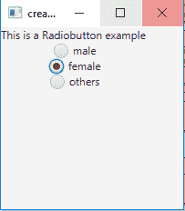
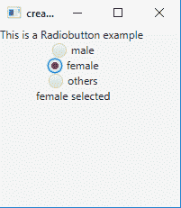

# JavaFX | RadioButton 带示例

> 原文:[https://www . geesforgeks . org/JavaFX-radio button-with-examples/](https://www.geeksforgeeks.org/javafx-radiobutton-with-examples/)

RadioButtons 是 JavaFx 包的一部分。单选按钮主要用于创建一系列只能选择一个的项目。当按下单选按钮并释放时，会发送一个操作事件，该操作事件可以使用事件处理程序来处理。
单选按钮可以添加到切换组，这样用户就不能选择多个项目。默认情况下，单选按钮不属于任何切换组。使用 getSelectedToggle()函数可以找到切换组的选定项目。

**单选按钮类**的构造函数:

1.  **单选按钮()**:创建标签为空字符串的单选按钮。
2.  **单选按钮(字符串 t)** :创建一个以指定文本为标签的单选按钮

**常用方法**:

| 方法 | 说明 |
| --- | --- |
| **getText（）** | 返回单选按钮的文本标签 |
| **isSelected()** | 返回单选按钮是否被选中 |
| **设置选定(布尔 b)** | 设置单选按钮是否被选中 |
| **settoggle group(toggle group TG)** | 设置单选按钮的切换组 |
| **火()** | 当且仅当单选按钮尚未选择或不属于切换组时，切换单选按钮的状态。 |

下面的程序说明了单选按钮类:

*   **Program to create RadioButton and add it to the stage**: This program creates a RadioButton indicated by the name r1, r2, r3\. The radio button will be created inside a scene, which in turn will be hosted inside a stage (which is the top level JavaFX container). The function setTitle() is used to provide title to the stage. Then a tile-pane is created, on which addChildren() method is called to attach the radio button inside the scene, along with the resolution specified by (200, 200) in the code. Finally, the show() method is called to display the final results.

    ```java
    // Java program to create RadioButton and add it to the stage
    import javafx.application.Application;
    import javafx.scene.Scene;
    import javafx.scene.control.*;
    import javafx.scene.layout.*;
    import javafx.event.ActionEvent;
    import javafx.event.EventHandler;
    import javafx.collections.*;
    import javafx.stage.Stage;
    import javafx.scene.text.Text.*;
    import javafx.scene.text.*;
    public class radiobutton extends Application {

        // launch the application
        public void start(Stage s)
        {
            // set title for the stage
            s.setTitle("creating RadioButton");

            // create a tile pane
            TilePane r = new TilePane();

            // create a label
            Label l = new Label("This is a Radiobutton example ");

            // create radiobuttons
            RadioButton r1 = new RadioButton("male");
            RadioButton r2 = new RadioButton("female");
            RadioButton r3 = new RadioButton("others");

            // add label
            r.getChildren().add(l);
            r.getChildren().add(r1);
            r.getChildren().add(r2);
            r.getChildren().add(r3);

            // create a scene
            Scene sc = new Scene(r, 200, 200);

            // set the scene
            s.setScene(sc);

            s.show();
        }

        public static void main(String args[])
        {
            // launch the application
            launch(args);
        }
    }
    ```

    **输出:**
    

*   **Program to create RadioButton and add it to a ToggleGroup**: This program creates a RadioButton indicated by the name r1, r2, r3\. The radio button will be created inside a scene, which in turn will be hosted inside a stage (which is the top level JavaFX container). The function setTitle() is used to provide title to the stage. A toggle group is created and the radio buttons are added to the toggle group using setToggleGroup() function. Then a tile-pane is created, on which addChildren() method is called to attach the radio button inside the scene, along with the resolution specified by (200, 200) in the code. Finally, the show() method is called to display the final results.

    ```java
    // Java Program to create RadioButton and add it to a ToggleGroup
    import javafx.application.Application;
    import javafx.scene.Scene;
    import javafx.scene.control.*;
    import javafx.scene.layout.*;
    import javafx.event.ActionEvent;
    import javafx.event.EventHandler;
    import javafx.collections.*;
    import javafx.stage.Stage;
    import javafx.scene.text.Text.*;
    import javafx.scene.text.*;
    public class radiobutton_1 extends Application {
        // labels
        Label l;

        // launch the application
        public void start(Stage s)
        {
            // set title for the stage
            s.setTitle("creating RadioButton");

            // create a tile pane
            TilePane r = new TilePane();

            // create a label
            l = new Label("This is a Radiobutton example ");

            // create a toggle group
            ToggleGroup tg = new ToggleGroup();

            // create radiobuttons
            RadioButton r1 = new RadioButton("male");
            RadioButton r2 = new RadioButton("female");
            RadioButton r3 = new RadioButton("others");

            // add radiobuttons to toggle group
            r1.setToggleGroup(tg);
            r2.setToggleGroup(tg);
            r3.setToggleGroup(tg);

            // add label
            r.getChildren().add(l);
            r.getChildren().add(r1);
            r.getChildren().add(r2);
            r.getChildren().add(r3);

            // create a scene
            Scene sc = new Scene(r, 200, 200);

            // set the scene
            s.setScene(sc);

            s.show();
        }

        public static void main(String args[])
        {
            // launch the application
            launch(args);
        }
    }
    ```

    **输出:**
    

*   **Program to create RadioButton, add it to a ToggleGroup and add a listener to it**: This program creates a RadioButton indicated by the name r1, r2, r3\. The radio button will be created inside a scene, which in turn will be hosted inside a stage (which is the top level JavaFX container). The function setTitle() is used to provide title to the stage. A toggle group is created and the radio buttons are added to the toggle group using setToggleGroup() function. A label l2 is created to show which radio button is selected. A change listener is added to handle any change in the selection of the radio buttons (using the addListener() function). The change in selection is depicted by changing the text of label l2\. Then a tile-pane is created, on which addChildren() method is called to attach the radio button inside the scene, along with the resolution specified by (200, 200) in the code. Finally, the show() method is called to display the final results.

    ```java
    // Java Program to create RadioButton, add it to a ToggleGroup and add a listener to it
    import javafx.application.Application;
    import javafx.scene.Scene;
    import javafx.scene.control.*;
    import javafx.scene.layout.*;
    import javafx.event.ActionEvent;
    import javafx.event.*;
    import javafx.collections.*;
    import javafx.stage.Stage;
    import javafx.scene.text.Text.*;
    import javafx.scene.text.*;
    import javafx.beans.value.*;
    public class radiobutton_2 extends Application {

        // launch the application
        public void start(Stage s)
        {
            // set title for the stage
            s.setTitle("creating RadioButton");

            // create a tile pane
            TilePane r = new TilePane();

            // create a label
            Label l = new Label("This is a Radiobutton example ");
            Label l2 = new Label("nothing selected");

            // create a toggle group
            ToggleGroup tg = new ToggleGroup();

            // create radiobuttons
            RadioButton r1 = new RadioButton("male");
            RadioButton r2 = new RadioButton("female");
            RadioButton r3 = new RadioButton("others");

            // add radiobuttons to toggle group
            r1.setToggleGroup(tg);
            r2.setToggleGroup(tg);
            r3.setToggleGroup(tg);

            // add label
            r.getChildren().add(l);
            r.getChildren().add(r1);
            r.getChildren().add(r2);
            r.getChildren().add(r3);
            r.getChildren().add(l2);

            // create a scene
            Scene sc = new Scene(r, 200, 200);

            // add a change listener
            tg.selectedToggleProperty().addListener(new ChangeListener<Toggle>() 
            {
                public void changed(ObservableValue<? extends Toggle> ob, 
                                                        Toggle o, Toggle n)
                {

                    RadioButton rb = (RadioButton)tg.getSelectedToggle();

                    if (rb != null) {
                        String s = rb.getText();

                        // change the label
                        l2.setText(s + " selected");
                    }
                }
            });

            // set the scene
            s.setScene(sc);

            s.show();
        }

        public static void main(String args[])
        {
            // launch the application
            launch(args);
        }
    }
    ```

    **输出:**
    

    **注意:**以上程序不会在在线 IDE 中运行请使用离线编译器
    **参考:**[https://docs . Oracle . com/javase/8/JavaFX/API/JavaFX/scene/control/radio button . html](https://docs.oracle.com/javase/8/javafx/api/javafx/scene/control/RadioButton.html)