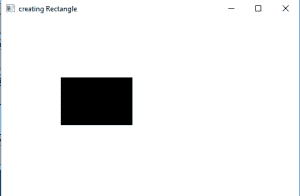
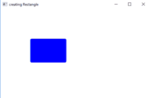

# JavaFX |矩形和圆角矩形示例

> 原文:[https://www . geesforgeks . org/JavaFX-矩形和圆角矩形-带示例/](https://www.geeksforgeeks.org/javafx-rectangle-and-rounded-rectangle-with-examples/)

矩形类是 JavaFX 的一部分。类创建一个具有指定宽度、高度和位置的矩形。
默认情况下，“矩形”有尖角，但边缘可以通过应用弧线高度和宽度来变圆。

**施工方:**

1.  **矩形():**创建矩形的空实例
2.  **矩形(双 w，双 h):** 创建具有指定宽度和高度的矩形
3.  **矩形(双 x，双 y，双 w，双 h):** 创建一个具有指定宽度、高度和位置的矩形
4.  **矩形(双 w，双 h，Paint f)** :创建一个具有指定宽度和高度的矩形并填充

**常用方法**

<figure class="table">

| 方法 | 说明 |
| --- | --- |
| 隐藏式() | 返回矩形的弧高 |
| **弧宽()** | 返回矩形的弧宽 |
| **getHeight（）** | 返回矩形的高度 |
| **getWidth()** | 返回矩形的宽度 |
| **getX()** | 获取属性 x 的值。 |
| **getY（）** | 获取属性 y 的值。 |
| **设置灯光(双 v)** | 设置矩形的弧高 |
| **setArcWidth(双 v)** | 设置矩形的弧宽 |
| **设置高度(双值)** | 设置矩形的高度 |
| **设定宽度(双倍数值)** | 设置矩形的宽度 |
| **setX(双值)** | 设置矩形位置的 x 坐标 |
| **setY(双值)** | 设置矩形位置的 y 坐标 |

</figure>

**示例程序，说明矩形类**的使用

这个程序创建一个矩形，用矩形这个名字来表示(位置的坐标和高度和宽度作为参数传递)。矩形将在场景内创建，而场景又将在舞台内托管。函数 setTitle()用于为舞台提供标题。然后创建一个组，并附加圆。这个小组附属于现场。最后，调用 show()方法显示最终结果。

**程序创建一个矩形并将其添加到场景中**

## Java 语言(一种计算机语言，尤用于创建网站)

```java
// Java Program to create a rectangle and add it to the scene
import javafx.application.Application;
import javafx.scene.Scene;
import javafx.scene.control.Button;
import javafx.scene.layout.*;
import javafx.scene.paint.Color;
import javafx.scene.shape.Rectangle;
import javafx.scene.control.*;
import javafx.stage.Stage;

import javafx.scene.Group;
public class Rectangle_0 extends Application {

    // launch the application
    public void start(Stage stage)
    {
        // set title for the stage
        stage.setTitle("creating Rectangle");

        // create a rectangle
        Rectangle rectangle = new Rectangle(100.0d, 100.0d, 120.0d, 80.0d);

        // create a Group
        Group group = new Group(rectangle);

        // create a scene
        Scene scene = new Scene(group, 500, 300);

        // set the scene
        stage.setScene(scene);

        stage.show();
    }

    public static void main(String args[])
    {
        // launch the application
        launch(args);
    }
}
```

**输出**



**程序创建一个圆角矩形，设置一个填充并将其添加到场景中**

这个程序创建一个矩形，用矩形这个名字来表示(位置的坐标和高度和宽度作为参数传递)。圆角将使用 setArcHeight()和 setArcWidth()函数进行设置。矩形的填充将使用 setFill()函数设置。矩形将在场景内创建，而场景又将在舞台内托管。函数 setTitle()用于为舞台提供标题。然后创建一个组，并附加圆。这个小组附属于现场。最后，调用 show()方法显示最终结果。

## Java 语言(一种计算机语言，尤用于创建网站)

```java
// Java Program to create a rounded rectangle
// and set a fill and add it to the scene
import javafx.application.Application;
import javafx.scene.Scene;
import javafx.scene.control.Button;
import javafx.scene.layout.*;
import javafx.scene.paint.Color;
import javafx.scene.shape.Rectangle;
import javafx.scene.control.*;
import javafx.stage.Stage;

import javafx.scene.Group;
public class Rectangle_1 extends Application {

    // launch the application
    public void start(Stage stage)
    {
        // set title for the stage
        stage.setTitle("creating Rectangle");

        // create a rectangle
        Rectangle rectangle = new Rectangle(100.0d, 100.0d, 120.0d, 80.0d);

        // set fill for rectangle
        rectangle.setFill(Color.BLUE);

        // set rounded corners
        rectangle.setArcHeight(10.0d);
        rectangle.setArcWidth(10.0d);

        // create a Group
        Group group = new Group(rectangle);

        // create a scene
        Scene scene = new Scene(group, 500, 300);

        // set the scene
        stage.setScene(scene);

        stage.show();
    }

    public static void main(String args[])
    {
        // launch the application
        launch(args);
    }
}
```

**输出:**



**注意:**以下程序可能无法在联机 IDE 中运行，请使用脱机编译器

**参考:**
[https://docs . Oracle . com/javase/8/JavaFX/API/JavaFX/scene/shape/rectangle . html](https://docs.oracle.com/javase/8/javafx/api/javafx/scene/shape/Rectangle.html)