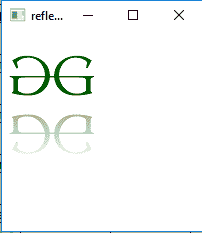
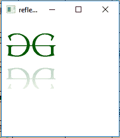

# JavaFX |反射类

> 原文:[https://www.geeksforgeeks.org/javafx-reflection-class/](https://www.geeksforgeeks.org/javafx-reflection-class/)

反射类是 JavaFX 的一部分。反射类用于在输入值的实际图像下方添加反射图像。反射图像不会响应鼠标事件或输入上的包含方法。

**类的构造函数:**

1.  **反射()**:创建新的反射对象。
2.  **反射(双拓扑集、双分数、双拓扑容量、双底部不透明度)**:使用指定的拓扑集、分数、拓扑容量和底部不透明度创建新的反射对象。

**常用方法:**

| 方法 | 说明 |
| --- | --- |
| getBottomOpacity() | 返回底部不透明度的值 |
| getTopOpacity() | 返回拓扑容量的值 |
| getFraction() | 返回反射图像与真实图像的比例 |
| getTopOffset() | 返回顶部偏移量的值 |
| getInput() | 返回属性输入的值 |
| setBottomOpacity(双 v) | 设置底部不透明度的值 |
| settopopacity(双 v) | 设置拓扑容量的值 |
| setFraction(双 v) | 设置反射图像占真实图像的比例 |
| settopoffset(双 v) | 设置顶部偏移的值 |
| 设置输入(效果五) | 设置属性输入的值 |

**下面的程序说明了反射类的使用:**

1.  **Java program to add a reflection to the image using the reflection class:** In this program a *FileInputStream* is created and an image is taken as input from a file. An Image named *image* is created using the input from the file input stream. From the image, an *image view object* is created and it is added to the *VBox*. The VBox is then added to the scene and the scene is added to the stage. A Reflection effect is created and the effect is set to the image view using *setEffect()* function.

    ```
    // Java program to add a reflection to 
    // the image using the reflection class
    import javafx.application.Application;
    import javafx.scene.Scene;
    import javafx.scene.control.*;
    import javafx.scene.layout.*;
    import javafx.stage.Stage;
    import javafx.scene.image.*;
    import javafx.scene.effect.*;
    import java.io.*;
    import javafx.event.ActionEvent;
    import javafx.event.EventHandler;
    import javafx.scene.Group;

    public class reflection_1 extends Application {

        // launch the application
        public void start(Stage stage) throws Exception
        {

            // set title for the stage
            stage.setTitle("reflection example");

            // create a input stream
            FileInputStream input = new FileInputStream("D:\\GFG.png");

            // create a image
            Image image = new Image(input);

            // create a image View
            ImageView imageview = new ImageView(image);

            // create a reflection effect
            Reflection reflection = new Reflection();

            // set effect
            imageview.setEffect(reflection);

            // create a VBox
            VBox vbox = new VBox(imageview);

            // create a scene
            Scene scene = new Scene(vbox, 200, 200);

            // set the scene
            stage.setScene(scene);

            stage.show();
        }

        // Main Method
        public static void main(String args[])
        {
            // launch the application
            launch(args);
        }
    }
    ```

    **输出:**
    

2.  **Java program to add a reflection to the image using the reflection class and set the *top offset, top opacity, bottom opacity and fraction* of image which will appear as a reflection:** In this program a FileInputStream is created and an image is taken as input from a file. Image named *image* is created using the input from the file input stream. From the image, an *image view object* is created and it is added to the *VBox* . The *VBox* is then added to the scene and the scene is added to the stage. A Reflection effect is created and the effect is set to the image view using *setEffect()* function. The *bottom Opacity, top Opacity, top offset, and fraction* are set using the *setBottomOpacity(), setTopOpacity(), setFraction(), and setTopOffset()* function respectively.

    ```
    // Java program to add a reflection to the image
    // using the reflection class and set the top 
    // offset, top opacity bottom opacity and fraction
    // of image which will appear as reflection
    import javafx.application.Application;
    import javafx.scene.Scene;
    import javafx.scene.control.*;
    import javafx.scene.layout.*;
    import javafx.stage.Stage;
    import javafx.scene.image.*;
    import javafx.scene.effect.*;
    import java.io.*;
    import javafx.event.ActionEvent;
    import javafx.event.EventHandler;
    import javafx.scene.Group;

    public class reflection_2 extends Application {

        // launch the application
        public void start(Stage stage) throws Exception
        {

            // set title for the stage
            stage.setTitle("reflection example");

            // create a input stream
            FileInputStream input = new FileInputStream("D:\\GFG.png");

            // create a image
            Image image = new Image(input);

            // create a image View
            ImageView imageview = new ImageView(image);

            // create a reflection effect
            Reflection reflection = new Reflection();

            // set fraction
            reflection.setFraction(0.6);

            // set top Opacity
            reflection.setTopOpacity(0.3);

            // set bottom Opacity
            reflection.setBottomOpacity(0.1);

            // set top offset
            reflection.setTopOffset(0.5);

            // set effect
            imageview.setEffect(reflection);

            // create a VBox
            VBox vbox = new VBox(imageview);

            // create a scene
            Scene scene = new Scene(vbox, 200, 200);

            // set the scene
            stage.setScene(scene);

            stage.show();
        }

        // Main Method
        public static void main(String args[])
        {

            // launch the application
            launch(args);
        }
    }
    ```

    **输出:**

    

**注意:**上述程序可能无法在在线 IDE 中运行。请使用离线编译器。

**参考:**[https://docs . Oracle . com/javase/8/JavaFX/API/JavaFX/场景/效果/Reflection.html](https://docs.oracle.com/javase/8/javafx/api/javafx/scene/effect/Reflection.html)