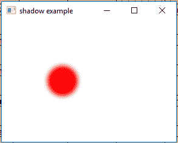
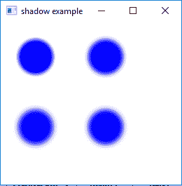

# JavaFX |阴影类

> 原文:[https://www.geeksforgeeks.org/javafx-shadow-class/](https://www.geeksforgeeks.org/javafx-shadow-class/)

影子类是 JavaFX 的一部分。阴影类创建边缘模糊的单色阴影。阴影是黑色的(默认情况下)，可以与原件结合来创建阴影。不同颜色的阴影可以添加到原始创建一个发光效果。阴影类继承效果类。

**类的构造函数:**

1.  **阴影()**:创建一个新的阴影对象。
2.  **阴影(模糊类型 t，颜色 c，双 r)** :用指定的模糊类型、颜色和半径创建一个新的阴影对象。
3.  **阴影(双 r，颜色 c)** :用半径和颜色创建一个新的阴影对象。

**常用方法:**

| 方法 | 说明 |
| --- | --- |
| getBlurType() | 返回效果的模糊类型。 |
| 获得颜色 （） | 返回效果的颜色。 |
| getInput() | 返回属性输入的值。 |
| 跟踪半径() | 返回阴影效果的半径。 |
| 设置模糊类型(模糊类型 v) | 设置阴影效果的模糊类型。 |
| setColor(颜色 v) | 设置阴影效果的颜色。 |
| 设置输入(效果五) | 设置属性输入的值。 |
| setRadius(双 v) | 设置阴影效果的半径。 |

下面的程序说明了影子类的使用:

1.  **Java program to create a Circle and add Shadow effect to it:** In this program we will create a Circle named *circle* and create a *Shadow effect shadow* with specified radius and color. The shadow effect will be added to the circle using the *setEffect()* function and the circle will be added to the group. The circles will be translated to specific position in the stage using *setTranslateX()* and *setTranslateY()* function. The group will be added to the scene and the scene will be added to the stage.

    ```
    // Java program to create a Circle 
    // and add Shadow effect to it
    import javafx.application.Application;
    import javafx.scene.Scene;
    import javafx.scene.control.*;
    import javafx.scene.layout.*;
    import javafx.stage.Stage;
    import javafx.scene.image.*;
    import javafx.scene.effect.*;
    import java.io.*;
    import javafx.scene.shape.Circle;
    import javafx.scene.paint.Color;
    import javafx.scene.Group;

    public class shadow_1 extends Application {

        // launch the application
        public void start(Stage stage) throws Exception
        {

            // set title for the stage
            stage.setTitle("shadow example");

            // create a circle
            Circle circle = new Circle(50.0f, 50.0f, 25.0f);

            // translate to a position
            circle.setTranslateX(50.0f);
            circle.setTranslateY(50.0f);

            // create a shadow effect
            Shadow shadow = new Shadow(10, Color.RED);

            // set effect
            circle.setEffect(shadow);

            // create a Group
            Group group = new Group(circle);

            // create a scene
            Scene scene = new Scene(group, 200, 200);

            // set the scene
            stage.setScene(scene);

            stage.show();
        }

        // Main Method
        public static void main(String args[])
        {

            // launch the application
            launch(args);
        }
    }
    ```

    **输出:**

    

2.  **Java program to create four Circles and add Shadow effect to it( of different BlurType):** In this program we will create a Circles named *circle*, *circle1*, *circle2*, *circle3* and create a Shadow effects named *shadow1*, *shadow2*, *shadow3*, *shadow4* with specified radius, color and blur type. The shadow effect will be added to the circle using the setEffect() function and the circles will be added to the group.The circles will be translated to specific position in the stage using *setTranslateX()* and *setTranslateY()* function. The group will be added to the scene and the scene will be added to the stage.

    ```
    // Java program to create four Circles and add Shadow
    // effect to it which are of different BlurType
    import javafx.application.Application;
    import javafx.scene.Scene;
    import javafx.scene.control.*;
    import javafx.scene.layout.*;
    import javafx.stage.Stage;
    import javafx.scene.image.*;
    import javafx.scene.effect.*;
    import java.io.*;
    import javafx.scene.shape.Circle;
    import javafx.scene.paint.Color;
    import javafx.scene.Group;

    public class shadow_2 extends Application {

        // launch the application
        public void start(Stage stage) throws Exception
        {

            // set title for the stage
            stage.setTitle("shadow example");

            // create a circle
            Circle circle = new Circle(0.0f, 0.0f, 25.0f);
            Circle circle1 = new Circle(0.0f, 0.0f, 25.0f);
            Circle circle2 = new Circle(0.0f, 0.0f, 25.0f);
            Circle circle3 = new Circle(0.0f, 0.0f, 25.0f);

            // translate to a position
            circle.setTranslateX(50.0f);
            circle.setTranslateY(50.0f);

            // translate to a position
            circle1.setTranslateX(150.0f);
            circle1.setTranslateY(50.0f);

            // translate to a position
            circle2.setTranslateX(50.0f);
            circle2.setTranslateY(150.0f);

            // translate to a position
            circle3.setTranslateX(150.0f);
            circle3.setTranslateY(150.0f);

            // create shadow effect
            Shadow shadow1 = new Shadow(BlurType.values()[0], Color.BLUE, 10);
            Shadow shadow2 = new Shadow(BlurType.values()[1], Color.BLUE, 10);
            Shadow shadow3 = new Shadow(BlurType.values()[2], Color.BLUE, 10);
            Shadow shadow4 = new Shadow(BlurType.values()[3], Color.BLUE, 10);

            // set effect
            circle.setEffect(shadow1);
            circle1.setEffect(shadow2);
            circle2.setEffect(shadow3);
            circle3.setEffect(shadow4);

            // create a Group
            Group group = new Group(circle, circle1, circle2, circle3);

            // create a scene
            Scene scene = new Scene(group, 200, 200);

            // set the scene
            stage.setScene(scene);

            stage.show();
        }

        // Main Method
        public static void main(String args[])
        {

            // launch the application
            launch(args);
        }
    }
    ```

    **输出:**
    

**注意:**上述程序可能无法在在线 IDE 中运行。请使用离线编译器。

**参考:**[https://docs . Oracle . com/javase/8/JavaFX/API/JavaFX/场景/效果/Shadow.html](https://docs.oracle.com/javase/8/javafx/api/javafx/scene/effect/Shadow.html)