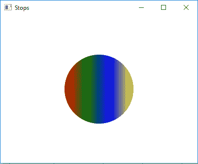

# JavaFX |停止类

> 原文:[https://www.geeksforgeeks.org/javafx-stop-class/](https://www.geeksforgeeks.org/javafx-stop-class/)

Stop 类是 JavaFX 的一部分。Stop 类包含偏移量和颜色。定义渐变颜色的一个元素，用于渐变。停止类继承 *[对象类](https://www.geeksforgeeks.org/object-class-in-java/)*

**该类的构造函数:**

*   **Stop(双 o，颜色 c)** :用指定的偏移和颜色创建一个新的 Stop 对象。

**常用方法:**

| 方法 | 说明 |
| --- | --- |
| 等于(对象 0) | 返回两个停止对象是否相等。 |
| 获得颜色 （） | 返回此偏移量处的颜色渐变。 |
| getOffset() | 返回停止点的偏移量。 |
| hashCode() | 返回停止对象的哈希码。 |

**创建停靠点的 Java 程序将其添加到线性渐变中，并将其应用到圆中:**在本程序中，我们将创建一个停靠点对象的数组，其偏移值范围从 0 到 1。创建具有指定停止点的线性渐变对象。然后用指定的 x，y 位置和半径创建一个圆，并添加线性渐变。创建一个 VBox 并设置它的对齐方式。将圆圈添加到 *vbox* 并将 vbox 添加到场景并将场景添加到舞台，并调用 *show()* 功能显示结果。

```java
// Java program to create stops add it to
// linear gradient and apply it to the circle
import javafx.application.Application;
import javafx.scene.Scene;
import javafx.scene.control.*;
import javafx.scene.layout.*;
import javafx.stage.Stage;
import javafx.scene.layout.*;
import javafx.scene.paint.*;
import javafx.scene.text.*;
import javafx.geometry.*;
import javafx.scene.layout.*;
import javafx.scene.shape.*;
import javafx.scene.paint.*;

public class STOP_1 extends Application {

    // launch the application
    public void start(Stage stage)
    {

        try {

            // set title for the stage
            stage.setTitle("Stops");

            // create stops
            Stop[] stop = {new Stop(0, Color.RED), 
                           new Stop(0.33, Color.GREEN), 
                           new Stop(0.66, Color.BLUE), 
                           new Stop(1, Color.YELLOW)};

            // create a Linear gradient object
            LinearGradient linear_gradient = new LinearGradient(0, 0,
                             1, 0, true, CycleMethod.NO_CYCLE, stop);

            // create a circle
            Circle circle = new Circle(100, 100, 70);

            // set fill
            circle.setFill(linear_gradient);

            // create VBox
            VBox vbox = new VBox(circle);

            // ste Alignment
            vbox.setAlignment(Pos.CENTER);

            // create a scene
            Scene scene = new Scene(vbox, 400, 300);

            // set the scene
            stage.setScene(scene);

            stage.show();
        }

        catch (Exception e) {

            System.out.println(e.getMessage());
        }
    }

    // Main Method
    public static void main(String args[])
    {

        // launch the application
        launch(args);
    }
}
```

**输出:**



**注意:**上述程序可能无法在联机 IDE 中运行，请使用脱机编译器。

**参考:**[https://docs . Oracle . com/javase/8/JavaFX/API/JavaFX/scene/paint/stop . html](https://docs.oracle.com/javase/8/javafx/api/javafx/scene/paint/Stop.html)