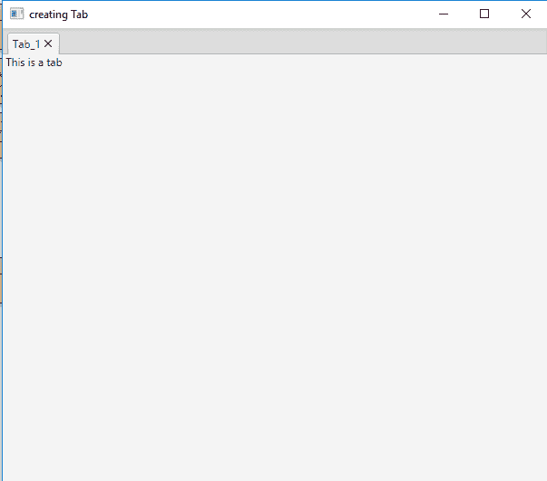
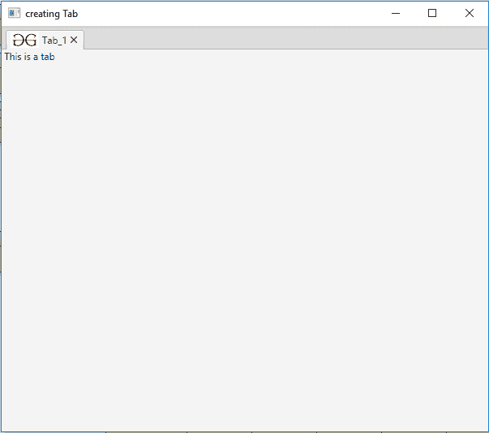

# JavaFX |选项卡类

> 原文:[https://www.geeksforgeeks.org/javafx-tab-class/](https://www.geeksforgeeks.org/javafx-tab-class/)

Tab 类是 JavaFX 的一部分。选项卡类创建一个包含在选项卡窗格中的对象。选项卡可以包含任何节点作为其内容。选项卡窗格可以包含多个选项卡。当用户单击选项卡时，选项卡的内容对用户可见。

**类的构造函数:**

1.  **选项卡()**:创建一个新的空选项卡。
2.  **选项卡(字符串 t)** :用指定的标题创建新的选项卡。
3.  **选项卡(字符串 t，节点 c)** :用指定的标题和内容创建一个新的选项卡。

**常用方法:**

| 方法 | 说明 |
| --- | --- |
| getContent() | 返回选项卡的内容节点。 |
| getContextMenu() | 返回与选项卡关联的上下文菜单。 |
| getGraphic() | 返回选项卡的图形。 |
| getId() | 返回标签的标识。 |
| getStyle（） | 与此选项卡关联的 CSS 样式字符串。 |
| getTabPane() | 返回选项卡的选项卡窗格。 |
| 获取文本 （） | 返回选项卡中显示的文本。 |
| getTooltip() | 返回与选项卡关联的工具提示。 |
| setId（String v） | 设置选项卡的标识。 |
| setContent(节点五) | 设置选项卡的内容。 |
| setContextMenu（ContextMenu v） | 设置选项卡的上下文菜单。 |
| 设置图形(节点五) | 为节点设置图形。 |
| setStyle(字符串 v) | 设置与此选项卡关联的 CSS 样式的字符串表示形式。 |
| setText（String v） | 设置选项卡的文本 |
| setTooltip（Tooltip v） | 设置选项卡的工具提示(当用户悬停在选项卡上时会出现一个弹出窗口)。 |
| setDisable(boolean v) | 说明此选项卡的禁用状态。 |

以下程序说明了制表符类的使用:

1.  **Java program to create a tab and add it to the TabPane:** In this program we will create a Tab named *tab_1*. We will also create a Label named *label*. We will add the label to the tab by using the function *setContent()*. The title of the tab will be passed as arguments. We will create a TabPane named tabpane and add the tab to the tabpane. Now, we will add the tabpane to the scene and add the scene to the stage and display the stage using the *show()* function.

    ```java
    // Java program to create a tab 
    // and add it to the TabPane
    import javafx.application.Application;
    import javafx.scene.Scene;
    import javafx.scene.layout.*;
    import javafx.stage.Stage;
    import javafx.scene.Group;
    import javafx.scene.control.*;

    public class Tab_1 extends Application {

        // launch the application
        public void start(Stage stage)
        {

            // set title for the stage
            stage.setTitle("creating Tab");

            // create Tab
            Tab tab_1 = new Tab("Tab_1");

            // create a label
            Label label = new Label(" This is a tab ");

            // add label to the tab
            tab_1.setContent(label);

            // add tab
            // create a tabpane
            TabPane tabpane = new TabPane(tab_1);

            // create a scene
            Scene scene = new Scene(tabpane, 600, 500);

            // set the scene
            stage.setScene(scene);

            stage.show();
        }

        // Main Method
        public static void main(String args[])
        {

            // launch the application
            launch(args);
        }
    }
    ```

    **输出:**
    

2.  **Java program to create a tab, add graphic(in the tab) to it and add it to the TabPane:** In this program we will create a Tab named *tab_1*. We will also create a Label named label. We will add label to the tab by using the function *setContent()*. The title of the tab will be passed as arguments. We will create a FileInputStream named *input* to import the image. An Image will be created named *image* from the file input stream, then we will create an ImageView named *imageview* from the imported image. We will add this imageview to the tab using the *setGraphic()* function. We will create a TabPane named *tabpane* and add the tab to the *tabpane* . Now, we will add the tabpane to the scene and add the scene to the stage and display the stage using the *show()* function.

    ```java
    // Java program to create a tab, add
    // graphic(in the tab) to it and add
    // it to the TabPane
    import javafx.application.Application;
    import javafx.scene.Scene;
    import javafx.scene.layout.*;
    import javafx.stage.Stage;
    import javafx.scene.Group;
    import javafx.scene.control.*;
    import java.io.*;
    import javafx.scene.image.*;

    public class Tab_2 extends Application {

        // launch the application
        public void start(Stage stage)
        {

            try {

                // set title for the stage
                stage.setTitle("creating Tab");

                // create Tab
                Tab tab_1 = new Tab("Tab_1");

                // create a label
                Label label = new Label(" This is a tab ");

                // add label to the tab
                tab_1.setContent(label);

                // create a input stream
                FileInputStream input = new FileInputStream("f:\\gfg.png");

                // create a image
                Image image = new Image(input);

                // create a image View
                ImageView imageview = new ImageView(image);

                // add graphic to the tab
                tab_1.setGraphic(imageview);

                // add tab
                // create a tabpane
                TabPane tabpane = new TabPane(tab_1);

                // create a scene
                Scene scene = new Scene(tabpane, 600, 500);

                // set the scene
                stage.setScene(scene);

                stage.show();
            }
            catch (Exception e) {
                System.err.println(e.getMessage());
            }
        }

        // Main Method
        public static void main(String args[])
        {

            // launch the application
            launch(args);
        }
    }
    ```

    **输出:**

    

**注意:**上述程序可能无法在在线 IDE 中运行。请使用离线编译器。

**参考:**[https://docs . Oracle . com/javase/8/JavaFX/API/JavaFX/scene/control/tab . html](https://docs.oracle.com/javase/8/javafx/api/javafx/scene/control/Tab.html)