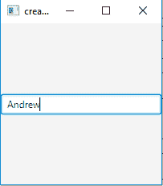
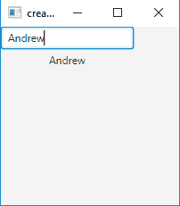
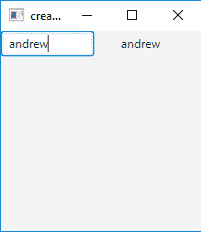
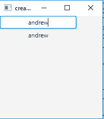

# JavaFX | TextField

> 原文:[https://www.geeksforgeeks.org/javafx-textfield/](https://www.geeksforgeeks.org/javafx-textfield/)

TextField 类是 JavaFX 包的一部分。它是一个允许用户输入一行无格式文本的组件，它不允许多行输入它只允许用户输入一行文本。然后可以根据需要使用文本。

**文本字段类**的构造函数:

1.  **文本字段()**:创建一个包含空文本内容的新文本字段
2.  **文本字段(字符串)**:用初始文本创建一个新的文本字段。

**常用方法**:

| 方法 | 说明 |
| --- | --- |
| **set ref column count(int v)** | 设置属性 prefColumnCount 的值。 |
| **设置动作(事件处理程序值)** | 设置 onAction 属性的值。 |
| **设置对齐(位置 v)** | 设置属性对齐的值。 |
| **预列计数属性()** | 首选的文本列数 |
| **onActionProperty()** | 与此文本字段关联的操作处理程序，如果未分配操作处理程序，则为 null。 |
| **get ref column count()** | 获取属性 prefColumnCount 的值。 |
| **getnations()** | 获取 onAction 属性的值。 |
| **getAlignment()** | 获取属性对齐的值。 |
| **getCharacters()** | 返回支持文本字段内容的字符序列。 |

以下程序说明了文本字段的使用:

1.  **Java program to create a TextField and add it to stage**: This program creates a TextField indicated by the name b. The TextField will be created inside a scene, which in turn will be hosted inside a stage (which is the top level JavaFX container). The function setTitle() is used to provide title to the stage. Then a Title-pane is created, on which addChildren() method is called to attach the TextField inside the scene, along with the resolution specified by (200, 200) in the code. Finally the show() method is called to display the final results.

    ```
    // Java program to create a textfield and add it to stage
    import javafx.application.Application;
    import javafx.scene.Scene;
    import javafx.scene.control.*;
    import javafx.scene.layout.StackPane;
    import javafx.stage.Stage;
    public class Textfield extends Application {

        // launch the application
        public void start(Stage s)
        {
            // set title for the stage
            s.setTitle("creating TextField");

            // create a textfield
            TextField b = new TextField();

            // create a stack pane
            StackPane r = new StackPane();

            // add textfield
            r.getChildren().add(b);

            // create a scene
            Scene sc = new Scene(r, 200, 200);

            // set the scene
            s.setScene(sc);

            s.show();
        }

        public static void main(String args[])
        {
            // launch the application
            launch(args);
        }
    }
    ```

    **输出** :
    

2.  **Java program to create a TextField with an initial text and add an event handler**: This program creates a TextField indicated by the name b. We will create a label which will display the Text when the enter key is pressed.we will create an event handler that will handle the event of the Text field and the event handler would be added to the Textfield using setOnAction() method. The TextField will be created inside a scene, which in turn will be hosted inside a stage (which is the top level JavaFX container). The function setTitle() is used to provide title to the stage. Then a Title-pane is created, on which addChildren() method is called to attach the TextField and a label inside the scene, along with the resolution specified by (200, 200) in the code. Finally, the show() method is called to display the final results.

    ```
    // Java program to create a textfield and add a
    // event handler to handle the event of textfield
    import javafx.application.Application;
    import javafx.scene.Scene;
    import javafx.scene.control.*;
    import javafx.scene.layout.*;
    import javafx.event.ActionEvent;
    import javafx.event.EventHandler;
    import javafx.scene.control.Label;
    import javafx.stage.Stage;
    public class Textfield_1 extends Application {

        // launch the application
        public void start(Stage s)
        {
            // set title for the stage
            s.setTitle("creating textfield");

            // create a textfield
            TextField b = new TextField("initial text");

            // create a tile pane
            TilePane r = new TilePane();

            // create a label
            Label l = new Label("no text");

            // action event
            EventHandler<ActionEvent> event = new EventHandler<ActionEvent>() {
                public void handle(ActionEvent e)
                {
                    l.setText(b.getText());
                }
            };

            // when enter is pressed
            b.setOnAction(event);

            // add textfield
            r.getChildren().add(b);
            r.getChildren().add(l);

            // create a scene
            Scene sc = new Scene(r, 200, 200);

            // set the scene
            s.setScene(sc);

            s.show();
        }

        public static void main(String args[])
        {
            // launch the application
            launch(args);
        }
    }
    ```

    **输出** :
    

3.  **Java program to create a textfield with an initial text and add an event handler**: This program creates a TextField indicated by the name b. We will set an initial text by invoking its constructor with a string and also set the preferred column count using setPrefColumnCount() method. We will create a label which will display the Text when the enter key is pressed. We will create an event handler that will handle the event of the Text field and the event handler would be added to the Textfield using setOnAction() method. The TextField will be created inside a scene, which in turn will be hosted inside a stage (which is the top level JavaFX container). The function setTitle() is used to provide title to the stage. Then a Title-pane is created, on which addChildren() method is called to attach the TextField and a label inside the scene, along with the resolution specified by (200, 200) in the code. Finally, the show() method is called to display the final results.

    ```
    // Java program to create a textfield with a initial text
    // and preferred column count and add a event handler to
    // handle the event of textfield
    import javafx.application.Application;
    import javafx.scene.Scene;
    import javafx.scene.control.*;
    import javafx.scene.layout.*;
    import javafx.event.ActionEvent;
    import javafx.event.EventHandler;
    import javafx.scene.control.Label;
    import javafx.stage.Stage;
    public class TextField_2 extends Application {

        // launch the application
        public void start(Stage s)
        {
            // set title for the stage
            s.setTitle("creating textfield");

            // create a textfield
            TextField b = new TextField("initial text");

            // set preffered column count
            b.setPrefColumnCount(7);

            // create a tile pane
            TilePane r = new TilePane();

            // create a label
            Label l = new Label("no text");

            // action event
            EventHandler<ActionEvent> event = new EventHandler<ActionEvent>() {
                public void handle(ActionEvent e)
                {
                    l.setText(b.getText());
                }
            };

            // when enter is pressed
            b.setOnAction(event);

            // add textfield
            r.getChildren().add(b);
            r.getChildren().add(l);

            // create a scene
            Scene sc = new Scene(r, 200, 200);

            // set the scene
            s.setScene(sc);

            s.show();
        }

        public static void main(String args[])
        {
            // launch the application
            launch(args);
        }
    }
    ```

    **输出** :
    

4.  **Java program to create a TextField with an initial text and center alignment of text and add an event handler**: This program creates a TextField indicated by the name b.we will set an initial text by invoking its constructor with a string and also set the alignment using setAlignment() method.we will create a label which will display the Text when the enter key is pressed.we will create an event handler that will handle the event of the Text field and the event handler would be added to the Textfield using setOnAction() method. The TextField will be created inside a scene, which in turn will be hosted inside a stage (which is the top level JavaFX container). The function setTitle() is used to provide title to the stage. Then a Title-pane is created, on which addChildren() method is called to attach the TextField and a label inside the scene, along with the resolution specified by (200, 200) in the code. Finally, the show() method is called to display the final results.

    ```
    // Java program to create a textfield with a initial text and center alignment of text
    // and add a event handler to handle the event of textfield
    import javafx.application.Application;
    import javafx.scene.Scene;
    import javafx.scene.control.*;
    import javafx.scene.layout.*;
    import javafx.event.ActionEvent;
    import javafx.event.EventHandler;
    import javafx.scene.control.Label;
    import javafx.stage.Stage;
    import javafx.geometry.*;
    public class TextField_4 extends Application {

        // launch the application
        public void start(Stage s)
        {
            // set title for the stage
            s.setTitle("creating textfield");

            // create a textfield
            TextField b = new TextField("initial text");

            // set alignment of text
            b.setAlignment(Pos.CENTER);

            // create a tile pane
            TilePane r = new TilePane();

            // create a label
            Label l = new Label("no text");

            // action event
            EventHandler<ActionEvent> event = new EventHandler<ActionEvent>() {
                public void handle(ActionEvent e)
                {
                    l.setText(b.getText());
                }
            };

            // when enter is pressed
            b.setOnAction(event);

            // add textfield
            r.getChildren().add(b);
            r.getChildren().add(l);

            // create a scene
            Scene sc = new Scene(r, 200, 200);

            // set the scene
            s.setScene(sc);

            s.show();
        }

        public static void main(String args[])
        {
            // launch the application
            launch(args);
        }
    }
    ```

    **输出** :
    

    **注意:**上述程序可能无法在联机 IDE 中运行，请使用脱机编译器。

    **参考**:[https://docs . Oracle . com/javase/8/JavaFX/API/JavaFX/scene/control/textfield . html](https://docs.oracle.com/javase/8/javafx/api/javafx/scene/control/TextField.html)