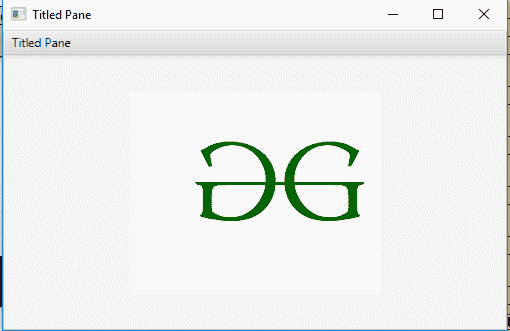

# Javafx | title Depane 类

> 原文:[https://www.geeksforgeeks.org/javafx-titledpane-class/](https://www.geeksforgeeks.org/javafx-titledpane-class/)

TitledPane 类是 JavaFX 的一部分。标题类创建一个标题可以打开或关闭的面板。TitledPane 类扩展了标记为的*类。*

**该类的构造函数:**

*   **title Depane()**:创建一个新的 title Depane 对象。
*   **标题平面(字符串 t，节点 n)** :用指定的内容和标题创建一个新的标题平面对象。

**常用方法:**

| 方法 | 说明 |
| --- | --- |
| getContent() | 返回标题平面的内容。 |
| isAnimated() | 返回标题平面是否动画化。 |
| isCollapsible() | 返回标题平面是否可折叠。 |
| isExpanded() | 返回标题平面是否展开。 |
| 设置动画(布尔 v) | 设置平铺面板的动画状态。 |
| 集合可折叠(布尔型 v | 设置平铺面板的可折叠状态。 |
| setContent(节点五) | 设置标题窗格的内容窗格。 |
| setExpanded(布尔值 v) | 设置标题平面的展开状态。 |

下面的程序说明了标题窗格类的使用:

1.  **Java program to create a TitledPane and add a label to it:**
    *   在这个程序中，我们将创建一个标题平面并给它添加一个标签。
    *   标签将包含使用文件输入流导入的图片。
    *   将此图片添加到标签中。
    *   将标签添加到标题窗格。
    *   现在将标题窗格添加到场景中，并将场景添加到舞台中。
    *   调用 *show()* 功能显示最终结果。

    ```java
    // Java program to create a TitledPane
    // and add a label to it.
    import javafx.application.Application;
    import javafx.scene.Scene;
    import javafx.scene.control.*;
    import javafx.scene.layout.*;
    import javafx.stage.Stage;
    import javafx.scene.layout.*;
    import javafx.scene.paint.*;
    import javafx.scene.text.*;
    import javafx.geometry.*;
    import javafx.scene.layout.*;
    import javafx.scene.shape.*;
    import javafx.scene.paint.*;
    import javafx.scene.*;
    import java.io.*;
    import javafx.scene.image.*;

    public class TitledPane_1 extends Application {

        // launch the application
        public void start(Stage stage)
        {

            try {

                // set title for the stage
                stage.setTitle("Titled Pane");

                // create a input stream
                FileInputStream input = new FileInputStream("D:\\GFG.png");

                // create a image
                Image image = new Image(input);

                // create a image View
                ImageView imageview = new ImageView(image);

                // create Label
                Label label = new Label("", imageview);

                // create TiledPane
                TitledPane titled_pane = new TitledPane("Titled Pane", label);

                // create a scene
                Scene scene = new Scene(titled_pane, 500, 300);

                // set the scene
                stage.setScene(scene);

                stage.show();
            }

            catch (Exception e) {

                System.out.println(e.getMessage());
            }
        }

        // Main Method
        public static void main(String args[])
        {

            // launch the application
            launch(args);
        }
    }
    ```

    **输出:**

    <video class="wp-video-shortcode" id="video-229167-1" width="640" height="360" preload="metadata" controls=""><source type="video/mp4" src="https://media.geeksforgeeks.org/wp-content/uploads/TitledPane.mp4?_=1">[https://media.geeksforgeeks.org/wp-content/uploads/TitledPane.mp4](https://media.geeksforgeeks.org/wp-content/uploads/TitledPane.mp4)</video>
2.  **Java program to create a TitledPane, state whether it is animated or not, collapsible or not and add a label to it:**
    *   在这个程序中，我们将创建一个标题平面并给它添加一个标签。
    *   标签将包含使用文件输入流导入的图片。
    *   将此图片添加到标签中，并将标签添加到标题为 _pane 的*中。*
    *   将标题为 _pane 的*添加到场景中，并将场景添加到舞台中。*
    *   调用 *show()* 功能显示最终结果。
    *   使用*设置动画()*功能将动画设置为假，并使用*设置可折叠()*功能将可折叠设置为假。

    ```java
    // Java program to create a TitledPane, state 
    // whether it is animated or not, collapsible
    // or not and add a label to it
    import javafx.application.Application;
    import javafx.scene.Scene;
    import javafx.scene.control.*;
    import javafx.scene.layout.*;
    import javafx.stage.Stage;
    import javafx.scene.layout.*;
    import javafx.scene.paint.*;
    import javafx.scene.text.*;
    import javafx.geometry.*;
    import javafx.scene.layout.*;
    import javafx.scene.shape.*;
    import javafx.scene.paint.*;
    import javafx.scene.*;
    import java.io.*;
    import javafx.scene.image.*;

    public class TitledPane_2 extends Application {

        // launch the application
        public void start(Stage stage)
        {

            try {

                // set title for the stage
                stage.setTitle("Titled Pane");

                // create a input stream
                FileInputStream input = new FileInputStream("D:\\GFG.png");

                // create a image
                Image image = new Image(input);

                // create a image View
                ImageView imageview = new ImageView(image);

                // create Label
                Label label = new Label("", imageview);

                // create TiledPane
                TitledPane titled_pane = new TitledPane("Titled Pane", label);

                // set Animated
                titled_pane.setAnimated(false);

                // set collapsible
                titled_pane.setCollapsible(false);

                // create a scene
                Scene scene = new Scene(titled_pane, 500, 300);

                // set the scene
                stage.setScene(scene);

                stage.show();
            }

            catch (Exception e) {

                System.out.println(e.getMessage());
            }
        }

        // Main Method
        public static void main(String args[])
        {

            // launch the application
            launch(args);
        }
    }
    ```

    **输出:**

    

**注意:**上述程序可能无法在联机 IDE 中运行，请使用脱机编译器。

**参考:**[https://docs . Oracle . com/javase/8/JavaFX/API/JavaFX/scene/control/title dpane . html](https://docs.oracle.com/javase/8/javafx/api/javafx/scene/control/TitledPane.html)