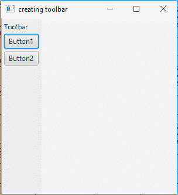

# JavaFX |工具栏类

> 原文:[https://www.geeksforgeeks.org/javafx-toolbar-class/](https://www.geeksforgeeks.org/javafx-toolbar-class/)

ToolBar 类是 JavaFX 的一部分。工具栏是垂直或水平显示项目的控件。按钮、切换按钮和分隔符通常放在工具栏中。您也可以在其中插入任何节点。如果工具栏中容纳的项目太多，允许选择工具栏中当前不可见的项目，将出现溢出按钮。ToolBar 将 focusTraversable 设置为 false。

**该类的构造函数:**

1.  **工具栏()**:创建一个空工具栏。
2.  **工具栏(节点… n)** :创建填充了指定节点的工具栏。

**常用方法:**

| 方法 | 说明 |
| --- | --- |
| getItems（） | 返回工具栏的项目。 |
| getOrientation() | 返回工具栏的方向。 |
| 设置方向(方向五) | 设置对象方向的值。 |

下面程序举例说明 ToolBar 类的使用:

1.  **Java program to create a toolbar and add it to the scene:** In this program we will create a Toolbar named *toolbar*. We will also create a Label named *label* and two Buttons named *button1* and *button2* and add them to the toolbar. Add the toolbar to the VBox named *vbox* and add the *VBox* to the scene. Then add the scene to the stage and call the *show()* function to display the results.

    ```java
    // Java program to create a toolbar
    // and add it to the scene
    import javafx.application.Application;
    import javafx.scene.Scene;
    import javafx.scene.control.*;
    import javafx.scene.layout.*;
    import javafx.stage.Stage;
    import javafx.event.ActionEvent;
    import javafx.event.EventHandler;
    import javafx.scene.Group;

    public class Toolbar extends Application {

        // launch the application
        public void start(Stage stage)
        {

            try {

                // set title for the stage
                stage.setTitle("creating toolbar");

                // create a label
                Label label = new Label("Toolbar");

                // creating buttons
                Button button1 = new Button("Button1");
                Button button2 = new Button("Button2");

                // creating toolbar
                ToolBar toolbar = new ToolBar(label, button1, button2);

                // create a VBox
                VBox vbox = new VBox(toolbar);

                // create a scene
                Scene scene = new Scene(vbox, 300, 300);

                // set the scene
                stage.setScene(scene);

                stage.show();
            }

            catch (Exception e) {

                System.out.println(e.getMessage());
            }
        }

        // Main Method
        public static void main(String args[])
        {

            // launch the application
            launch(args);
        }
    }
    ```

    **输出:**
    

2.  **Java program to create a toolbar and add it to the scene and set the orientation of the toolbar:** In this program we will create a Toolbar named *toolbar*. We will also create a Label named *label* and two Buttons named *button1* and *button2* and add them to the toolbar by using the *getItems().add()* function. Set the orientation of the toolbar using the *setOrientation()* function. Now add the toolbar to the HBox named *hbox* and add the HBox to the *scene*. Finally add the scene to the stage and call the *show()* function to display the results.

    ```java
    // Java program to create a toolbar and
    // add it to the scene and set orientation
    // of the toolbar
    import javafx.application.Application;
    import javafx.scene.Scene;
    import javafx.scene.control.*;
    import javafx.scene.layout.*;
    import javafx.stage.Stage;
    import javafx.event.ActionEvent;
    import javafx.event.EventHandler;
    import javafx.scene.Group;
    import javafx.geometry.*;

    public class Toolbar_1 extends Application {

        // launch the application
        public void start(Stage stage)
        {

            try {

                // set title for the stage
                stage.setTitle("creating toolbar");

                // create a label
                Label label = new Label("Toolbar");

                // creating buttons
                Button button1 = new Button("Button1");
                Button button2 = new Button("Button2");

                // creating toolbar
                ToolBar toolbar = new ToolBar();

                // add items
                toolbar.getItems().add(label);
                toolbar.getItems().add(button1);
                toolbar.getItems().add(button2);

                // set orientation of the toolbar
                toolbar.setOrientation(Orientation.VERTICAL);

                // create a HBox
                HBox hbox = new HBox(toolbar);

                // create a scene
                Scene scene = new Scene(hbox, 300, 300);

                // set the scene
                stage.setScene(scene);

                stage.show();
            }

            catch (Exception e) {

                System.out.println(e.getMessage());
            }
        }

        // Main Method
        public static void main(String args[])
        {

            // launch the application
            launch(args);
        }
    }
    ```

    **输出:**

    

**注意:**上述程序可能无法在在线 IDE 中运行。请使用离线编译器。

**参考:**[https://docs . Oracle . com/javase/8/JavaFX/API/JavaFX/scene/control/toolbar . html](https://docs.oracle.com/javase/8/javafx/api/javafx/scene/control/ToolBar.html)