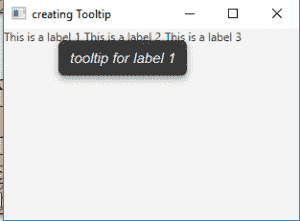
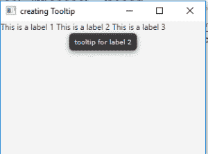
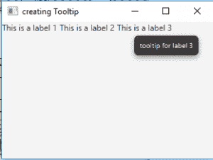

# JavaFX |工具提示

> 原文:[https://www.geeksforgeeks.org/javafx-tooltip/](https://www.geeksforgeeks.org/javafx-tooltip/)

工具提示是 JavaFx 包的一部分。当鼠标悬停在组件上时，工具提示用于向用户显示附加信息。所有组件都可以与工具提示相关联，也可以与屏幕的一部分相关联。

**工具提示类**的构造函数:

1.  **工具提示()**:创建文本为空字符串的工具提示。
2.  **工具提示(字符串 t)** :用指定的文本创建工具提示。

**常用方法**:

| 方法 | 说明 |
| --- | --- |
| **getFont()** | 获取属性字体的值。 |
| **getText（）** | 获取属性文本的值。 |
| **getTextAlignment()** | 获取属性 textAlignment 的值。 |
| **安装(节点 n，工具提示 t)** | 将给定工具提示与给定节点相关联。 |
| **isActivated()** | 获取激活的属性的值。 |
| **setFont(字体 v)** | 设置属性字体的值。 |
| **七字(字串 v)** | 设置属性文本的值。 |
| **设置对齐(文本对齐 v)** | 设置属性文本对齐的值。 |

下面的程序说明了工具提示在 Java 中的使用:

**程序创建一个标签并给标签添加 tooltip 文本**:我们将为标签 l，l1，l2 创建 3 个 Tooltip 对象 t，T1，t2。然后我们将为两个标签 t1 和 t2 设置字体。对于 t，我们将设置 Arial 字体，对于 t1 Tooltip，我们将设置 Verdana 字体。我们将 t1 和 t2 的文本分别设置为左对齐和右对齐，我们可以使用两种方式将工具提示设置为标签:第一种是使用 setTooltip()函数，另一种是使用 install()函数。然后创建一个平铺窗格，在该窗格上调用 addChildren()方法来附加场景内部的标签，以及代码中由(200，200)指定的分辨率。最后调用 show()方法显示最终结果。

```java
// Java program to create label and add Tooltip text to the labels
import javafx.application.Application;
import javafx.scene.Scene;
import javafx.scene.control.*;
import javafx.scene.layout.*;
import javafx.event.ActionEvent;
import javafx.event.EventHandler;
import javafx.collections.*;
import javafx.stage.Stage;
import javafx.scene.text.Text.*;
import javafx.scene.text.*;
public class tooltip extends Application {
    // labels
    Label l, l1, l2;

    // tooltip
    Tooltip t, t1, t2;

    // launch the application
    public void start(Stage s)
    {
        // set title for the stage
        s.setTitle("creating Tooltip");

        // create a tile pane
        TilePane r = new TilePane();

        // create a label
        l = new Label("This is a label 1 ");
        l1 = new Label("This is a label 2 ");
        l2 = new Label("This is a label 3 ");

        // create tooltip for labels
        t = new Tooltip();
        t1 = new Tooltip("tooltip for label 2");
        t2 = new Tooltip("tooltip for label 3");

        // set text for label 1
        t.setText("tooltip for label 1");

        // set font for tooltip
        t.setFont(Font.font("Arial", FontPosture.ITALIC, 15));
        t1.setFont(Font.font("Verdana", FontPosture.REGULAR, 10));

        // set alignment for tooltip text
        t1.setTextAlignment(TextAlignment.LEFT);
        t2.setTextAlignment(TextAlignment.RIGHT);

        // set the tooltip for labels
        l.setTooltip(t);
        l1.setTooltip(t1);
        Tooltip.install(l2, t2);

        // add label
        r.getChildren().add(l);
        r.getChildren().add(l1);
        r.getChildren().add(l2);

        // create a scene
        Scene sc = new Scene(r, 200, 200);

        // set the scene
        s.setScene(sc);

        s.show();
    }

    public static void main(String args[])
    {
        // launch the application
        launch(args);
    }
}
```

**输出** :






**注意:**上述程序可能无法在联机 IDE 中运行，请使用脱机编译器。

**参考:**[https://docs . Oracle . com/javase/8/JavaFX/API/JavaFX/scene/control/tooltip . html](https://docs.oracle.com/javase/8/javafx/api/javafx/scene/control/Tooltip.html)