# JavaFX 教程

> 原文:[https://www.geeksforgeeks.org/javafx-tutorial/](https://www.geeksforgeeks.org/javafx-tutorial/)

在 Java 编程语言中，有许多开发人员用来开发图形用户界面应用程序的库。这些库包括 Java Swing 和高级窗口工具包。Sun Microsystems(现由甲骨文公司收购)发布了另一个名为 **JavaFX** 的 Java 库和工具包，以推广可从设备类别访问的桌面和丰富的互联网应用程序(RIA)。在 JavaFX 出现后，Java 开发人员和程序员能够更有效、更高效地开发 GUI 应用程序。

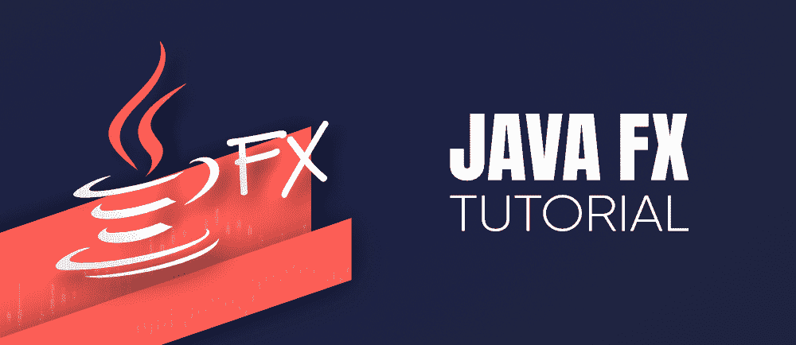

### **什么是 JavaFX？**

JavaFX 是一个 Java 库和图形用户界面工具包，旨在开发和促进丰富的互联网应用程序、网络应用程序和桌面应用程序。使用 JavaFX 最显著的好处是，使用该库编写的应用程序可以在多个操作系统上运行，如 Windows、Linux、iOS、安卓，以及桌面、网络、手机、电视、平板电脑等多个平台。JavaFX 库的这一特性使其在操作系统和不同平台上非常通用。

> **注意:**丰富的互联网应用程序是那些允许与桌面应用程序相似的特征和专业知识的网络应用程序。与标准 web 应用程序相比，这些应用程序为用户提供了更令人满意的视觉体验。

引入 JavaFX 是为了取代 Java Swing GUI 框架。然而，JavaFX 比 Java Swing 提供了更多增强的功能和特性。与 Java Swing 类似，JavaFX 也实现了自己的组件。JavaFX 的组件与操作系统无关。JavaFX 被认为是轻量级的，并且受到硬件的刺激。根据一份报告，在使用 JavaFX 开发富互联网应用程序(RIA)后，这些应用程序的浏览器渗透率为 76%。

### **需要 JavaFX**

在 JavaFX 之前，开发客户端应用程序是一项非常复杂和繁琐的任务。程序员和开发人员过去需要几个库来添加各种功能，如媒体、用户界面控件、动画和效果、2D 和 3D 形状等。，在他们的应用中。当 JavaFX 出现时，这个问题得到了解决，它通过将所有特性引入一个单一的库，改变了 web 应用程序开发的整个场景。除此之外，程序员还可以利用旧库的所有现有优势，如 Java Swing 和高级窗口工具包。

JavaFX 还显示了有价值的图形和各种媒体 API 的集合，这可以进一步帮助设计流畅的应用程序。JavaFX 还在硬件加速图形的帮助下利用了改进的图形处理单元(GUI)。如果开发人员希望将图形动画和用户界面控件结合到他们的应用程序中，那么他们可以使用 JavaFX 提供的各种接口。

**历史上的贾法克斯**

JavaFX 以前是由克里斯·奥利弗开发的。当时，他在一家名为 See Beyond Technology Corporation 的公司任职。最初，JavaFX 项目被认为是表单跟随函数(F3)。该项目旨在为开发图形用户界面应用程序提供更丰富的界面。后来在 2005 年 6 月，Sun Micro-systems 接手了 F3 项目，并将其名称从 F3 改为 JavaFX。

**JavaFX 的时间线**

*   **2005 年–**太阳微系统公司于 2005 年 6 月接管了 See Beyond 公司，并将 F3 项目收购为 JavaFX。
*   **2007–**JavaFX 在每年举行的全球网络会议 Java One 上正式宣布成立。
*   **2008–**Net Beans 与 JavaFX 的集成开放。JavaFX 1.0 的 Java 标准开发工具包也在同一年发布。
*   **2009–**JavaFX 的下一个版本发布了，即 JavaFX 1.2，同时也引入了对 JavaFX Mobile 的支持。仅在同一年，甲骨文公司也收购了太阳微系统公司。
*   **2010 年–**JavaFX 1.3 版本于 2010 年发布。
*   **2011 年–**2011 年，JavaFX 版本问世。
*   **2012–**推出桌面对 JavaFX Mac OS 的支持。
*   **2014–**JavaFX 最先进的版本，即 JavaFX 8，于 2014 年 3 月 18 日作为 Java 不可或缺的一部分发布。

### JavaFX 的特性

JavaFX 是一个基于 Java 的开源框架，用于推进富客户端应用。JavaFX 在 Java 平台的图形用户界面(GUI)开发技术领域被公认为 Java Swing 的替代者或继承者。JavaFX 库作为公共 Java 应用程序编程接口(API)提供。

JavaFX 库包含许多特性，使其成为开发人员开发富客户端应用程序的精选选项。这些特征如下:

1.  **Java 库–**JavaFX 是一个 Java 库，它允许用户获得所有 Java 特性的支持，比如多线程、泛型、lambda 表达式等等。用户还可以使用他们选择的任何 Java 编辑器或 IDE，如 Eclipse、NetBeans，来编写、编译、运行、调试和打包他们的 JavaFX 应用程序。

2.  **平台无关–**使用 JavaFX 制作的丰富互联网应用是平台无关的。JavaFX 库对所有可以在 JVM 上管理的脚本语言开放，包括——Java、Groovy、Scala 和 JRuby。

3.  **FXML–**JavaFX 强调一种类似 HTML 的声明性标记语言，称为 FXML。FXML 基于可扩展标记语言(XML)。这种标记语言的唯一目的是指定用户界面。在 FXML 中，编程可以通过改进的图形用户界面来适应用户。

4.  **场景构建器–**JavaFX 还实现了一个名为场景构建器的工具，它是 FXML 的可视化编辑器。场景构建器生成可以传输到集成开发环境(如 Eclipse 和 NetBeans)的 FXML 标记，这进一步帮助用户将业务逻辑结合到他们的应用程序中。用户还可以使用拖放设计界面，该界面用于设计 FXML 应用程序(就像 Java Swing 和 DreamWeaver 应用程序的&拖放功能一样)。

5.  **硬件加速图形管道–**JavaFX 应用程序的图形基于硬件加速图形渲染管道，通常称为 Prism。棱镜引擎提供平滑的 JavaFX 图形，当与受支持的显卡或图形处理单元(GPU)一起使用时，可以快速渲染。在系统没有图形卡的情况下，棱镜引擎默认为软件渲染堆栈。

6.  **WebView–**JavaFX 应用也可以插入网页。为了嵌入网页，JavaFX 的 Web View 使用了一种新的 HTML 呈现引擎技术，称为 WebKitHTML。WebView 用于在 JavaFX 应用程序中插入网页。在 WebView 中运行的 JavaScript 可以调用 Java APIs，反之亦然。

7.  **内置 UI 控件–**JavaFX 包含所有主要的内置 UI 控件，有助于开发功能完善的应用程序。这些内置的用户界面组件不依赖于操作系统。简而言之，这些控件不依赖于任何操作系统，如视窗、iOS、安卓等。这些内置控件足以单独执行应用程序的整个实现。

8.  **CSS 样式化–**就像网站使用 CSS 进行样式化一样，JavaFX 也提供了将应用程序与 CSS 样式化集成的功能。通过对 CSS 样式的简单了解和理解，用户可以增强他们的应用程序的样式，也可以改善他们的实现前景。

9.  **丰富的 API 集合–**JavaFX 库还提供了一个有价值的 API 集合，有助于开发 GUI 应用程序、2D 和 3D 图形等。这个 API 集合还包括了 Java 平台的所有特性。因此，使用这个应用编程接口，用户可以访问 Java 语言的特性，如泛型、注释、多线程和 Lambda 表达式，以及许多其他特性。在 JavaFX 中，流行的 Java Collections 库也得到了改进，并引入了列表和地图等概念。使用这些 API，用户可以看到数据模型的变化。

10.  **高性能媒体引擎–**与图形管道一样，JavaFX 也拥有一个媒体管道，可以在低延迟下推进稳定的互联网多媒体播放。这种高性能的媒体引擎或媒体管道基于一个被称为 Gstreamer 的多媒体框架。

### JavaFX 的体系结构

JavaFX 有许多相互连接的内置元素。JavaFX 库包含了一系列有价值的 API、类和接口，足以产生丰富的互联网应用程序和图形用户界面应用程序，这些应用程序具有可以在多个平台上一致运行的强大图形。

下图显示了 JavaFX 平台的完整架构。在这里，您可以检查支持 JavaFX API 的元素。

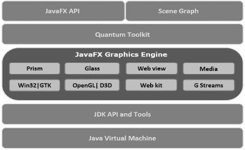

从上图中我们可以看到，JavaFX 架构包含许多不同的组件。这些组件简述如下:

1.  **JavaFX API–**JavaFX 架构的最顶层拥有一个 JavaFX 公共 API，该 API 实现了能够产生具有丰富图形的全功能 JavaFX 应用程序所需的所有类。这个 API 的所有重要包的列表如下。
2.  **javafx.animation:** 它包括用于将基于过渡的动画(如填充、渐变、旋转、缩放和平移)组合到 javafx 节点的类(节点的集合构成了场景图)。
3.  **javafx . css-**它包含用于向 JavaFX 图形用户界面应用程序添加类似 CSS 的样式的类。
4.  它包含用于表示 2D 图形并在其上执行方法的类。
5.  **JavaFX . scene**这个 JavaFX API 包实现了类和接口来建立场景图。在扩展中，它还呈现子包，如画布、图表、控件、效果、图像、输入、布局、媒体、绘画、形状、文本、变换、网页等。这些是支持这个珍贵的 JavaFX 应用编程接口的各种元素。
6.  **javafx . application-**这个包包括一组负责 JavaFX 应用程序生命周期的类。
7.  **javafx . event-**它包括用于执行和管理 JavaFX 事件的类和接口。
8.  这个 javafx 应用编程接口包容纳了用于 JavaFX 应用程序的顶级容器类。
9.  **场景图–**场景图是任何图形用户界面应用程序开发的起点。在 JavaFX 中，所有的图形用户界面应用程序都只使用场景图。场景图包括被称为节点的丰富互联网应用程序的原语。简单地说，场景图中的单个组件被称为节点。一般来说，场景图由一组节点组成。所有这些节点都以分层树的形式组织，描述了应用程序用户界面的所有可视组件。一个节点实例只能追加到场景图中一次。场景图的节点可以有许多段，如效果、不透明度、变换、事件处理程序、应用程序特定状态。节点有三种一般类型。

这些措施如下:

*   **根节点–**根节点是指没有任何节点作为其父节点的节点。
*   **叶节点–**叶节点是不包含任何节点作为其子节点的节点。
*   **分支节点–**分支节点是指包含一个节点作为其父节点，同时也包含一个节点作为其子节点的节点。

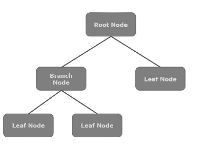

**10。Quantum Toolkit–**Quantum Toolkit 用于将棱镜和玻璃开窗工具包集中连接起来，并使它们为堆栈中的上述层做好准备。简单地说，它将 Prism 和 GWT 联系在一起，并使它们对 JavaFX 可用。

**11 时。Prism–**JavaFX 应用程序的图形基于硬件加速的图形渲染管道，通常称为 Prism。棱镜引擎支持平滑的 JavaFX 图形，当与支持的显卡或图形处理单元(GPU)一起使用时，可以快速执行。在系统不包含图形卡的情况下，棱镜引擎默认为软件渲染堆栈。解读图形，棱镜练习

*   Windows XP 和 Vista 上的 DirectX 9。
*   Windows 7 上的 DirectX 11。
*   嵌入式系统。

**12 时。Glass Windowing Toolkit–**Glass Windowing Toolkit 或简称 Glass，是一个平台相关层，有助于将 JavaFX 平台连接到主操作系统(OS)。Glass Windowing Toolkit 非常有用，因为它为本机操作系统提供了诸如控制窗口、事件、计时器和表面等服务。

**13。WebView–**JavaFX 应用程序也可以插入网页。为了嵌入网页，JavaFX 的 Web View 使用了一种新的 HTML 呈现引擎技术，称为 WebKitHTML。WebView 用于在 JavaFX 应用程序中插入网页。出现在 WebView 中的 JavaScript 可以调用 Java APIs，反之亦然。这个元素促进了不同的网络技术，比如 HTML5、CSS、JavaScript、DOM 和 SVG。使用 web 视图，我们可以执行来自 JavaFX 应用程序的 HTML 内容，还可以为应用程序的用户界面(UI)部分实现一些 CSS 样式。

**14。媒体引擎–**与图形管道一样，JavaFX 也拥有一个媒体管道，可以在低延迟下推进稳定的互联网多媒体播放。这种高性能的媒体引擎或媒体管道基于一个被称为 Gstreamer 的多媒体框架。通过应用 Media 引擎，JavaFX 应用可以支持音视频媒体文件的播放。软件包 **javafx.scene.media** 涵盖了可以为 javafx 应用程序提供媒体功能的所有类和接口。

以上是构成 JavaFX 架构的组件。

### **JavafX 应用程序的生命周期**

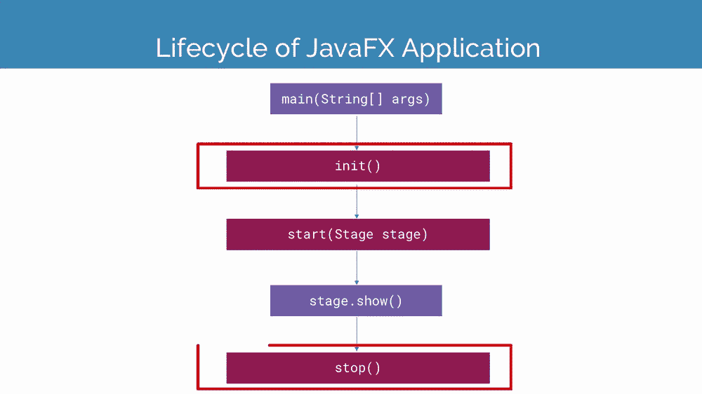

一个 JavaFX 应用程序类总共有三种生命周期方法。这些方法是–

*   **start()–**start()方法是 JavaFX 应用程序的入口点方法，JavaFX 的所有图形代码都要写在这里。
*   **init()–**init()方法是一个可以被覆盖的空方法。在这种方法中，用户不能创建舞台或场景。
*   **stop()–**stop()方法是一个空方法，也可以被覆盖，就像 init()方法一样。在这种方法中，用户可以编写代码来暂停应用程序。

除了这些方法之外，JavaFX 应用程序还实现了一个名为 **launch()的静态方法。**此 launch()方法用于启动 JavaFX 应用程序。如前所述，launch()方法是静态的，用户应该只从静态方法调用它。通常，调用 launch()方法的静态方法只是 main()方法。

每当用户启动一个 JavaFX 应用程序时，只有很少的操作是以特定的方式执行的。下面是 JavaFX 应用程序的启动顺序。

1.  首先，创建一个应用程序类的实例。
2.  之后，调用 init()方法。
3.  在 init()方法之后，调用 start()方法。
4.  调用 start()方法后，启动器等待 JavaFX 应用程序结束，然后调用 stop()方法。

**终止 JavaFX 应用程序**

一旦 JavaFX 应用程序的最后一个窗口关闭，JavaFX 应用程序就会隐式停止。用户可以通过将布尔值“False”传递给静态方法 **setImplicitExit()来关闭该功能。**该方法应始终仅从静态上下文中调用。

用户还可以通过练习两种方法中的任何一种来显式停止一个 JavaFX 应用程序， **Platform.exit()** 或 **System.exit(int)** 。

**JavaFX 的用户界面组件**

JavaFX 包含所有主要的内置 UI 组件，有助于开发功能完善的应用程序。这些内置的用户界面组件不依赖于操作系统。简而言之，这些控件不依赖于任何操作系统，如视窗、iOS、安卓等。这些内置控件足以单独执行应用程序的整个实现。

用户可以在他们的应用程序中添加许多组件，使它们看起来更高级，图形更丰富。这些段的定义如下:

### **贾法克斯 2D 形状**

任何可以用两个平面(即 X 和 Y 平面)在坐标系上表示的几何形状都称为二维形状或 2D 形状。2D 形状的例子有直线、正方形、矩形、圆形、日蚀等。

JavaFX 允许用户在他们的 JavaFX 应用程序中灵活地添加和创建这些 2D 形状。JavaFX API 中有几个类用于在 JavaFX 应用程序中执行 2D 形状。所有这些类别的 2D 形状都是 javafx.scene.shape 包的一部分。名为**形状**的类是 JavaFX 中所有二维形状的根类。这个包中有许多类，包含各种各样的 2D 形状。
创建 2D 形状的步骤如下:

**步骤 1:** 在 JavaFX 应用程序中添加 2D 形状的第一步是实例化所需形状的相应类。出于说明的目的，考虑一下如果用户想要向他们的 JavaFX 应用程序添加一行，他们应该首先实例化 **javafx.scene.shape.line** 类。他们还需要实例化同一个类的对象，如下定义:

```
Line line = new Line();
```

**步骤 2:** 类和对象实例化后，用户还应该使用 setter 函数设置所需形状的属性。出于说明的目的，考虑如果用户想要向他们的 JavaFX 应用程序添加一条线，那么在实例化之后，他们应该设置线的起点和终点的 X 和 Y 坐标，定义如下:

```
line.setStartX(0);  
line.setStartY(0);          
line.setEndX(100);  
line.setEndY(200);
```

**第三步:**完成以上两步后，用户的第三步是将所需形状实例化的对象添加到组中，方法是将其声明为构造函数的参数。出于说明的目的，考虑如果为了在 JavaFX 应用程序中获得一条线，用户应该将线条形状的实例化对象添加到组中，那么它的定义如下:

```
Group root = new Group();
root.getChildren().add(line); 
```

**2D 形状的类型**

在 javafx 的 **javafx.scene.shape** 包中，用户可以在他们的应用程序中使用许多可用的形状。下面是 JavaFX 提供的各种 2D 形状的列表。

*   **线–**在 2D 坐标系中连接两个坐标(X 和 Y)的几何结构称为线。如果用户想要在他们的 JavaFX 应用程序中创建一条线，那么他们应该实例化 **javafx.scene.shape.Line** 类。
*   **矩形–**矩形是一种几何形状，有两组相同的边，在它们的接合处有四个直角。如果用户想在他们的 JavaFX 应用程序中创建一个矩形，那么他们应该实例化**JavaFX . scene . shape . rectangle**类。
*   **椭圆–**一般来说，椭圆可以定义为有两个焦点的曲线。在椭圆中，从椭圆的每个点到焦点的距离总和是恒定的。如果用户想在他们的 JavaFX 应用程序中创建一个椭圆，那么他们应该实例化**JavaFX . scene . shape . ellipse**类。
*   **圆–**一般来说，一种特定类型的椭圆，其两个焦点位于同一位置，称为圆。如果用户想在他们的 JavaFX 应用程序中创建一个圆，那么他们应该实例化**JavaFX . scene . shape . circle**类。
*   **弧–**弧可以定义为圆或椭圆圆周的一部分。如果用户想要在他们的 JavaFX 应用程序中创建一个弧，那么他们应该实例化 **javafx.scene.shape.Arc** 类。
*   **多边形–**一般来说，多边形是一种几何形状，可以通过连接各种协同规划线段来形成。如果用户想在他们的 JavaFX 应用程序中创建一个多边形，那么他们应该实例化**JavaFX . scene . shape . polygon**类。
*   **三次曲线–**XY 平面上 3 度的曲线称为三次曲线。如果用户想在他们的 JavaFX 应用程序中创建一条三次曲线，那么他们应该实例化**JavaFX . scene . shape . cubic curve**类。
*   **四次曲线–**XY 平面中 2 度的曲线称为四次曲线。如果用户想在他们的 JavaFX 应用程序中创建一个四元曲线，那么他们应该实例化**JavaFX . scene . shape . quad curve**类。

### JavaFX 效果

任何改善图形显示的行为或运动都称为效果。在 JavaFX 中，我们可以说，任何应用于节点以在视觉上增强其外观的算法都是一种效果。为了指定效果，使用了节点类的效果属性。

JavaFX 让用户可以灵活地在其 JavaFX 应用程序中添加各种效果，如绽放、模糊和发光。JavaFX API 中有几个类用于在 JavaFX 应用程序中执行这些效果。所有这些类别的效果都是 **javafx.scene.effects** 包的一部分。名为 Effect 的类是 JavaFX 中所有效果的根类。这个包中有很多类，包含各种各样的效果。

为了向节点添加效果，用户需要按如下顺序执行这些步骤:

**步骤 1:** 对 Node 应用效果的第一步是通过实例化它们各自的类来创建 JavaFX 应用程序中的所有节点。出于说明的目的，考虑如果用户想要在他们的应用程序中对图像应用发光效果，那么他们应该首先通过实例化图像类来创建图像节点。之后，他们应该将其视图设置如下所示:

> //创建图像
> 
> img 映像=新映像(“https://media . geeksforgeeks . org/WP-content/uploads/20210224040124/jsbincollaborative javacriptdebug 6 . png”)；
> 
> //设置图像视图
> 
> image view img view = new image view(img)：
> 
> //设置图像的位置
> 
> imgView.setX（100）;
> 
> imgView.setY（100）;
> 
> //设置图像视图的适合高度和宽度
> 
> imgview . setfitheight(200)；
> 
> imgview . setfitwidth(400)；
> 
> //设置图像视图的保留比例
> 
> img view . set preservation(true)的缩写形式：

**步骤 2:** 在创建图像节点并设置图像视图之后，用户应该实例化表示需要应用于所创建的节点的所需效果的类。出于说明的目的，考虑用户是否希望在他们的应用程序中应用发光效果，那么他们需要实例化发光类，如下所示:

```
Glow glow = new Glow();
```

**步骤 3:** 实例化所需效果的类后，用户需要使用其 setter 方法为实例化的效果设置属性。出于说明目的，假设用户可以使用如下所示的方法设置发光效果的属性:

```
// Setting the level property
glow.setLevel(0.9);
```

**第四步:**经过以上三步，用户最终可以使用 setEffect()方法将所需的效果应用到节点上。

**例如–**用户可以通过将 glow 类的对象传递给该方法来设置图像节点的发光效果，如下所示–

```
imgView.setEffect(glow); 
```

### JavaFX 效果的类型

在 javafx 的 **javafx.scene.effect** 包中，用户可以在他们的应用程序中使用许多可用的效果。下面是 JavaFX 提供的这些效果的各种类的列表。

1.  **混合物–**两种或两种以上不同物质的混合物被称为混合物。如果用户应用混合效果，则该效果会在同一位置获取两个不同输入的像素，并基于混合模式创建混合(组合)输出。类**JavaFX . scene . effect . blend**代表混合效果。

2.  **发光–**JavaFX 的发光效果使提供的输入图像发光。利用这种效果，可以使输入的亮像素变得更亮。类 **javafx.scene.effect.Glow** 代表发光效果。

3.  **发光–**就像发光效果一样，在发光效果中，节点某些部分的像素也会发光。类**JavaFX . scene . effect . bloom**代表 bloom effect。

4.  **阴影–**阴影效果是生成给定节点的副本的效果，具有一些模糊的边缘。类**JavaFX . scene . effect . shadow**代表阴影效果。

5.  **反射–**在 JavaFX 的反射效果中，每当用户将该效果应用到指定节点时，就会在节点的底部追加该节点的反射。类**JavaFX . scene . effect . reflection**代表反射效果。

6.  **颜色调整–**在 JavaFX 中，用户还可以通过对图像实施颜色调整效果来改变图像的颜色。这种效果包括调整每个像素的色调、饱和度、亮度和对比度。类**表示颜色调整效果。** 
7.  **SepiaTone–**在 JavaFX 中，当将 Sepia 色调效果应用于 JavaFX 的节点(大多数情况下为图像)时，该节点会被染成红棕色。类**表示棕褐色调效果。** 
8.  **照明–**用于模拟光源发出的光线的效果称为照明效果。在 JavaFX 中，可以有各种各样的光源，特别是点光源、远光源和点光源。类**JavaFX . scene . effect . Lighting**代表灯光效果。

9.  **内阴影–**当用户将该效果应用于节点时，该节点的阴影将在该节点的边缘内部生成。类**表示内部阴影效果。**

### **JavaFX 文本**

就像几个形状和效果一样，用户也可以在 JavaFX 中创建一个应用不同文本的节点。文本节点由名为 **Text** 的类表示，该类属于 **javafx.scene.text** 包。这个文本类包含了许多在 JavaFX 中生成文本并改变其外观的特性。文本类的另一个特点是这个类也继承了 JavaFX 的 Shape 类，它属于 **javafx.scene.shape** 包。因此，扩展到文本的特征，如字体、对齐方式、行距、文本等。，它还获取了基本的形状节点属性，如 strokeFill、strokeWidth、strokeType 等。

要创建文本节点，用户需要遵循以下特定步骤:

**步骤 1:** 在 JavaFX 应用程序中创建文本节点的第一步是实例化文本节点的相应类。

**说明:**包 javafx.scene.text 的类 Text 表示 javafx 中的文本节点。用户可以通过实例化这个类来创建文本，如下所示:

```
Text txt = new Text();
```

**第二步:**实例化文本节点对应的类后，在 JavaFX 中创建文本节点的第二步是使用 setter 函数设置所需文本的属性。

**说明:**实例化 Text 类后，用户需要使用 setText()方法将值设置为此属性，如下所示:

```
String text = "Hello how are you"  
txt.setText(text);
txt.setX(50);  
txt.setY(50);
```

**第三步:**完成以上两步后，用户的第三步是将所需文本实例化的对象添加到组中，方法是将其声明为构造函数的参数。

**说明:**为了在 JavaFX 应用程序中获取文本，用户应该将文本节点的实例化对象添加到组中。

```
Group root = new Group();
root.getChildren().add(txt); 
```

### JavaFX 文本的属性

下表显示了 JavaFX 文本的属性。

<figure class="table">

| 

#### **Attribute**

 | 

#### **Description**

 | 

#### **Setting method**

 |
| --- | --- | --- |
| 字体 | 它表示文本的字体。 | setFont(字体值) |
| **行距** | 它以像素为单位表示线条之间的垂直间距。这个属性的类型是 double。 | 设置行间距(双倍间距) |
| **文字** | 它表示要呈现的文本字符串。此属性的类型是字符串。 | 设置文本(字符串值) |
| **下划线** | 使用此属性，用户可以通过将其设置为 true 来给文本加下划线。此属性的类型是布尔型。 | 设置下划线(布尔值) |
| **X** | 它表示文本的 X 坐标。 | setX(双值) |
| **Y** | 它表示文本的 Y 坐标。 | setY(双数值) |
| **穿过** | 在此属性的帮助下，用户可以通过将此属性设置为 true 来在文本中插入一行。此属性的类型是布尔型。 | 设置删除线(布尔值) |
| **包裹宽度** | 它以像素为单位表示线条之间的垂直间距。这个属性的类型是 double。 | setWrappingWidth(双精度值) |
| **文本对齐** | 它将文本设置为水平对齐 | 设置对齐(文本对齐值) |

</figure>

### JavaFX 动画

产生物体运动神话的过渡称为动画。动画还可以定义为在指定的持续时间内对对象顺序执行的一组转换，以便对象可以按其实际状态显示。这可以通过快速显示帧来实现。在 JavaFX 中，包 **javafx.animation** 包括所有帮助将动画应用到节点上的类。这个包的所有类都扩展了类**JavaFX . animation . animation**。JavaFX 为转换提供了类，如旋转转换、缩放转换、平移转换、渐变转换、填充转换、存储转换等。

将动画应用到目标节点的步骤如下:

要将特殊动画应用到目标节点，用户应遵循以下步骤:

**步骤 1:** 将动画应用到特定节点的第一步是使用节点的相应类创建该节点。

```
Square sqr = new Square(100,100,100,100);    
sqr.setFill(Color.GREEN);  
```

**步骤 2:** 创建节点后，下一步是实例化要应用于创建的节点的相应动画类。

```
RotateTransition rotate = new RotateTransition();  
```

**步骤 3:** 在实例化各自的动画类之后，在步骤中，用户应该设置动画的属性。

```
rotate.setDuration(Duration.millis(2000));    
rotate.setAxis(Rotate.Y_Axis);  
rotate.setCycleCount(1000);  
```

**第四步:**下一步，用户要设置动画将要应用的目标节点。

```
rotate.setNode(sqr);  
```

**步骤 5:** 完成上述所有步骤后，将动画应用到目标节点的最后一步是使用 animation 类的 play()方法播放应用的动画。

```
rotate.play(); 
```

### 不同类别的 JavaFX 动画/过渡

在 javafx 的 javafx.animation 包中，有许多可供用户在应用程序中使用的转换。以下是 JavaFX 提供的各种动画列表。

*   **缩放过渡–**缩放过渡用于在特定持续时间内对选择性节点的缩放进行动画制作。如果用户想要在他们的 JavaFX 应用程序中实现节点的缩放转换，那么他们应该实例化**JavaFX . animation . scale transition**类。

*   **平移转换**–平移转换用于在特定持续时间内将选择性节点从一个位置平移到另一个位置。如果用户想要在他们的 JavaFX 应用程序中实现到一个节点的翻译转换，那么他们应该实例化**JavaFX . animation . translate transition**类。

*   **旋转过渡**–旋转过渡用于在特定持续时间内通过其中一个轴旋转选择节点。如果用户想要在他们的 JavaFX 应用程序中实现到一个节点的旋转转换，那么他们应该实例化**JavaFX . animation . rotateransition**类。

*   **渐变过渡–**渐变过渡用于制作节点不透明度的动画。简而言之，我们可以说渐变过渡在特定的持续时间内保持刷新节点的不透明度，以便达到最终的不透明度值。如果用户想要在他们的 JavaFX 应用程序中实现到一个节点的渐变，那么他们应该实例化**JavaFX . animation . fade transition**类。

*   **描边过渡**–描边过渡用于为节点的描边颜色设置动画，以便节点的描边颜色在特定持续时间内在两个颜色值之间变化。如果用户想要在他们的 JavaFX 应用程序中实现到节点的笔画转换，那么他们应该实例化**JavaFX . animation . stroke transition**类。

*   **并行过渡**–并行过渡用于以并行方式在选择的节点上执行多个动画。如果用户想要在他们的 JavaFX 应用程序中实现到一个节点的并行转换，那么他们应该实例化**JavaFX . animation . parallel transition**类。

*   **填充过渡**–填充过渡用于激活选择性节点的填充颜色，以便节点的填充颜色在特定持续时间内在两个颜色值之间变化。如果用户想要在他们的 JavaFX 应用程序中实现到节点的填充转换，那么他们应该实例化**JavaFX . animation . fill transition**类。

*   **路径转换**–路径转换用于在特定持续时间内沿着指定路径移动选择节点。如果用户想要在他们的 JavaFX 应用程序中实现到一个节点的路径转换，那么他们应该实例化**JavaFX . animation . path transition**类。

### 三维形状

任何可以在坐标系中使用三个平面(即 X、Y 和 Z 平面)表示的立体几何图形都称为三维形状或三维形状。3D 形状和 2D 形状之间的主要区别在于，与 2D 形状相比，3D 形状总是需要额外的坐标值 Z，以便在坐标系上绘制。

有许多基本的三维形状，我们每天都会看到，如圆柱体、球体、盒子、立方体、金字塔等。然而，JavaFX 只实现了 3 个类来创建 3D 形状。这些类别包括球体、圆柱体和盒子。这些类在 **javafx.scene.shape** 包中定义。这个包提供了处理三维形状的所有方法。包 javafx.scene.shape 的类 Shape3D 是 javafx 中所有 3D 形状类的基类。

**JavafX 中 3D 形状的类型**

在 JavaFX 中，3D 形状有两种不同的特征。这些是:

**1。预定义的 3D 形状:**预定义的 3D 形状是其类已经存在于 JavaFX 应用编程接口中的形状。这些形状是圆柱体、球体和长方体。为了在 JavaFX 应用程序中创建这些形状，用户只需要实例化这些类。这些类包括生成正确形状所需的几个属性和方法。

**2。用户定义的 3D 形状:** JavaFX 提供类**JavaFX . scene . shape . trianglemesh**，它扩展了抽象类 j**avafx . scene . shape . mesh .**这个类方便用户定义自己的点、纹理坐标和面作为类的属性。

### 创建三维形状的步骤:

如上所述，JavaFX 中不同的 3D 形状有不同的类。为了创建三维形状，用户只需要实例化这些类。用户可以使用以下步骤在他们的 JavaFX 应用程序中生成适当的形状。

**1。**第一步是实例化用户想要构建的相应 3D 形状的类。

**例如–**如果用户希望创建一个 Box，那么他应该实例化 JavaFX 的 Box 类。

```
Box box = new Box();  
```

**2。**实例化类后，下一步是设置实例化类的属性。

**例如–**如果用户已经实例化了 JavaFX 的 Box 类，那么他应该设置 Box 类的高度、宽度和深度等属性。

```
box.setHeight(100.0);  
box.setDepth(80.0);  
box.setWidth(60.0);    
```

**3。**经过以上两个步骤，用户要为场景设置摄像头。简而言之，用户可以将相机设置到相机视图的特定位置。但是，这一步是可选的。用户可以使用以下代码设置摄像机视图–

```
PerspectiveCamera cam = new PerspectiveCamera();    
cam.setTranslateX(100.0);  
cam.setTranslateY(80.0);  
cam.setTranslateZ(-50.0);  
scene.setCamera(cam)  
```

**4。**为 JavaFX 应用程序创建 3D 形状的最后一步是将 3D 形状附加到场景图，并为场景和舞台设置相关属性。

**例如:**如果用户已经实例化了盒子类，那么他应该将该类与场景图和舞台链接起来。

```
Group root = new Group();    
root.getChildren().add(box);    
Scene scene = new Scene(root,500,500);  
primaryStage.setScene(scene);  
primaryStage.setTitle("3D shape Example");  
primaryStage.show();
```

**不同类别的 JavaFX 3D 形状**

在 JavaFX 中，基本上有 3 个预定义的 3D 形状类可供用户在他们的应用程序中使用。以下是 JavaFX 提供的各种 3D 形状的简要介绍。

*   **球体–**球体可以定义为完美的圆形实体三维对象。在 JavaFX 中，类**代表球体。**
*   **盒子–**一般来说，盒子可以定义为所有面都是矩形的三维形状。盒子的三个维度是高度、宽度和深度。在 JavaFX 中，类**T3【JavaFX . scene . shape . Box】代表 Box。**
*   **圆柱体**–圆柱体可以定义为一个三维实体，它有两个平行的圆形底座，由一个曲面连接。它有两个主要属性，如半径和高度。在 JavaFX 中，类 javafx.scene.shape.Cylinder 用来表示圆柱体。

### JavaFX 转换

转换意味着通过实现各种规则将一些图形修改成不同的东西。在 JavaFX 中，有不同种类的转换，如平移、向上或向下缩放、旋转、剪切等。

使用 JavaFX，用户可以在节点上实现转换，例如旋转、缩放和平移。所有这些转换都由几个类表示，这些类属于包**JavaFX . scene . transform .**

**不同类的 JavaFX 转换**

在 JavaFX 中，基本上有 4 个预定义的 JavaFX 转换类可供用户在他们的应用程序中使用。下面是 JavaFX 提供的各种转换的简要介绍。

*   **旋转–**旋转用于将对象从其源旋转一定角度。类**表示旋转。**
*   **平移–**平移用于修改节点的位置。类**代表翻译。**
*   **缩放–**缩放用于修改节点的大小。类**表示缩放。**
*   **剪切–**剪切用于改变物体在特定方向上的斜度。类**表示剪切。**

**对目标节点应用转换的步骤如下:**

要对目标节点应用特殊转换，用户应该遵循下面给出的步骤:

**1。**第一步是实例化用户想要应用的相应转换的类。

**例如–**如果用户想要在特定节点上应用翻译转换，那么他应该实例化翻译类。

```
TranslateTransition translate = new TranslateTransition();  
```

**2。**实例化类后，下一步是设置实例化类的属性。

**例如–**如果用户已经实例化了 JavaFX 的 translate 转换类，那么他应该设置诸如 translate byX、translate byY、duration 和 translated 类的循环计数等属性。

```
translate.setByX(400);          
translate.setDuration(Duration.millis(1000));  
translate.setCycleCount(500);  
```

**3。**将转换设置到相应的节点，并使用 play()方法播放转换。

**例如:**假设用户想要翻译一个特定的节点，那么在实例化一个转换类并设置其值之后，用户应该使用应该播放翻译的节点的名称来设置节点。

```
translate.setNode(name of the node);  
translate.play();  
```

### **JavaFX 用户界面控件**

用户界面控件是真正向用户公开的元素，用于相互通信或信息交换。布局表示屏幕上用户界面元素的结构。响应是用户界面组件在发生某个事件时的反应。

但是，包 **javafx.scene.control** 实现了按钮、标签等 UI 元素所需的所有类。每个类都描述一个特定的用户界面控件，并且很少解释它们的样式方法。

**不同类别的 JavaFX UI 控件**

在 JavaFX 中，有许多用户在他们的应用程序中使用的用户界面控件。下面是使用 JavaFX 设计图形用户界面时通常使用的用户界面控件列表。

*   **按钮–**按钮是控制应用程序功能的组件。按钮类用于生成指定的按钮。它由**JavaFX . scene . control . button**类表示。
*   **标签–**标签是应用于描述屏幕上纯文本的元素。通常，标签是用节点设置的，它表示。它由**JavaFX . scene . control . label**类表示。
*   **文本字段–**文本字段通常用于以文本的形式接受用户的输入。它由**JavaFX . scene . control . textfield**类表示。
*   **进度条–**进度条用于向用户显示输出过程。它由**JavaFX . scene . control . progress bar**类表示。
*   **单选按钮–**单选按钮用于向用户提供各种选项。用户只能在所有选项中选择一个。单选按钮有两个选项，可以选择也可以取消选择。它由**JavaFX . scene . control . radio button**类表示。
*   **复选框–**复选框用于从用户处获取包含各种选项的信息。用户将复选框标记为开(真)或关(假)。JavaFX 中的 CheckBox 由**JavaFX . scene . control . CheckBox**类表示。
*   **滑块–**滑块用于以图形形式向用户提供选项窗格，用户需要在值范围内移动滑块来选择其中一个选项。它由**Java FX . scene . control . slider**类表示。
*   **菜单–**JavaFX 提供了一个菜单类来实现菜单。菜单是任何应用程序的主要组件。它由**JavaFX . scene . control . menu**类表示。
*   **密码字段–**密码字段用于获取用户的密码。无论用户在密码字段中键入什么，都不会在屏幕上显示给任何人。由**JavaFX . scene . control . passwordfield**类表示。
*   **Scroll Bar–**JavaFX Scroll Bar 用于向用户实现滚动条，以便用户可以向下滚动应用程序页面。它由**类表示。** 

### JavaFX 图表

通常，图表可以定义为以符号形式表示数据的图形或图表。图表主要用于表示大量的数据以及部分数据之间的关系。我们可以创建不同种类的图表来表示不同种类的信息。在 JavaFX 中，我们可以使用包**提供的类来创建图表**

**图表类型**

JavaFX 中的图表可以分为以下类型:

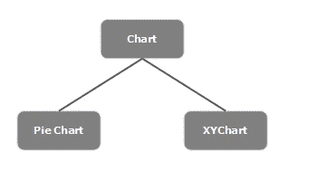

1.  **饼图–**在饼图中，圆形的面积用于定义完整信息的几个比例。在 JavaFX 中，类**用于处理饼图。** 
2.  **XYChart–**在 XYChart 中，数据在 XY(水平和垂直)轴上绘制。X 轴表示一种类型的值，Y 轴表示另一种类型的值。在绘制在 X 和 Y 图表上的值之间进行映射，以显示适当的信息。在 JavaFX 中，类**JavaFX . scene . chart . XYChart**被用来处理 XYChart。

**轴的类型**

在图表中，除了 X 轴和 Y 轴之外，还可以有不同类型的轴。这些是–

1.  **类别轴–**类别轴用于描述信息的各个部分。该轴与数值轴不同，具体数值不显示在类别轴上。在 JavaFX 中，类**描述了类别轴。用户只需要实例化这个类就可以生成类别轴。** 
2.  **数轴–**数轴用于表示数值的具体范围。在 JavaFX 中，类**代表数值轴。用户只需要实例化这个类就可以生成数轴。**

**不同类别的 JavaFX 图表**

在 JavaFX 中，有许多图表供用户在他们的应用程序中使用。下面是使用 JavaFX 设计图形用户界面时常用的图表列表。

*   **饼图–**在饼图中，圆形的面积用于定义完整信息的几个比例。在 JavaFX 中，类**用于处理饼图。** 
*   **条形图–**条形图用于使用矩形条描述各种数据。这些条的长度代表数值。条形图可以垂直和水平绘制。在 JavaFX 中，条形图由名为**的类表示**
*   **折线图–**折线图用于将信息显示为由直线段连接的数据点(标记)列表。折线图解释了数据如何以规则的时间频率变化。在 JavaFX 中，折线图由名为**的类表示**
*   **面积图–**面积图用于绘制面积图。它绘制了给定点集和轴之间的区域。一般来说，这个图表用来区分两个量。在 JavaFX 中，面积图由一个名为**的类来表示**

**JavaFX 布局**

布局是描述场景图中对象的用户界面样式的顶级容器类。JavaFX 布局可以看作所有独立节点的父节点。JavaFX 提供了几个布局窗格，可以促进各种风格的布局。

在 JavaFX 中，布局描述了在屏幕上查看元素的过程。它主要建立场景图节点。JavaFX 中有各种内置的布局窗格，分别是 HBox、VBox、StackPane、FlowBox、AnchorPane 等。每个内置布局都由一个单独的类表示，需要实例化该类才能实现特定的布局窗格。

所有这些类都属于 **javafx.scene.layout** 包。 **javafx.scene.layout.Pane** 类是 javafx 布局所有内置类的根类。

**创建 JavaFX 布局的步骤**

为了创建布局，我们需要遵循以下步骤–

**1。**在 JavaFX 应用程序中创建布局的第一步是用户应该实例化各自的布局类，

**例如–**如果用户想要创建一个 HBox 布局，那么他应该实例化 JavaFX 布局的 HBox 类。

```
HBox root = new HBox();
```

**2。**实例化相应的类后，下一步是设置布局的属性。

```
root.setSpacing(20);
```

**3。**经过以上两步，在 JavaFX 应用程序中创建布局的最后一步是向布局对象添加节点。

```
root.getChildren().addAll(<NodeObjects>);
```

**不同类别的 JavaFX 布局**

在 JavaFX 中，有各种 JavaFX 布局类可供用户在他们的应用程序中使用。以下是 JavaFX 提供的各种布局的简要介绍。

*   **HBox–**HBox 布局用于将 JavaFX 应用程序中的所有节点排列在特定的水平行中。在 JavaFX 中，一个 HBox 布局由一个名为**的类表示**
*   **边框面板–**边框面板布局用于将 JavaFX 应用程序中的节点排列在顶部、左侧、右侧、底部和中心位置。在 JavaFX 中，BorderPane 布局由名为**的类表示**
*   **Grid Pane–**网格窗格布局用于将 JavaFX 应用程序中的节点排列为由行和列组成的网格。这种布局在使用 JavaFX 设计表单时非常方便。在 JavaFX 中，GridPane 布局由名为**的类表示**
*   **流窗格–**流窗格布局用于包装流中的所有节点。水平流动窗格在其高度包裹窗格的组件，而垂直流动窗格在其宽度包裹组件。在 JavaFX 中，一个流面板布局由一个名为**的类来表示**
*   **stack pane–**堆栈窗格布局用于将 JavaFX 应用程序中的节点排列在另一个之上，就像在堆栈中一样。首先追加的节点在堆栈底部排序，下一个节点存储在堆栈顶部。在 JavaFX 中，StackPane 布局由名为**的类表示**
*   **VBox–**VBox 布局用于将 JavaFX 应用程序中的所有节点排列在单个垂直列中。在 JavaFX 中，VBox 布局由名为**的类表示**

**JavaFX 事件处理**

JavaFX 赋予用户生成多种类型的应用程序的适应性，例如桌面应用程序、网络应用程序和图形应用程序。在当今的应用程序中，用户在应用程序的精确执行中扮演着重要的角色。在大多数情况下，用户需要与应用程序交互。

在 JavaFX 中，每当用户与应用程序节点交互时，就会发生一个事件。有多个引用，通过使用这些引用，用户可以创建事件。例如，用户可以使用鼠标，或者按下键盘上的任何按钮，或者滚动应用程序的任何页面以生成事件。因此，我们可以说这些事件基本上是通知我们在用户端发生了一些事情。一个完美的应用程序需要最少的时间来处理事件。

**在 JavaFX 中处理事件**

在 JavaFX 中，事件主要用于通知应用程序用户选择的操作。JavaFX 实现了实现事件的工具，将事件路由到其目标，并授权应用程序处理事件。

javafx 提供了类 **javafx.event.Event** ，它包含了描述可以在 JavaFX 中创建的各种事件的所有子类。任何事件都是事件类或其任何子类的实例。

JavaFX 中有几个事件，即 MouseEvent、KeyEvent、ScrollEvent、DragEvent 等。用户可以通过继承类 j **avafx.event.Event.** 来进一步指定他们的个人事件

**事件类型**

一般来说，JavaFX 事件主要分为以下几类

1.  **前台事件–**前台事件的发生本质上是由于用户与应用程序 GUI 的直接交流。例如，点击按钮、按键、从列表中选择项目、滚动页面等。

2.  **后台事件–**后台事件不需要用户与应用的交互。这些事件的发生主要是由于操作系统中断失败、操作完成等。

**不同类的 JavaFX 事件处理**

JavaFX 支持处理各种各样的事件。类 **javafx.event.Event** 是每个事件的基类。它的任何子类的实例都是一个事件。JavaFX 提供了广泛的事件混合。其中一些放在下面–

*   **键事件–**键事件是一个输入事件，它象征着节点上发生的击键。该事件包括按键、释放按键和键入按键等操作。它由名为**的类表示** 
*   **mouse event–**mouse event 也是点击鼠标时发生的输入事件。它包括鼠标点击、鼠标按下、鼠标释放、鼠标移动、鼠标进入目标、鼠标退出目标等动作。由名为**的类表示** 
*   **window event–**window event 是与窗口显示和窗口隐藏动作相关联的事件。它包括窗口隐藏、窗口显示、窗口隐藏、窗口显示等操作。它由名为**的类表示** 
*   **拖动事件–**拖动事件是拖动鼠标时发生的输入事件。它包括诸如拖动输入、拖动下降、拖动输入目标、拖动退出目标、拖动结束等活动。它由名为**的类表示**

以上是 JavaFX 应用编程接口的不同用户界面组件。

**在 IDE 中设置 JavaFX**

我们需要在我们的集成开发环境中配置 JavaFX，以便使用它，我们在这里借助 Eclipse 集成开发环境来说明这一点，因为它被 Java 开发人员广泛使用。

**第 1 步:**点击右上角的“帮助”部分，进一步进入“Eclipse 市场”，如下图所示。

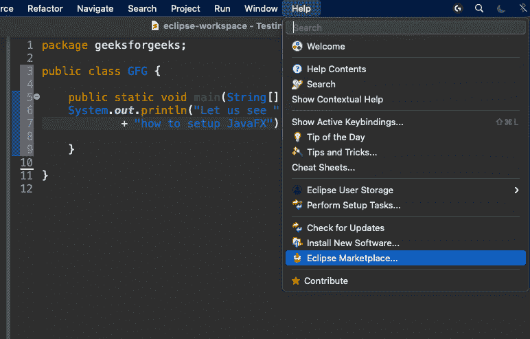

**第 2 步:**现在写下首字母‘FX’并按回车键。将弹出下面的窗口，然后安装如下所示的 e(fx)剪辑 3.6.0，该剪辑将出现在顶部搜索中，稍后通过接受条款和条件并按“下一步”继续安装。这需要一点时间。

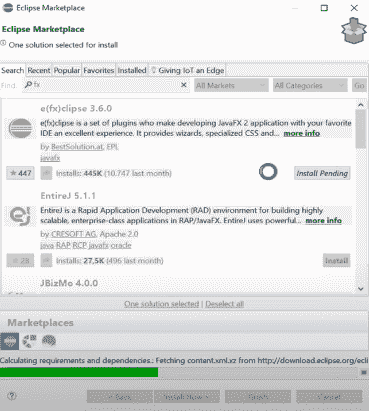

**第 3 步:**重新启动 IDE，现在打开新的“**文件”“新的–>“其他”**，在这里您会发现之前不存在的 JavaFX 插件，如下图所示:

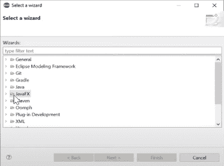

**第 4 步:**选择 JavaFX 项目，选择“下一步”

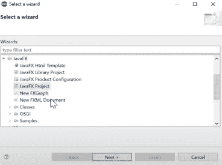

> 就像命名普通项目一样，创建 JavaFX 项目并根据需求选择设置，然后点击**下一步**“稍后”**完成**。

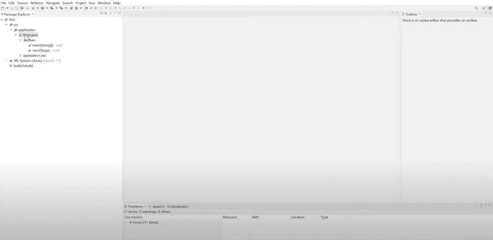

您将看到这个窗口，其中的主旨是我们的 IDE(eclipse)不知道 JavaFX 在哪里，到目前为止，我们只将 JavaFX 设置为仅在 eclipse 中工作，但尚未下载 JavaFX。

**步骤 5:** 通过将 JavaFX 提取到系统上的某个位置来下载它，并且一定要记住提取它的指定路径。下载时，您可以选择长期支持版本或最新版本，但如果您是 JavaFX 的新手，建议选择长期版本，因为最新版本可能会引发一些错误。根据你的操作系统。

**步骤 6:** 创建用户库

转到**窗口–>偏好设置**，在那里输入用户，然后转到**用户库。**这里添加一个新的用户库和名称 t，相关的不一定是命名的 JavaFX 或保留一些以前的计数器名称。

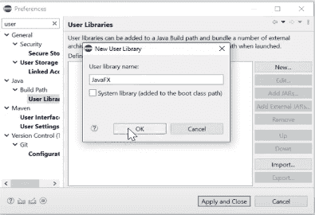

到

第七步:现在转到“**添加外部 JAR”**，将上面保留的安装 JavaFX 的路径复制到本地目录中，如下所示选择所有路径:

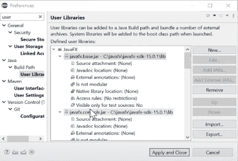

点击'**应用并关闭'**

**步骤 8:** 通过右键单击项目并转到**构建路径–>配置构建路径来解决不需要的错误。**现在转到**库–>类路径**并添加库。在这里你会找到所有的用户库，名字会弹出来，这是早些时候给的库。点击**完成–>应用–>应用并关闭**，你会看到现在所有的错误都消失了。

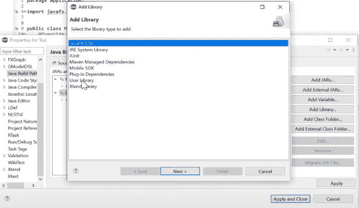

**步骤 9:** 现在配置运行配置。

转到**运行–>Java 应用程序–>主–>参数。** keynote 在这里，您需要传递如下图所示的参数，但是路径会根据您安装 JavaFX 的位置而变化。

```
--module-path "YOUR\PATH\lib" --add-modules javafx.controls,javafx.fxml
```

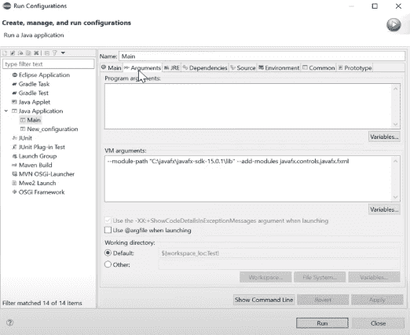

> **这之后可以开始 JavaFX 操作，因为现在会弹出一个窗口。干杯！**

### JavaFX v/s Java Swing

图形业务支持 Java Swing 和 Java FX 的性能。但是，两者又有很大的不同。Java Swing 和 Java FX 之间的一些主要区别如下–

<figure class="table">

| 

Java Swing

 | 

JavaFX

 |
| --- | --- |
| Swing 是 Java 开发人员创建图形用户界面的标准工具包 | JavaFX 为设计桌面应用程序提供平台帮助。 |
| Swing 有一个更精细的图形用户界面组件集合 | JavaFX 有相当多的 UI 组件可用，但比 Swing 提供的组件更差。 |
| Swing 是一个遗留库，它提供了可插拔的用户界面组件 | JavaFX 的 UI 组件仍在增长，具有更高级的外观和感觉。 |
| Swing 可以实现具有传统外观和感觉的 UI 组件。 | JavaFX 可以提供具有现代 UI 的丰富的互联网应用程序。 |
| 与 Swing 相关的类可以在带有完整文档的 Java API 指南中找到 | JavaFX 文档以各种格式提供，具有全面的细节和文件支持。 |
| 秋千是大自然的降临。因此，它可以使用传统的 Java 组件类来生成用户界面组件 | Java FX 最初使用一种称为 JavaFX Script 的声明性语言。 |
| Swing 有一个用户界面组件库，并充当遗留组件 | JavaFX 有几个构建在 Swing 之上的组件。 |
| Swing 对 MVC 有帮助，但是它在一个组件中并不统一。 | JavaFX 支持对 MVC 真的很有利。 |
| Swing 有各种各样的 ide，它们为快速开发提供了一个工具。 | JavaFX 也获得了许多 ide 的支持，但是它没有 Swing 那么有经验。 |
| swing 从 Java 基础类更名而来，太阳微系统公司在 1997 年宣布了它 | JavaFX 最初于 2008 年 12 月由 Sun 微系统发布，现在被 Oracle 收购。 |
| 摇摆中的事件不是那么一致 | JavaFX 中的事件比它们在 Swing 中的同类事件更加深思熟虑，更加一致。 |
| Swing 缺乏对现代触摸设备的任何支持。 | JavaFX 对类似滚动、滑动、旋转和缩放的签名手势进行了基本维护。 |
| Swing 有按钮、复选框和音乐盒等基本控件。 | JavaFX 有许多 Swing 没有的引人注目的控件 |

</figure>

这些是 JavaFX 和 Java Swing 的主要区别点

### 使用 JavaFX 制作的真实应用程序

有许多真实世界的应用程序都是使用 JavaFX 制作的。下面给出了一些应用及其使用领域–

<figure class="table">

| s 没有。 | 应用 | 使用区域 | 描述 |
| --- | --- | --- | --- |
| one | 卡利普馆长 | 医院/外科 | 这是一个将安装在医院手术室的应用程序，用于查找患者数据、记录手术，并将生成的文档存储在中心医院数据库中。 |
| Two | Lynden 导航器 | 派遣 | 它用于使航站楼的管理人员能够查看计划到达其设施的航班信息，以及计划离开其设施的航班信息。 |
| three | 阿特拉斯交易者 | 金融 | 它允许用户选择哪种商品(黄金、石油、小麦等)。)他们想购买或出售。 |
| four | 模板编辑 IAV | 车队数据分析 | 它是一个用于海量车队数据的数据分析系统。它用于配置在平台上执行的分析。 |
| five | carl zeiss meditec ag 论坛 | 医学的 | 它是眼科临床患者数据的存档软件。它是 Swing 和 JavaFX 的混合体，目前仍在向外移民。 |
| six | 德国艾滋病基金会 | 办公室 | 它正在通过提供财政支持和支持该领域的项目等方式，帮助受艾滋病或艾滋病毒影响的人。 |
| seven | NEOS——新欧洲视觉运营系统 EBU | 电视机 | 它用于确保电视和无线电传输从一个位置传输到另一个位置。 |
| eight | 阿联酋航空公司网络容量优化 | 航空 | 它允许网络规划部门将各种请求整合到现有的航班时刻表中。可能的请求有新航班、取消航班、修改航班等。 |
| nine | 美国宇航局深空轨道探索者 | 空间 | 它有助于在广阔的潜在数据空间中快速设计弹道，支持太阳系中任何以行星和月球为中心的弹道。 |

</figure>

JavaFX 是一个 Java 库和图形用户界面工具包，旨在开发和促进丰富的互联网应用程序、网络应用程序和桌面应用程序。使用 JavaFX 最显著的好处是，使用该库编写的应用程序可以在多个操作系统上运行，如 Windows、Linux、iOS、安卓，以及桌面、网络、手机、电视、平板电脑等多个平台。