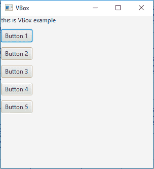
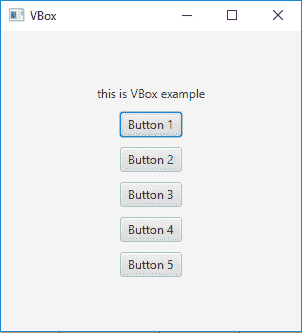

# JavaFX | VBox 类

> 原文:[https://www.geeksforgeeks.org/javafx-vbox-class/](https://www.geeksforgeeks.org/javafx-vbox-class/)

VBox 是 JavaFX 的一部分。VBox 以垂直列的形式布局其子代。如果 vbox 设置了边框和/或填充，那么内容将在这些插页中显示。VBox 类扩展了*窗格类*。

**该类的构造函数:**

1.  **VBox()** :创建间距= 0 且在 TOP_LEFT 对齐的 VBox 布局。
2.  **VBox(双 s)** :创建一个新的 VBox，在子对象之间有指定的间距。
3.  **VBox(double s，Node… c)** :用指定的节点和节点之间的间距创建一个新的 VBox。
4.  **VBox(Node… c)** :创建间距= 0 的 VBox 布局。

**常用方法:**

| 方法 | 说明 |
| --- | --- |
| getAlignment() | 返回属性对齐的值。 |
| getSpacing() | 返回其子对象之间的间距。 |
| 设置对齐(位置值) | 设置 VBox 的对齐方式。 |
| getChildren() | 返回 VBox 中的节点。 |

下面的程序说明了 VBox 类的使用:

1.  **Java Program to create a VBox and add it to the stage:** In this program we will create a VBox named *vbox*. We will create a label and add it to the *vbox*. We will also create some buttons and add them to the VBox using the *getChildren().add()* function. Now create a scene and add the *vbox* to the scene and add the scene to the stage and call *show()* function to display the final results.

    ```java
    // Java Program to create a VBox 
    // and add it to the stage
    import javafx.application.Application;
    import javafx.scene.Scene;
    import javafx.scene.control.*;
    import javafx.scene.layout.*;
    import javafx.stage.Stage;
    import javafx.event.ActionEvent;
    import javafx.event.EventHandler;
    import javafx.scene.canvas.*;
    import javafx.scene.web.*;
    import javafx.scene.Group;

    public class VBOX_1 extends Application {

        // launch the application
        public void start(Stage stage)
        {

            try {

                // set title for the stage
                stage.setTitle("VBox");

                // create a VBox
                VBox vbox = new VBox();

                // create a label
                Label label = new Label("this is VBox example");

                // add label to vbox
                vbox.getChildren().add(label);

                // add buttons to VBox
                for (int i = 0; i < 10; i++)
                {
                    vbox.getChildren().add(new Button("Button " + (int)(i + 1)));
                }

                // create a scene
                Scene scene = new Scene(vbox, 300, 300);

                // set the scene
                stage.setScene(scene);

                stage.show();
            }

            catch (Exception e) {

                System.out.println(e.getMessage());
            }
        }

        // Main Method
        public static void main(String args[])
        {

            // launch the application
            launch(args);
        }
    }
    ```

    **输出:**
    

2.  **Java Program to create a VBox, add spaces between its elements and add it to the stage:** In this program we will create a VBox named *vbox*. We will set the spacing by passing a double value of space as an argument to the constructor. Now create a label and add it to the *vbox*. To add some buttons to the VBox use the *getChildren().add()* function. Finally, create a scene and add the *vbox* to the scene and add the scene to the stage and call *show()* function to display the final results.

    ```java
    // Java Program to create a VBox, add 
    // spaces between its elements and add
    // it to the stage
    import javafx.application.Application;
    import javafx.scene.Scene;
    import javafx.scene.control.*;
    import javafx.scene.layout.*;
    import javafx.stage.Stage;
    import javafx.event.ActionEvent;
    import javafx.event.EventHandler;
    import javafx.scene.canvas.*;
    import javafx.scene.web.*;
    import javafx.scene.Group;

    public class VBOX_2 extends Application {

        // launch the application
        public void start(Stage stage)
        {

            try {

                // set title for the stage
                stage.setTitle("VBox");

                // create a VBox
                VBox vbox = new VBox(10);

                // create a label
                Label label = new Label("this is VBox example");

                // add label to vbox
                vbox.getChildren().add(label);

                // add buttons to VBox
                for (int i = 0; i < 5; i++)
                {
                    vbox.getChildren().add(new Button("Button " + (int)(i + 1)));
                }

                // create a scene
                Scene scene = new Scene(vbox, 300, 300);

                // set the scene
                stage.setScene(scene);

                stage.show();
            }

            catch (Exception e) {

                System.out.println(e.getMessage());
            }
        }

        // Main Method
        public static void main(String args[])
        {

            // launch the application
            launch(args);
        }
    }
    ```

    **输出:**

    

3.  **Java Program to create a VBox, add spaces between its elements, set an alignment and add it to the stage:** In this program we will create a VBox named *vbox*. We will set the spacing by passing a double value of space as an argument to the constructor. Set the alignment of the VBox using the *setAlignment()* function. Then create a label and add it to the *vbox*. Add some buttons to the VBox using the *getChildren().add()* function. Finally, create a scene and add the vbox to the scene and add the scene to the stage and call *show()* function to display the final results.

    ```java
    // Java Program to create a VBox, add spaces
    // between its elements, set an alignment 
    // and add it to the stage
    import javafx.application.Application;
    import javafx.scene.Scene;
    import javafx.scene.control.*;
    import javafx.scene.layout.*;
    import javafx.stage.Stage;
    import javafx.event.ActionEvent;
    import javafx.event.EventHandler;
    import javafx.scene.Group;
    import javafx.geometry.Pos;

    public class VBOX_3 extends Application {

        // launch the application
        public void start(Stage stage)
        {

            try {

                // set title for the stage
                stage.setTitle("VBox");

                // create a VBox
                VBox vbox = new VBox(10);

                // create a label
                Label label = new Label("this is VBox example");

                // add label to vbox
                vbox.getChildren().add(label);

                // set alignment
                vbox.setAlignment(Pos.CENTER);

                // add buttons to VBox
                for (int i = 0; i < 5; i++)
                {
                    vbox.getChildren().add(new Button("Button " + (int)(i + 1)));
                }

                // create a scene
                Scene scene = new Scene(vbox, 300, 300);

                // set the scene
                stage.setScene(scene);

                stage.show();
            }

            catch (Exception e) {

                System.out.println(e.getMessage());
            }
        }

        // Main Method
        public static void main(String args[])
        {

            // launch the application
            launch(args);
        }
    }
    ```

    **输出:**

    

**注意:**上述程序可能无法在联机 IDE 中运行，请使用脱机编译器。

**参考:**[https://docs . Oracle . com/javase/8/JavaFX/API/JavaFX/scene/layout/vbox . html](https://docs.oracle.com/javase/8/javafx/api/javafx/scene/layout/VBox.html)