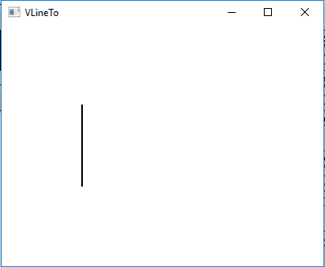
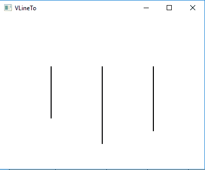

# JavaFX | VLineTo 类

> 原文:[https://www.geeksforgeeks.org/javafx-vlineto-class/](https://www.geeksforgeeks.org/javafx-vlineto-class/)

VLineTo 类是 JavaFX 的一部分。VLineTo 类创建从当前位置到指定 Y 坐标的垂直线路径。VLineTo 类继承了 PathElement 类。

**该类的构造函数:**

1.  **VLineTo()** :创建一个 VLineTo 的空对象。
2.  **VLineTo(双 y)** :创建一个具有指定 y 坐标值的 VLineTo 对象。

**常用方法:**

| 方法 | 说明 |
| --- | --- |
| 盖蒂（） | 返回 Y 坐标的值。 |
| setY(双 v) | 设置 Y 坐标的值。 |
| toString() | 返回 VLineTo 对象的字符串表示形式。 |
| yProperty() | 定义 Y 坐标。 |

以下程序说明了 VLineTo 类的使用:

*   **Java program to create a path and add VLineTo to it and display it:**
    1.  在这个程序中，我们将创建一个名为*路径*的路径对象。
    2.  用指定的 Y 坐标创建一个 VLineTo 对象。
    3.  然后创建一个名为 *moveto* 的 MoveTo 对象，并将 *moveto* 和 *vlineto* 对象添加到路径中。
    4.  将此路径添加到组对象，并将组对象添加到场景，并将场景添加到舞台。
    5.  调用 *show()* 功能显示最终结果。

    ```java
    // Java program to create a path
    // and add VLineTo to it and display it
    import javafx.application.Application;
    import javafx.scene.Scene;
    import javafx.scene.control.*;
    import javafx.scene.layout.*;
    import javafx.stage.Stage;
    import javafx.scene.layout.*;
    import javafx.scene.paint.*;
    import javafx.scene.text.*;
    import javafx.geometry.*;
    import javafx.scene.layout.*;
    import javafx.scene.shape.*;
    import javafx.scene.paint.*;
    import javafx.scene.*;

    public class VLineTo_1 extends Application {

        // launch the application
        public void start(Stage stage)
        {

            try {

                // set title for the stage
                stage.setTitle("VLineTo");

                // create VLineTo
                VLineTo vlineto = new VLineTo(200);

                // create moveto
                MoveTo moveto = new MoveTo(100, 100);

                // create a Path
                Path path = new Path(moveto, vlineto);

                // set fill for path
                path.setFill(Color.BLACK);

                // set stroke width
                path.setStrokeWidth(2);

                // create a Group
                Group group = new Group(path);

                // create a scene
                Scene scene = new Scene(group, 400, 300);

                // set the scene
                stage.setScene(scene);

                stage.show();
            }

            catch (Exception e) {

                System.out.println(e.getMessage());
            }
        }

        // Main Method
        public static void main(String args[])
        {

            // launch the application
            launch(args);
        }
    }
    ```

    **输出:**

    

*   **Java program to create a path and add multiple VLineTo object to it and display it:**
    1.  在这个程序中，我们将创建一个名为*路径*的路径对象。
    2.  用指定的 Y 坐标创建三个虚拟对象。
    3.  然后创建三个名为 *moveto* 、 *moveto_1* 和 *moveto_2* 的对象。
    4.  将所有*移动到*和*移动到*对象，按顺序添加到路径中。
    5.  将此路径添加到组对象，并将组对象添加到场景，并将场景添加到舞台。
    6.  调用 *show()* 功能显示最终结果。

    ```java
    // Java program to create a path and add the
    // multiple VLineTo object to it and display it
    import javafx.application.Application;
    import javafx.scene.Scene;
    import javafx.scene.control.*;
    import javafx.scene.layout.*;
    import javafx.stage.Stage;
    import javafx.scene.layout.*;
    import javafx.scene.paint.*;
    import javafx.scene.text.*;
    import javafx.geometry.*;
    import javafx.scene.layout.*;
    import javafx.scene.shape.*;
    import javafx.scene.paint.*;
    import javafx.scene.*;

    public class VLineTo_2 extends Application {

        // launch the application
        public void start(Stage stage)
        {

            try {

                // set title for the stage
                stage.setTitle("VLineTo");

                // create VLineTo
                VLineTo vlineto = new VLineTo(200);
                VLineTo vlineto_1 = new VLineTo(250);
                VLineTo vlineto_2 = new VLineTo(225);

                // create moveto
                MoveTo moveto = new MoveTo(100, 100);
                MoveTo moveto_1 = new MoveTo(200, 100);
                MoveTo moveto_2 = new MoveTo(300, 100);

                // create a Path
                Path path = new Path(moveto, vlineto, moveto_1,
                               vlineto_1, moveto_2, vlineto_2);

                // set fill for path
                path.setFill(Color.BLACK);

                // set stroke width
                path.setStrokeWidth(2);

                // create a Group
                Group group = new Group(path);

                // create a scene
                Scene scene = new Scene(group, 400, 300);

                // set the scene
                stage.setScene(scene);

                stage.show();
            }

            catch (Exception e) {

                System.out.println(e.getMessage());
            }
        }

        // Main Method
        public static void main(String args[])
        {

            // launch the application
            launch(args);
        }
    }
    ```

    **输出:**

    

**注意:**上述程序可能无法在联机 IDE 中运行，请使用脱机编译器。

**参考:**[https://docs . Oracle . com/javase/8/JavaFX/API/JavaFX/scene/shape/vlineto . html](https://docs.oracle.com/javase/8/javafx/api/javafx/scene/shape/VLineTo.html)