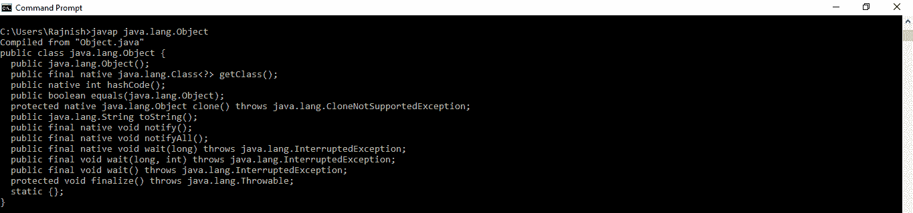
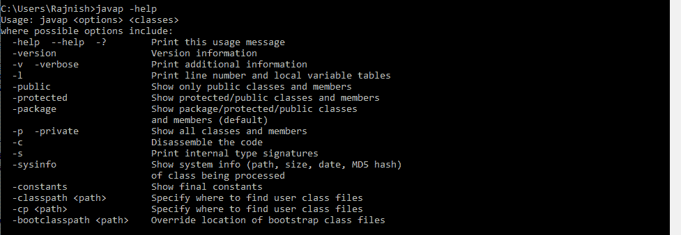
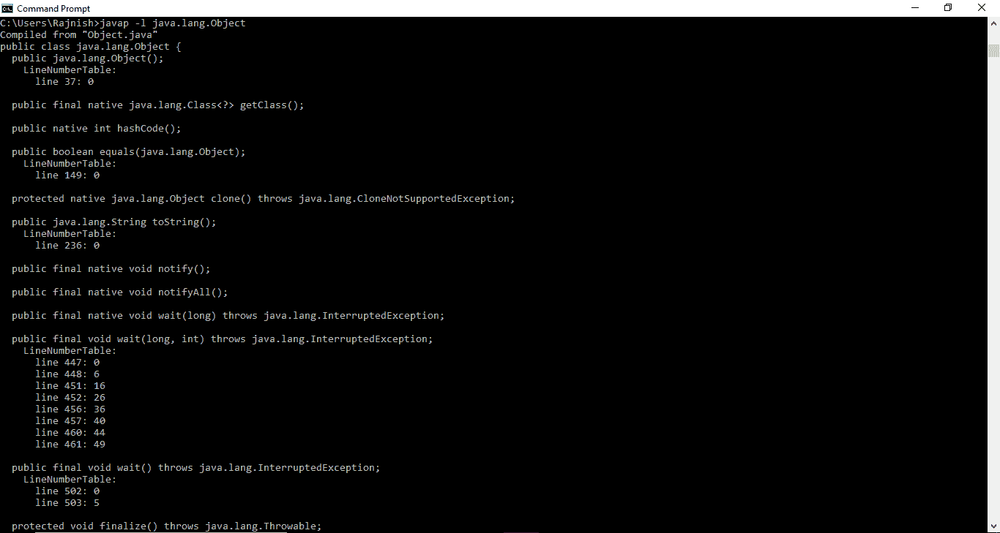
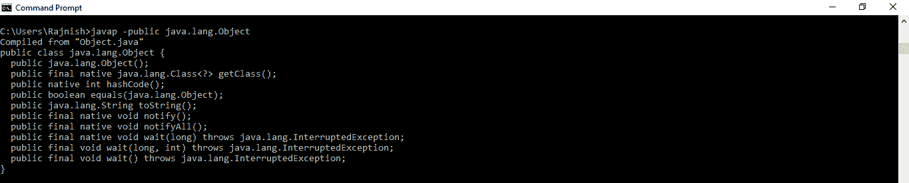
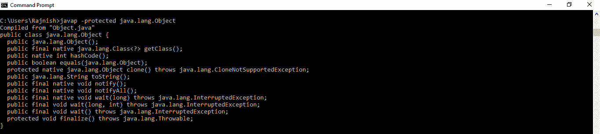
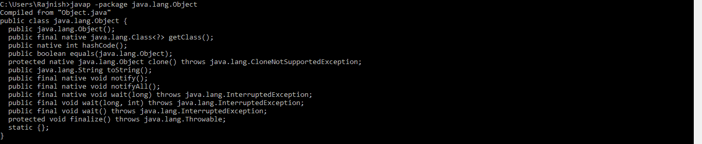
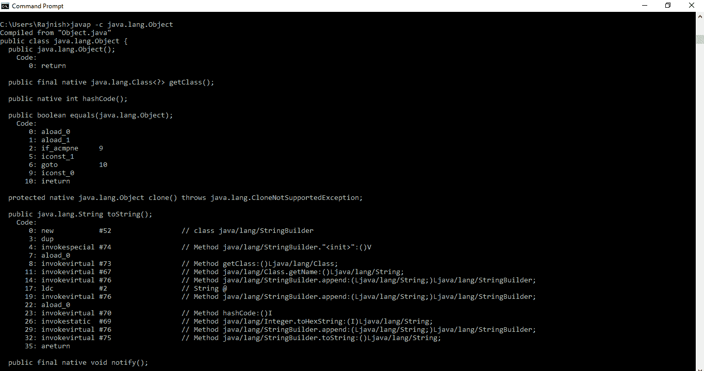
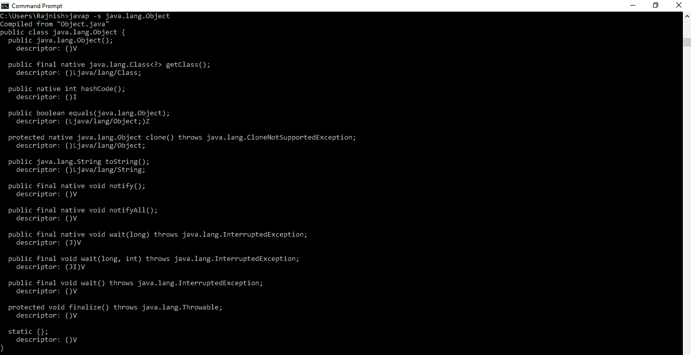
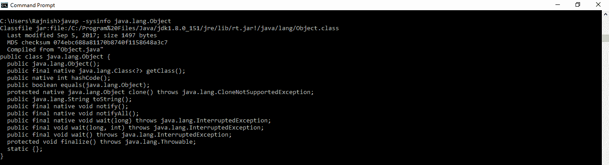
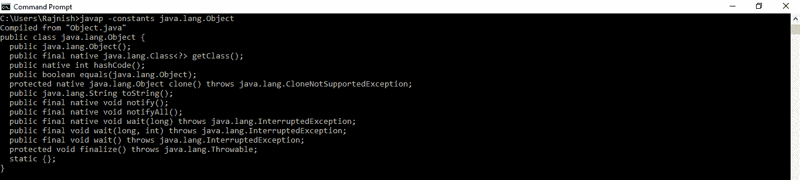

# Java 中的 javap 工具，示例

> 原文:[https://www . geesforgeks . org/javap-tool-in-Java-with-examples/](https://www.geeksforgeeks.org/javap-tool-in-java-with-examples/)

**<u>javap 工具</u>**

**javap**工具用于获取任何类或接口的信息。javap 命令(也称为 **Java 反汇编器**)反汇编一个或多个类文件。其输出取决于所使用的**选项**(**-c**或“**-详细**”分别表示字节码和字节码以及内部信息)。如果不使用任何选项，javap 会打印出传递给它的类的包、受保护的和公共的字段和方法。
**语法:**

```
javap [option] [classname]

```

**不使用选项时:**
**语法:**

```
javap class_name

```

**输出:**
[](https://media.geeksforgeeks.org/wp-content/uploads/20190509204337/hdgg.png) 
**使用选项时:**

选项的描述和实现如下:
**注:**有些选项打印的输出很长，无法完整显示。请在您的系统中尝试查看所用选项的完整输出。

*   **-help** or **–help** or **-? :**
    This option prints a help message for the javap command.
    **Syntax:**

    ```
    javap -help

    ```

    **输出:**
    [](https://media.geeksforgeeks.org/wp-content/uploads/20190509195111/help1.png)

*   **-version :**
    This option prints Version information of java.
    **Syntax:**

    ```
    javap -version

    ```

    **输出:**
    [](https://media.geeksforgeeks.org/wp-content/uploads/20190509195435/Annotation-2019-05-09-195420.png)

*   **-v** 或 **-verbose :**
    此选项打印附加信息，如堆栈大小、局部变量数量和方法参数。
    **语法:**

```
javap -v class_name

```

**输出:**
[](https://media.geeksforgeeks.org/wp-content/uploads/20190509195923/Annotation-2019-05-09-195904.png)

*   **-l :**
    This option prints line number and local variable tables.
    **Syntax:**

    ```
    javap -l class_name

    ```

    **输出:**
    [](https://media.geeksforgeeks.org/wp-content/uploads/20190509200237/l12.png)

    *   **-public :**
    This option prints only public classes and members.
    **Syntax:**

    ```
    javap -public class_name

    ```

    **输出:**
    [](https://media.geeksforgeeks.org/wp-content/uploads/20190509200523/Annotation-2019-05-09-200506.png)

    *   **-protected :**
    This option prints protected/public classes and members.
    **Syntax:**

    ```
    javap -protected class_name

    ```

    **输出:**
    [](https://media.geeksforgeeks.org/wp-content/uploads/20190509200727/prroetct.png)

    *   **-package :**
    This option prints package/protected/public classes and members (default).
    **Syntax:**

    ```
    javap -package class_name

    ```

    **输出:**
    [](https://media.geeksforgeeks.org/wp-content/uploads/20190509201202/Annotation-2019-05-09-201148.png)

    *   **-c :**
    This option prints Disassembled code.
    **Syntax:**

    ```
    javap -c class_name

    ```

    **输出:**
    [](https://media.geeksforgeeks.org/wp-content/uploads/20190509202232/Annotation-2019-05-09-202202.png)

    *   **-s :**
    This option prints internal type signatures.
    **Syntax:**

    ```
    javap -s class_name

    ```

    **输出:**
    [](https://media.geeksforgeeks.org/wp-content/uploads/20190509202511/s7.png)

    *   **-sysinfo :**
    This option prints system info (path, size, date, MD5 hash) of class being processed.
    **Syntax:**

    ```
    javap -sysinfo class_name

    ```

    **输出:**
    [](https://media.geeksforgeeks.org/wp-content/uploads/20190509202746/sys.png)

    *   **-constants :**
    This option prints final constants of class.
    **Syntax:**

    ```
    javap -constants class_name

    ```

    **输出:**
    [](https://media.geeksforgeeks.org/wp-content/uploads/20190509203117/Annotation-2019-05-09-203105.png)

    **参考文献:**[https://docs . Oracle . com/javase/8/docs/technotes/tools/windows/javap . html](https://docs.oracle.com/javase/8/docs/technotes/tools/windows/javap.html)