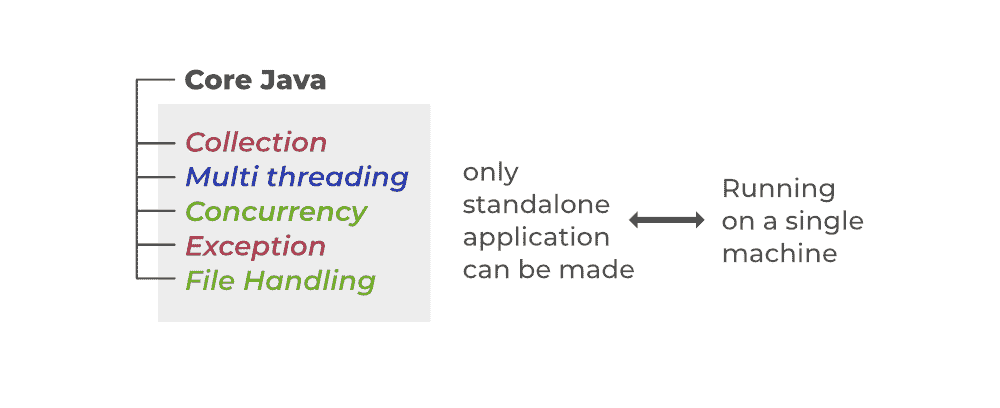
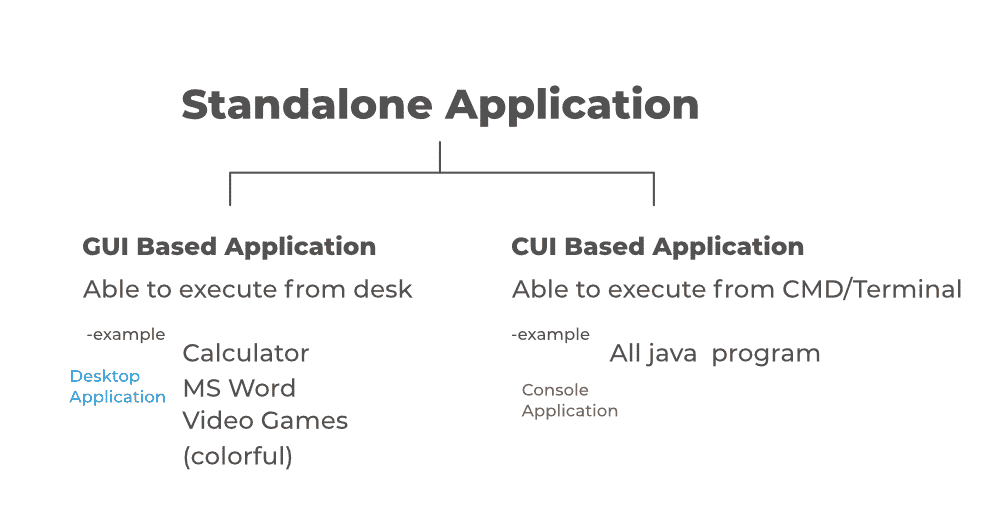
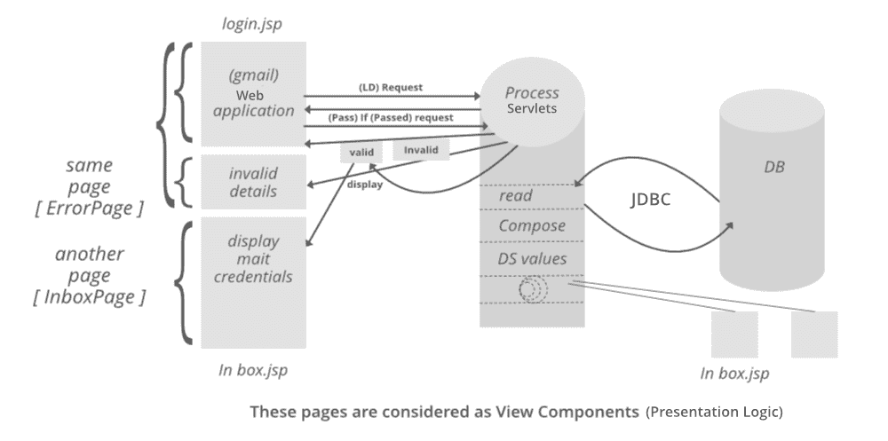
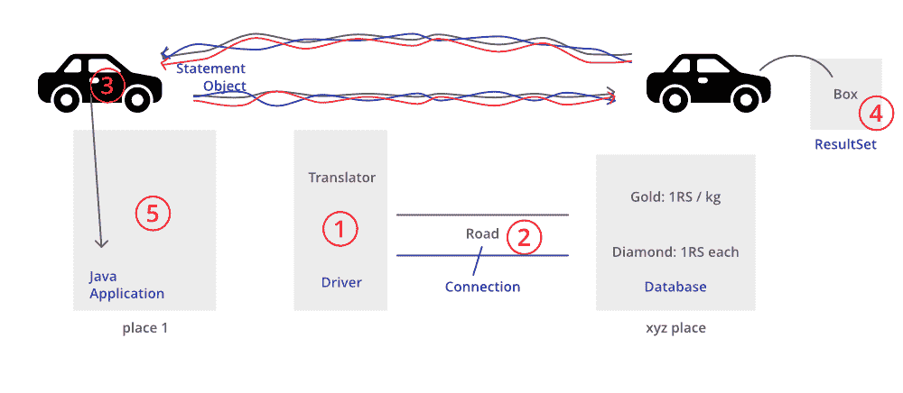
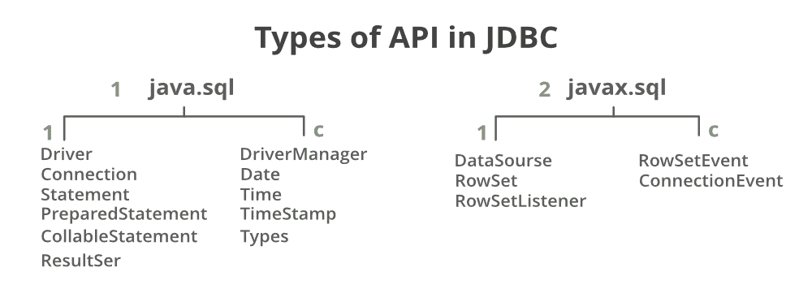
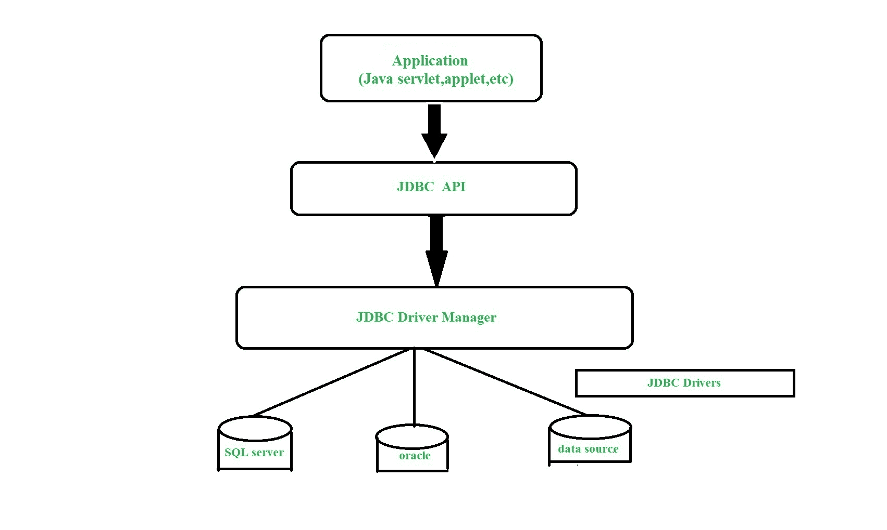

# JDBC 教程

> 原文:[https://www.geeksforgeeks.org/jdbc-tutorial/](https://www.geeksforgeeks.org/jdbc-tutorial/)

因此，在当今世界，我们主要与网站和数据库打交道，把它们当作最重要的东西，但如果我们仔细观察，数据才是最重要的。如果我们仔细观察，所有开发人员都在网络和移动技术上循环和工作，但保持不变的还是数据。


因此，迫切需要弄清楚数据是如何处理的，这一概念就是为此而产生的。



让我们概述一下为什么我们需要这个术语，这个术语可以用下面提供的图片更好地解释。

**为什么我们需要学习高级 java？**

由于我们非常熟悉 [**【核心 Java】**](https://www.geeksforgeeks.org/java/)的所有概念，现在是时候构建项目了，这些项目最终将构建一个应用程序作为最终产品。因此，如果我们只知道核心 java，我们只能构建可以在存储其组件的机器上运行的应用程序(简单地说，我们可以说所有代码都是在那里编写的)。这些类型的应用程序被称为**独立应用程序**。



> **注意:**独立应用程序作为编程世界中两种类型的应用程序之一，只适用于现实世界中 5%的应用程序。

因此，如果我们只构建独立的应用程序，那么范围就非常狭窄，导致开发和可伸缩性的范围非常小，这就产生了高级 java，而高级 Java 又产生了 **3 个组件**，主要是 **JSP** 、**servlet**和 **JDBC** ，以使应用程序在多台机器上运行。随着这 3 个组件的发展，它消除了只运行一台机器的限制，因为这对于用户来说在实际应用程序中是不切实际的，而是迫使用户安装然后使用它们。现在，这些类型的应用程序被称为 web 应用程序，即向最终用户提供服务而不安装它们的应用程序。这些应用程序被称为 web 应用程序，它们不是独立的应用程序。

现在你一定想知道什么是 JSP 和 Servlet，以及 JDBC 是如何与它们相关联的。目前，只关注 JDBC，通过参考下图，了解它到底是什么以及如何使用它:



> **注:**由图像得出的结论如下:
> 
> *   JSP 代表 Java 服务器页面，这些页面被视为视图组件，就像**表示逻辑**一样。
> *   Servlet 意味着在后端进行内部处理，例如读取、从数据库中获取值、比较等，就像我们的流程 servlet 中的**处理逻辑**一样。Servlets 也包含用于处理逻辑的后台处理的 java 类。
> *   正如在我们的**数据库**中所讨论的，JDBC 是用于 servlets 中的 **Java 应用程序**的**连接**。

**什么是 JDBC？**

让我们试着从头开始讨论，直到现在，在 java 领域，我们只是简单地编写代码(编程)和与数据库交互。你有没有想过如何在内部将我们的程序链接到一个数据库，赋予它巨大的能力，使项目和应用程序从我们的程序中分离出来。是的，有这个机制的帮助是可能的。让我们在一个真实的场景中讨论，稍后我们将使用技术术语进行映射，以便用图形表示对其进行绝对的技术理解。


**真实世界示例**

考虑两个地方 A 和 B。现在居住在 A 的人不知道居住在 B 的人的语言，反之亦然，我们将使用技术术语来描述 JDBC 内部的主要组成部分。



用技术术语映射相同的东西来说明上面的真实例子。这里，地点 A 被称为 java 应用程序，因此地点 B 被称为数据库。如上所述，负责将 java 应用程序调用转换为数据库调用以及将数据库调用转换为 java 应用程序调用的翻译器只不过是一个“驱动软件”。应用程序之间的道路是“连接”，最后，车辆是我们的“陈述对象”。现在上面的“需求”是我们的 SQL 查询，数据库引擎处理 SQL 语句后生成的“小块”除了“结果集”什么都没有传递。现在**、**这种 java 应用程序与数据库通信的技术就是‘Java 数据库连接’。到目前为止，我们已经对 JDBC 和极客有了一个清晰的概述，您会惊讶于我们已经介绍了它，让我们深入了解组件的工作，这些将在 JDBC 的环境设置中进行更深入的描述。

现在我们将深入到 JDBC 组件，如上所述，它是一种用于连接 Java 应用程序和数据库的技术。它是一个由许多类和接口组成的 API，借助于这些类和接口，我们能够将 java 应用程序连接到数据库，如上图所示。它主要有两个包，即: ***java.sql 包*** 和 ***javax.sql 包。***

> **注:**作为参考以上 SQL 作为数据库来说明包名。



因此，这里是我们将如何涵盖 JDBC 的疾病，以便了解整个过程在技术上是如何运转的。

*   JDBC 是什么
*   JDBC 的需要
*   JDBC 的数据类型
*   JDBC 建筑
*   JDBC 环境设置
*   连接 JDBC 的步骤(完成)
*   JDBC 实施范例(完成)

**4。JDBC 建筑**



从上面的图片中，我们将讨论遇到的 5 个主要术语，如下所示:

1.  驱动软件
2.  语句对象
3.  结果集
4.  连接对象
5.  SQL 查询

**5。JDBC 环境设置**

现在让我们讨论一下 JDBC 的各种类型的司机。因此，基本上有以下列出的 4 种标准驱动程序:

*   [类型 1 驱动程序或 JDBC-ODBC 桥驱动程序(桥驱动程序)](https://www.geeksforgeeks.org/jdbc-type-1-driver/)
*   [类型 2 驱动程序或本地应用编程接口驱动程序(本地应用编程接口)](https://www.geeksforgeeks.org/jdbc-type-2-driver/)
*   [Type-3 驱动程序或网络协议驱动程序(网络协议)](https://www.geeksforgeeks.org/jdbc-type-3-driver/)
*   [类型 4 驱动程序或精简驱动程序(本机协议)](https://www.geeksforgeeks.org/jdbc-type-4-driver/)

现在，你一定想知道他们是他们的点做出来哪些司机使用。解决这个问题的方法很简单，因为我们需要根据与之交互的数据库来使用驱动程序。

> **注意:**要使用的驱动程序直接丙酸酯到我们正在处理的哪种数据库。

驱动程序以对应于数据库的表格形式提及，如下所示:

<figure class="table">

| 数据库ˌ资料库 | 驱动程序名称 |
| --- | --- |
| 关系型数据库 | com.mysql.jdbc.Driver |

</figure>

现在你一定想知道这些列出的干燥剂将从哪里进口。所以为了导入驱动程序，你需要从网上下载一个 JAR 文件。考虑到最常用的数据库，即 MySQL，您需要下载一个名为“ *mysql.connector* ”的 JAR 文件，以此类推，其他数据库也是如此。

> **注意:**这不是一个必要的步骤，因为不同的集成开发环境具有不同的特性。在一些集成开发环境中，这些连接器是内置的，例如 NetBeans，而在 Eclipse 中，您需要通过简单地从互联网下载相应的 JAR 文件并加载到项目中来导入这个 JAR 文件，如上所述。
> 
> 如果不知道如何在 java IDE 中将 JAR 文件导入到库中，**先走这一步。**


**6。连接 JDBC 的步骤？**

基本上有七个步骤来连接 java 应用程序来处理数据库。在这里，数据库可以是结构化的，也可以是非结构化的，我们必须进行相应的处理，这将在后续步骤执行结束时变得清晰。一般来说，就 java 应用程序而言，我们主要处理 MySQL 或 Oracle 数据库。在这里，我们将为我们的 java 应用程序处理 MySQL 数据库，在处理过程中，我们只需按顺序执行下面列出的这些步骤来连接 JDBC，如下所示:

1.  为相应的数据库导入所需的包。
2.  加载并注册 JDBC 驱动程序。
    *   首先加载，然后注册
3.  建立联系
4.  创建语句
5.  执行查询
6.  处理结果
7.  关闭连接

让我们通过从现实世界中挑选案例来讨论上述步骤，以便清楚地理解我们的概念。考虑以下移动网络示例:

JDBC 的现实生活实现最常见于**移动联网**，图示如下:

*   想想你想和远方的人说话。为此，我们需要一种被称为手机/电信的设备，这标志着我们的第一步。
*   现在用户需要一个网络和一个 SIM 卡，这相当于步骤 2 的加载和注册过程。
*   现在有了可以工作的 SIM 卡，在我们试图建立通勤联系时，拨打号码和按下表示步骤 3 的呼叫按钮需要体力劳动。
*   我们需要传递的任何信息都相当于创建一个声明。
*   现在，一旦连接，我们需要说出我们已经想过的信息，这相当于执行查询。
*   现在将收到一个响应，这是我们的目标，标志着在 JDBC 的情况下处理结果的技术步骤 6。
*   最后，我们需要按下设备上的按钮来关闭通信，同样，关闭技术方面的连接也是一种很好的做法，这里是 JDBC。

**7。实施:**

*   假设我们要处理的数据库是 MySQL。所以首先我们需要导入这个包，对于 SQL 数据库来说它就是' ***java.sql.**** '。
*   现在按照 IDE(我们需要在 IDE 中的我们的项目中加载它对应的 JAR 文件，其中 JAR 应该手动插入到 IDE 中，以“ [eclispe IDE](https://www.geeksforgeeks.org/eclipse-vs-intellij-idea-vs-netbeans-for-java-development/) ”作为 IDE 参考，以便在下面的例子中说明同样的情况。
*   到目前为止，我们已经完成了将 JAR 导入到我们的项目中。现在为了加载驱动程序，我们将使用 [*forName()方法*](https://www.geeksforgeeks.org/class-forname-method-in-java-with-examples/) 通过编写“***com . MySQL . driver _ name***”其中属于类“ ***类***

**语法:**

```java
class com.mysql.jdbc.Driver ;
```

*   现在为了建立连接，我们必须实例化一个名为“连接”的接口
*   现在语句有三种类型:
    1.  正常陈述:
    2.  准备好的陈述:
    3.  可调用语句:存储过程
*   一旦创建了语句，现在我们将根据数据库的感知响应在数据库中执行查询。假设如果我们想从数据库中获取数据，那么这里的响应是表结构，或者如果我们只是简单地插入值，那么如果行数有效，则响应。
*   最后，无论我们得到的是表还是行，现在我们只需要处理结果。
*   此外，建议通过关闭接口和语句对象的对象来关闭连接以释放和释放内存资源。

**图解:**建立 JDBC

## Java 语言(一种计算机语言，尤用于创建网站)

```java
// Java Program to Illustrate Setting Up of JDBC

// Importing SQL database
import java.sql.*;

// Main class to illustrate demo of JDBC
class GFG {

    // Main driver method
    public static void main(String[] args) throws Exception
    {

        // Loading and registering drivers
        // Optional from JDBC version 4.0
        Class.forName("oracle.jdbc.OracleDriver");

        // Step 2:Establishing a connection
        Connection con = DriverManager(
            "jdbc:oracle:thin:@localhost:1521:XE",
            "username", "password");

        // Step 3: Creating statement
        Statement st = con.createStatement();

        // Step 4: Executing the query and storing the
        // result
        ResultSet rs = st.executeQuery(
            "select * from Students where Marks >= 70");

        // Step 5: Processing the results
        while (rs.next()) {
            System.out.println(rs.getString("students"));
            System.out.println(rs.getInt("marks"));
        }

        // Step 6: Closing the connections
        // using close() method to release memory resources  
        con.close();

      // Display message for successful execution of program
      System.out.println("Steps in Setting Up of JDBC");
    }
}
```

**输出:**

```java
Steps in Setting Up of JDBC
```

现在，让我们继续讨论它与真实数据库的交互，在成功地建立了数据库之后，如何管理内部事务。这里我们将不得不创建两个类，一个是我们的连接类，另一个是我们将使用连接器对象在 application.java 类中实现的类。我们已经完成了上图中的连接类，现在让我们借助一个例子来讨论应用程序类。考虑到数据库的 MySQL 在这里解释和编码出来是一样的。

**实现:**在我们的 MySQL 数据库中查询如下:

```java
select * from Student;
insert into Students values(7, geeksforGeeks);
select username from Student where userid = 7;
```

**示例:**

## Java 语言(一种计算机语言，尤用于创建网站)

```java
// Java Program to Illustrate Working Of JDBC
// with Above Query in Database

// Importing required classes
import java.io.*;
import java.util.*;

// Main class
// JDBC demo class
class GFG {

    // Main driver method
    public static void main(String[] args)
    {

        // Declaring and initializing arguments that
        // needed to be passed later in getConnection()
        String url = "jdbc:mysql://localhost/test";
        String uname = "root";
        String pass = "";

        // Query from the database taken
        // Custom query taken to illustrate
        String query
            = "select username from Student where id=7";

        // Loading and registering drivers
        Class.forName("com.mysqljdbc.Driver");

        // Creating an connection object by
        // getConnection() ethod which is static method and
        // returns the instance of Connection class

        // This method takes 3 parameters as defined above
        Connection con
            = DriverManager.getConnection(url, uname, pass);

        Statement st = con.createStatement();

        // It returns a tabular structure so we need
        // ResultSet as it stores chunk of data into
        // structures
        ResultSet rs = st.executeQuery(query);

        // Now we are having our data in object of ResultSet
        // which is no more tabular

        // Note:
        // Fetching the above data by storing it as a String
        // Here pointer is lagging with data for which we
        // use next() method to
        // take it to next record
        rs.next();

        // Here we are fetching username column data
        String name = rs.getString("username");

        // Lastly print the data
        System.out.println(name);

        // It is  good practice to clsoe the connection
        // using close() method

        // Closing the statement first
        st.close();

        // Now close the connection also
        con.close();
    }
}
```

**输出:**

```java
GeeksforGeeks
```