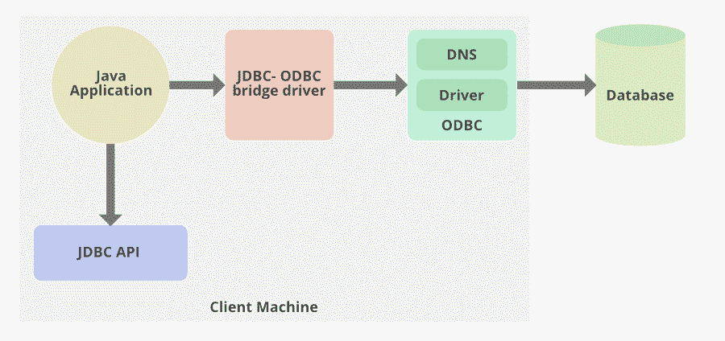

# JDBC–1 型驾驶员

> 原文:[https://www.geeksforgeeks.org/jdbc-type-1-driver/](https://www.geeksforgeeks.org/jdbc-type-1-driver/)

JDBC 驱动程序使 Java 应用程序能够与数据库交互，我们可以从中获取或存储数据。JDBC 驱动程序类似于 ODBC 驱动程序。JDBC 类包含在 Java 包中

*   连接到数据源，如数据库。
*   向数据库发送查询和更新语句
*   检索并处理从数据库接收的结果，以响应您的查询

JDK 附带的 Java.sql 包包含各种定义了行为的类，它们的实际实现是在第三方驱动程序中完成的。第三方供应商在其数据库驱动程序中实现 java.sql.Driver 接口。

JDBC 驱动程序类型用于对用于连接数据库的技术进行分类。

*   1 型桥驱动器
*   类型 2 本地应用编程接口
*   类型 3 网络协议
*   第 4 类本地协议

**Type -1** [**驱动程序 JDBC**](https://www.geeksforgeeks.org/jdbc-drivers/) 驱动程序也称为桥驱动程序它提供了一个桥来访问安装在每个客户端上的 ODBC 驱动程序。类型 1 驱动程序将对 JDBC 方法的调用转换为对开放数据库连接(ODBC)函数的调用。桥驱动程序允许 JDBC 应用程序立即访问由现有的 ODBC 驱动程序阵列提供的数据库连接。

[ODBC](https://www.geeksforgeeks.org/difference-odbc-jdbc/) 基于设备驱动模型，驱动封装了将一组标准的命令和函数转换成底层系统所需的特定调用所需的逻辑。使用 JDBC-ODBC 桥驱动程序，我们可以访问只支持 ODBC 的数据库。Java 应用程序向 JDBC-ODBC 桥驱动程序发送一个请求该请求在内部调用 ODBC 等效函数，ODBC 驱动程序从底层数据库中检索结果并将其发送回 JDBC-ODBC 桥驱动程序。

**驾驶台优势**

*   不同的数据源只能由这个驱动程序访问。
*   支持所有 ODBC 支持的数据库

**缺点:**

*   JAVA 应用程序应该只依赖于 ODBC 驱动程序
*   在每个客户端上，您需要安装 ODBC 来使类型 1 驱动程序工作
*   JDBC 方法调用被转换为 ODBC 调用，这会降低其性能

学习 JDBC 的简单方法。对于已经在每台客户机(通常是运行生产流程的基于 Windows 的计算机)上安装了 ODBC 驱动程序的公司来说，这可能很有用。这可能是访问某些低级桌面信息的唯一方法。但不适用于大规模应用。性能受到影响，因为从 JDBC 到 ODBC 的翻译工作有更高的标准。它不支持所有的 Java 特性。用户仅限于 ODBC 驱动程序基础功能。