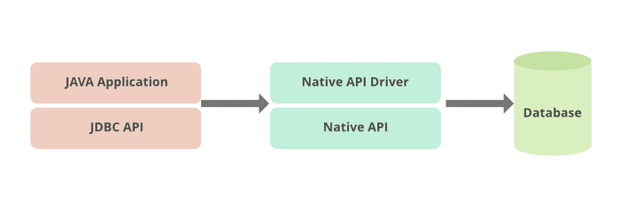

# JDBC–2 型驾驶员

> 原文:[https://www.geeksforgeeks.org/jdbc-type-2-driver/](https://www.geeksforgeeks.org/jdbc-type-2-driver/)

[**一个 JDBC**](https://www.geeksforgeeks.org/jdbc-drivers/) 驱动程序使 Java 应用程序能够与数据库交互，我们可以从中获取或存储数据。JDBC 驱动程序类似于 ODBC 驱动程序。JDBC 类包含在 Java 包中

*   连接到数据源，如数据库。
*   向数据库发送查询和更新语句
*   检索并处理从数据库接收的结果，以响应您的查询

JDK 附带的 Java.sql 包包含各种定义了行为的类，它们的实际实现是在第三方驱动程序中完成的。第三方供应商在其数据库驱动程序中实现了 [*java.sql.Driver*](https://www.geeksforgeeks.org/performing-database-operations-java-sql-create-insert-update-delete-select/) 接口。

*   JDBC 驱动程序类型用于对用于连接数据库的技术进行分类。
*   1 型桥驱动器
*   类型 2 本地应用编程接口
*   类型 3 网络协议
*   第 4 类本地协议

**类型 2 或 Partial Java 驱动程序:**也称为 Native API，将 JDBC 调用转换为特定于数据库的本机库调用，这些调用直接被数据库引擎理解。这种类型的驱动程序将 JDBC 调用转换为对 Oracle、Sybase、Informix、DB2 或其他数据库管理系统的客户端 API 的调用。

> 请注意，像桥驱动程序或类型 1 驱动程序一样，该驱动程序也需要在每个客户端机器上加载一些二进制代码。

*   JDBC 驱动程序使用本机应用编程接口直接与数据库客户端对话
*   它需要本机应用编程接口来连接到数据库客户端，它也不太便携和平台依赖
*   类型 2 驱动程序将 JDBC 呼叫转换为特定于数据库的呼叫，即该驱动程序特定于特定的数据库。
*   像类型 1 驱动程序一样，它不是用 Java 语言编写的，这就形成了可移植性问题。
*   如果我们改变数据库，我们必须改变本机应用编程接口，因为它是特定于数据库的。
*   它没有线程安全
*   不再生产或使用。
*   类型 2 驱动程序在架构上不兼容

> 这种类型的驱动程序将开发人员写入 JDBC 应用程序编程接口的调用转换为连接到特定数据库(如 IBM、Informix、Oracle 或 Sybase)的客户机应用程序编程接口的调用。