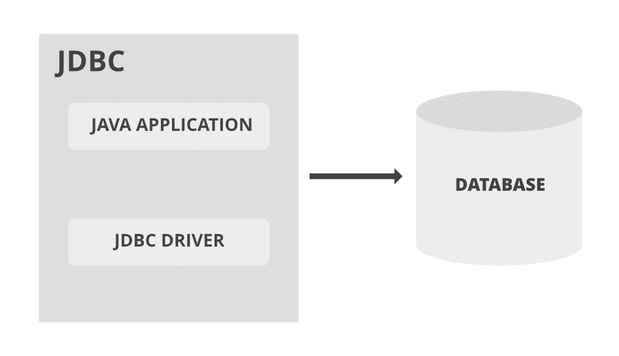
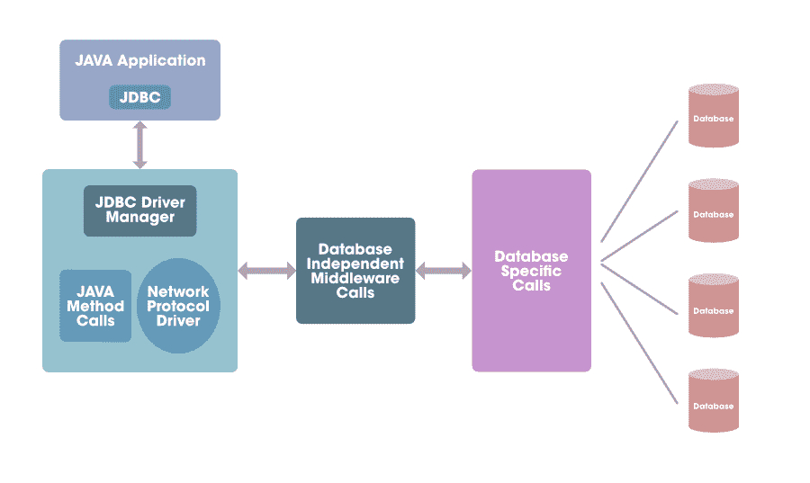

# JDBC–3 型驾驶员

> 原文:[https://www.geeksforgeeks.org/jdbc-type-3-driver/](https://www.geeksforgeeks.org/jdbc-type-3-driver/)

一个[JDBC 驱动程序](https://www.geeksforgeeks.org/jdbc-drivers/)使 Java 应用程序能够与一个数据库交互，我们可以从中获取或存储数据。JDBC 驱动程序类似于 ODBC 驱动程序。JDBC 类包含在 Java 包中

*   连接到数据源，如数据库。
*   向数据库发送查询和更新语句
*   检索并处理从数据库接收的结果，以响应您的查询

JDK 附带的 Java.sql 包包含各种定义了行为的类，它们的实际实现是在第三方驱动程序中完成的。第三方供应商在其数据库驱动程序中实现 [java.sql.Driver](https://www.geeksforgeeks.org/performing-database-operations-java-sql-create-insert-update-delete-select/) 接口。

JDBC 驱动程序类型用于对用于连接数据库的技术进行分类。

*   1 型桥驱动器
*   类型 2 本地应用编程接口
*   类型 3 网络协议
*   第 4 类本地协议

**Type -3 驱动程序 JDBC** 也称为网络协议驱动程序，因为它使用一个应用服务器，将 JDBC 呼叫直接或间接转换为供应商特定的数据库协议。该驱动程序将 JDBC 调用转换为中间件供应商的协议，然后由中间件服务器软件转换为特定于数据库的协议，从而提供与许多数据库的连接。

[中间件](https://www.geeksforgeeks.org/body-parser-middleware-in-node-js/)是介于操作系统和其上运行的应用程序之间的软件。中间件本质上是一个隐藏的翻译层，支持分布式应用程序的通信和数据管理。虽然所有中间件都执行通信功能，但公司选择使用的类型将取决于使用的是什么服务以及需要通信的信息类型。

**3 型驱动器的优势**

*   当用户有多个数据库并且想要使用单个驱动程序来连接所有数据库时，可以使用它。
*   无需在客户端机器上安装驱动程序代码，因为 Type-3 驱动程序基于服务器。
*   后端服务器组件针对运行数据库的操作系统进行了优化。
*   提供比类型 1 和类型 2 驱动程序更好的性能。

**3 型驱动器的缺点**

*   当中间件在不同的机器上运行时，Type-4 驱动程序会更有效。
*   它需要中间件服务器上特定于数据库的代码。