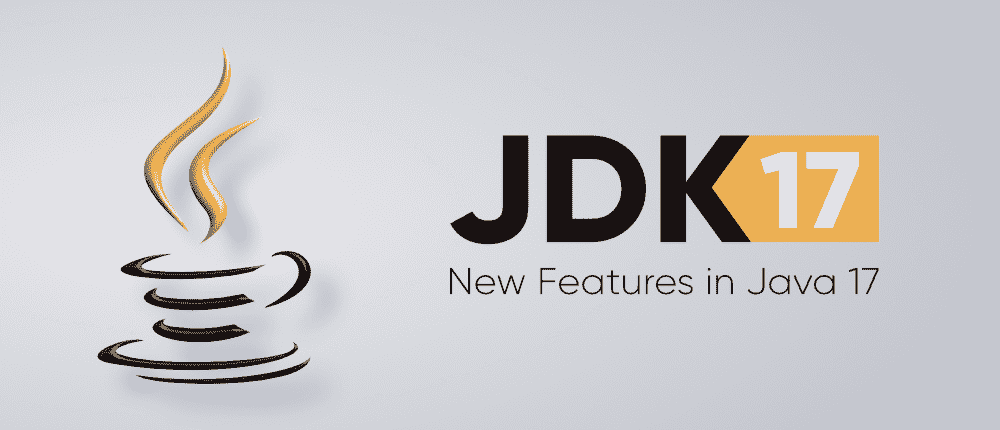
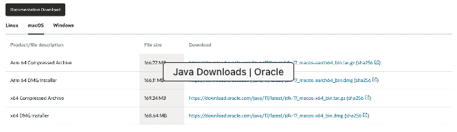
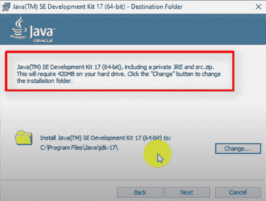

# JDK 17–Java 17 的新功能

> 原文:[https://www . geesforgeks . org/JDK-17-new-features-in-Java-17/](https://www.geeksforgeeks.org/jdk-17-new-features-in-java-17/)

Java 17 LTS 是 Java SE 平台的最新长期支持版本。JDK 17 二进制文件可以在生产中自由使用，也可以根据甲骨文免费条款和条件许可协议免费重新分发，其中 LTS 代表长期支持。**2021 年 9 月 15 日发布。**



**你有没有想过我们这样说是什么意思？**

没有单调的思维模式和频繁的发布，当一个人熟悉和理解一个更新的操作时。基本上，JDK17 的开放 LTS 版本已经发布，它由开发工具、一组库、一个 java 虚拟机和其他文件组成。随着每一个版本的发布，我们确实会看到新的功能，同时保持检查，其中一些功能会被修改或删除。让我们讨论开放 LTS 版本的演变，否则直接切换到安装部分或更新到它。


**开放 LTS Java 版本的演变**

还记得过去的日子吗，我们可以等待新的 java 版本，比如 2006 年到 2012 年的 Java 6，2013 年遵循 Java 7，然后是 2014 年的 Java 8，在那里引入了最流行的概念 lambda streams 和 streams。到目前为止还不错，因为随着新版本的发布，可以解释为 java 正在成为 It 行业的热门产品。坚持向前现在我们在很短的时间间隔内看到新的 java 版本，比如到 2017 年我们有 Java 9，到 2018 年我们有 Java 10，同年我们确实看到 Java 11。但这一次 java 在行业中有了更深的根基，因为大多数公司都选择 Java 作为他们开发对员工要求很高的技能集的主要语言。

众所周知，这种编程语言是由**甲骨文系统**拥有、设计和更新的，这家公司也是如此，在 2018 年之后，我们可以描绘出这样一种模式，即每年肯定会有新的发布，在 2019 年这一年，我们也会看到 Java 12、Java 13。到 2020 年，我们看到新的 Java LTS 发布周期是每 6 个月一次，这已经成为一个普遍的议程，2020 年 Java 14 和 Java 15 也是如此。今年，我们已经将 Java1 6 视为最新的 LTS，但与往常一样，随着快速扩张，我们应该会看到新的 LTS **Java17，它于 2021 年 9 月 15 日发布**回到最近。

> 大多数开发人员都喜欢它，有些人不是因为他们的洞察力，但对于进取的世界来说，它变得乏味，因为它对公司来说变得紧张，在连续 6 个月后，新版本推出一些新功能，同时删除一些以前的功能，这样做是为了让每个 LTS 版本都可以访问长达几年的适当工作流程。在当今世界，有些公司选择稳定性，而其他公司选择可扩展性和易用性，并引入了新功能。

### JDK17 中引入的特性

是的，每个人都为这个版本中的重大更新而疯狂，以便转换工作流，但是开发人员应该感到失望，因为没有像我们从 JDK 增强提案(通常称为 JEPS)中看到的那样大的发布更新版本检查，如下所述:

> 306:恢复始终严格的浮点语义
> 
> 356:增强型伪随机数生成器
> 
> 382:新的苹果电脑渲染管道
> 
> 391:macos/aach 64 端口
> 
> 398:拒绝删除小程序应用编程接口
> 
> 403:强封装 JDK 堆内构件
> 
> 406:交换机的模式匹配(预览)
> 
> 407:移除 RMI 激活
> 
> 409:可选课程
> 
> 410:移除实验 AOT 和 JIT 编译器
> 
> 411:拒绝删除安全管理器
> 
> 412:外部函数和内存应用编程接口(孵化器)
> 
> 414:矢量应用编程接口(第二孵化器)
> 
> 415:特定于上下文的反序列化筛选器

从这一点来看，我们认为在这个版本中没有显著的标记变化，但是为了更深入地理解它们，我们将它们分为以下 4 类:

1.  不错的开发者类型的东西
2.  特定开发人员类型的东西
3.  跟上苹果的步伐
4.  清理各种东西

**第 1 类:**开发人员不错

> 406:交换机的模式匹配(预览)
> 
> 409:可选课程

**1.1 交换机的模式匹配:**

它通过允许模式和语句出现在案例标签中，扩展了开关表达式和语句的表达能力和适用性。它还允许在需要时放松开关的历史零敌对状态。

**新增两种模式介绍如下:**

*   保护模式:使用模式和布尔表达式进行进一步细化
*   圆括号模式

**1.2** **封级:**

用密封的类和接口增强 java 编程语言。密封类和接口限制了哪些其他类或接口可以扩展或实现它们。

**语法:**

```java
public abstract sealed class Animal
permits Dog, Cat, Rabbit {...}
```

**第 2 类:** **特定开发商**

> 306:恢复始终严格的浮点语义

**2.1** **恢复始终严格的浮点语义:**

它使浮点运算始终严格。

**2.2** **增强型伪随机数发生器:**

它为伪随机数发生器提供了新的接口类型和实现，使其更容易使用各种 PRNG 算法，并更好地支持基于流的操作。

**2.3** **强封装 JDK 堆内构件:**

它高度概括了 JDK 所有非关键的内部因素

**2.4 外来函数&记忆 API(孵化器):**

它引入了一个 API，通过这个 API，java 程序可以在 java 运行时之外解释代码和数据。

**2.5** **矢量 API(第二孵化器):**

它引入了一个应用编程接口来表达向量计算，在运行时可靠地编译成最佳向量指令。

**2.6** **特定于上下文的反序列化过滤器:**

它允许应用程序配置特定于上下文和动态选择的反序列化过滤器。

**第三类:** **跟上苹果类的东西**

**3.1** **新的 macOS 渲染管道:**

它改变了 java 2D macOS 渲染管道，让 macOS 使用 Apple Metal API，而不是不推荐使用的 Apple OpenGL API。

**3.2****MAC OS/aach 64 端口**

**第四类:**清理各种杂物

**4.1** **反对删除小程序应用编程接口:**

小程序应用编程接口将被删除，因为它已被弃用，因为 JDK9 大多数浏览器不再支持它。

**4.2 移除 RMI 激活:**

虽然 RMI 仍然被使用，但是 RMI 激活机制随着过去十年的网络技术已经过时了。

**4.3 移除实验 AOT 和 JIT 编译器**:

移除实验性的基于 java 的提前(AOT)和及时(JIT)编译器。

**4.4 拒绝删除安全管理器:**

不赞成在未来版本中删除安全管理器。安全管理器可以追溯到 java 1.0。这么多年来，它一直不是保护客户端 java 代码的主要手段。

### **JDK 17**的安装

所以现在让我们讨论如何下载最新版本。为了下载最新的 LTS 版本，这意味着 JDK

**第一步:**浏览浏览器[访问甲骨文网站](https://www.oracle.com/java/technologies/downloads/)。



**第 2 步:**根据您的操作系统下载版本，为了方便不同的操作系统，请参考以下内容:

*   。debian fo Linux
*   . dmg for macOS
*   。适用于 Windows 的

继续下一步，选择要在本地计算机上安装它的目录，注意，通过下面的快照可以看到安装过程中的 JRE 内置支持，因此您不需要在标题图像中单独添加它。



**步骤 3:** [设置系统环境变量](https://www.geeksforgeeks.org/how-to-set-java-path-in-windows-and-linux/)的路径，为了检查是否安装了新的 JDK，通过输入以下命令通过终端进行验证。

```java
javac --version
java --version
```