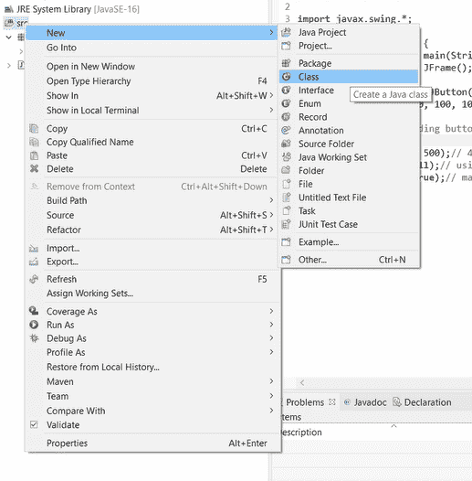
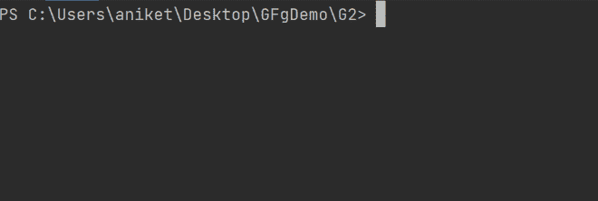
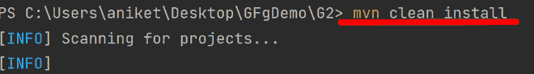
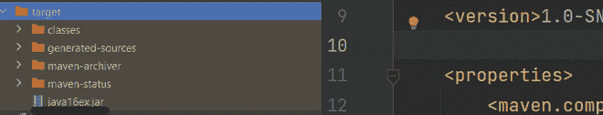
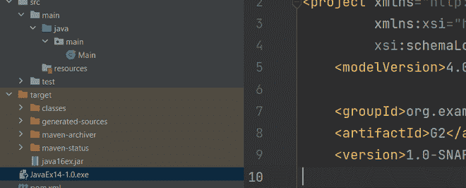
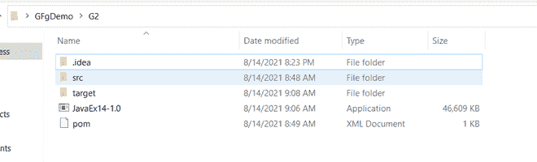
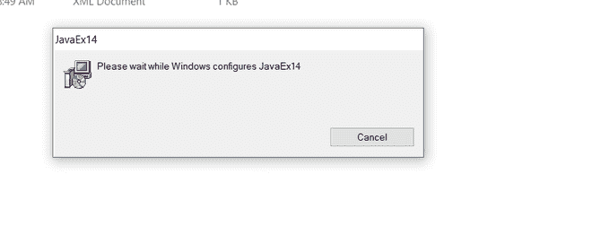
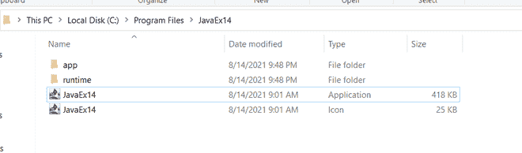
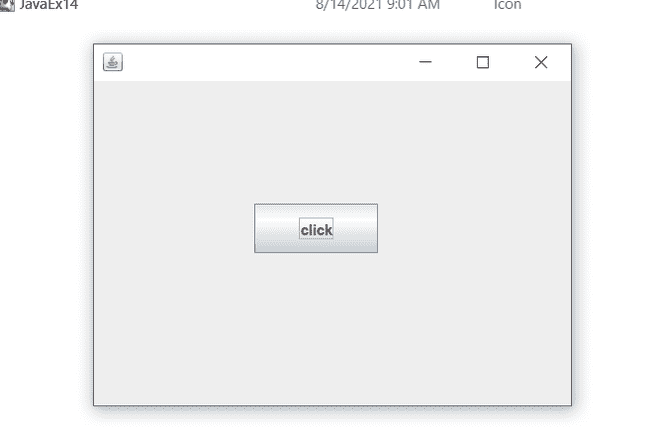

# Java 中的 JEP 包工具

> 原文:[https://www.geeksforgeeks.org/jep-package-tool-in-java/](https://www.geeksforgeeks.org/jep-package-tool-in-java/)

J package 工具是在 java 14 中作为孵化工具引入的。直到 java 15 之前，它一直是一个孵化工具。它将 java 应用程序打包成特定于平台的特性。基本上，这个工具将我们的 java 源文件转换成可执行文件。在 Windows 中，可执行文件有两种类型。在类型的 ubuntu 中。rpm 和. deb. J 包工具将 java 源文件转换成这些文件。

**程序:**

1.  在集成开发环境中创建一个 maven 项目，并创建一个新的 java 类(先决步骤)
2.  在 java 文件中插入代码片段。(先决条件步骤)
3.  定义我们将要包装的 JAR 文件名。类文件和相关配置。(先决条件步骤)
4.  在集成开发环境中打开终端
5.  输入命令“ *mvn 清洁安装*
6.  输入以下命令进行打包，JavaEx14.exe 文件将在该命令之后创建。
7.  找到这个文件。
8.  单击并安装它们
9.  单击 JavaEx14 运行该应用程序，将显示一个正在运行的弹出窗口。

**实施:**

**第一步:**在你的 IDE 中创建一个 maven 项目，并创建一个新的 java 类，众所周知。



**步骤 2:** 将以下代码插入下面提供的 java 文件。

**示例 1:** Java 应用程序

## Java 语言(一种计算机语言，尤用于创建网站)

```java
// Java Program to b Associated with JAR File to
// Illustrate JEP Package Tool

// Importin al classes from java.Swing package
// as this package is responsible for GUI
import javax.swing.*;

// Main class
public class GFG {

    // Main driver method
    public static void main(String args[])
    {

        // Creating object of classes JFrame and JButton
        // been there inside Swing package
        JFrame f = new JFrame();
        JButton b = new JButton("click");

        // Setting bounds to GUI with help
        // of inbuilt methods been there up
        b.setBounds(130, 100, 100, 40);
        f.add(b);
        f.setSize(400, 300);
        f.setLayout(null);
        f.setVisible(true);
    }
}
```

**步骤 3:** 现在我们需要定义 JAR 文件名，我们将在其中包装。类文件和相关配置。它包含在如下所示的构建路径中:

**示例 2:** JAR 文件

```java
<?xml version="1.0" encoding="UTF-8"?>
<project xmlns="http://maven.apache.org/POM/4.0.0"
         xmlns:xsi="http://www.w3.org/2001/XMLSchema-instance"
         xsi:schemaLocation="http://maven.apache.org/POM/4.0.0 http://maven.apache.org/xsd/maven-4.0.0.xsd">
    <modelVersion>4.0.0</modelVersion>

    <groupId>org.example</groupId>
    <artifactId>G2</artifactId>
    <version>1.0-SNAPSHOT</version>

    <properties>
        <maven.compiler.source>16</maven.compiler.source>
        <maven.compiler.target>16</maven.compiler.target>
    </properties>
    <build>
        <finalName>java16ex</finalName>
    </build>
</project>
```

现在让我们以顺序的方式提出视觉辅助的主要步骤。

**步骤 4:** 打开集成开发环境中的终端



**步骤 5:** 输入以下命令创建 jar 依赖关系



> 执行该命令后，将创建如下 jar，如下图所示



**第 6 步:**输入如下命令进行打包，如下图所示视觉辅助:


> 执行此命令后，JavaEx14.exe 文件将创建如下



**步骤 7:** 定位文件



**第 8 步:**点击安装



**第 9 步:**点击 JavaEx14 运行应用程序



> 控制台上将显示正在运行的应用程序弹出窗口

