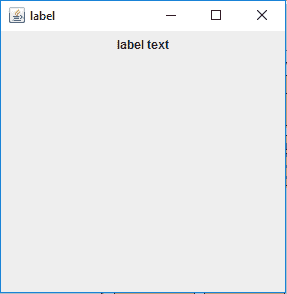
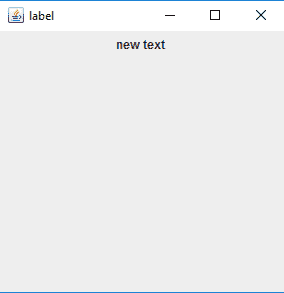
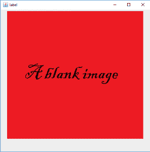
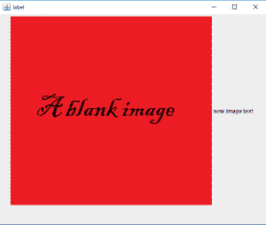

# jlabel | Java swing

> 哎哎哎:# t0]https://www . geeksforgeeks . org/jlabel-Java-swing/

JLabel 是 java Swing 的一个类。JLabel 用于显示短字符串或图像图标。JLabel 可以显示文本和/或图像。JLabel 只是文本或图像的显示，它无法获得焦点。JLabel 对于输入事件(如鼠标焦点或键盘焦点)是不活动的。默认情况下，标签垂直居中，但用户可以更改标签的对齐方式。
**类的构造函数有:**

1.  **JLabel() :** 创建一个没有文本或图像的空白标签。
2.  **JLabel(字符串):**用指定的字符串创建新标签。
3.  **JLabel(图标 i) :** 创建一个带有图像的新标签。
4.  **JLabel(字符串 s，图标 I，int align) :** 使用字符串、图像和指定的水平对齐方式创建新标签

**该类常用的方法有:**

1.  **getIcon() :** 返回标签显示的图像
2.  **设置图标(图标 i) :** 将标签显示的图标设置为图像 I
3.  **getText() :** 返回标签将显示的文本
4.  **设置文本(字符串):**将标签显示的文本设置为字符串

**1。程序创建一个空白标签并添加文本。**

## Java 语言(一种计算机语言，尤用于创建网站)

```java
// Java Program to create a
// blank label and add text to it.
import java.awt.event.*;
import java.awt.*;
import javax.swing.*;
class text extends JFrame {

    // frame
    static JFrame f;

    // label to display text
    static JLabel l;

    // default constructor
    text()
    {
    }

    // main class
    public static void main(String[] args)
    {
        // create a new frame to store text field and button
        f = new JFrame("label");

        // create a label to display text
        l = new JLabel();

        // add text to label
        l.setText("label text");

        // create a panel
        JPanel p = new JPanel();

        // add label to panel
        p.add(l);

        // add panel to frame
        f.add(p);

        // set the size of frame
        f.setSize(300, 300);

        f.show();
    }
}
```

**输出:**



**2。使用构造函数创建新标签的程序–标签(字符串)**

## Java 语言(一种计算机语言，尤用于创建网站)

```java
// Java Program to create a new label
// using constructor - JLabel(String s)
import java.awt.event.*;
import java.awt.*;
import javax.swing.*;
class text extends JFrame {

    // frame
    static JFrame f;

    // label to display text
    static JLabel l;

    // default constructor
    text()
    {
    }

    // main class
    public static void main(String[] args)
    {
        // create a new frame to store text field and button
        f = new JFrame("label");

        // create a label to display text
        l = new JLabel("new text ");

        // create a panel
        JPanel p = new JPanel();

        // add label to panel
        p.add(l);

        // add panel to frame
        f.add(p);

        // set the size of frame
        f.setSize(300, 300);

        f.show();
    }
}
```

**输出:**



**3。程序创建一个标签并添加图像。**

## Java 语言(一种计算机语言，尤用于创建网站)

```java
// Java Program to create  a label
// and add image to it .
import java.awt.event.*;
import java.awt.*;
import javax.swing.*;
class text extends JFrame {

    // frame
    static JFrame f;

    // label to display text
    static JLabel l;

    // default constructor
    text()
    {
    }

    // main class
    public static void main(String[] args)
    {
        // create a new frame to store text field and button
        f = new JFrame("label");

        // create a new image icon
        ImageIcon i = new ImageIcon("f:/image.png");

        // create a label to display image
        l = new JLabel(i);

        // create a panel
        JPanel p = new JPanel();

        // add label to panel
        p.add(l);

        // add panel to frame
        f.add(p);

        // set the size of frame
        f.setSize(500, 500);

        f.show();
    }
}
```

**输出:**



**4。向标签**
添加图像和字符串的程序

## Java 语言(一种计算机语言，尤用于创建网站)

```java
// Java Program to add a image and string
// to a label with horizontal alignment
import java.awt.event.*;
import java.awt.*;
import javax.swing.*;
class text extends JFrame {

    // frame
    static JFrame f;

    // label to display text
    static JLabel l;

    // default constructor
    text()
    {
    }

    // main class
    public static void main(String[] args)
    {
        // create a new frame to store text field and button
        f = new JFrame("label");

        // create a new image icon
        ImageIcon i = new ImageIcon("f:/image.png");

        // create a label to display text and image
        l = new JLabel("new image text ", i, SwingConstants.HORIZONTAL);

        // create a panel
        JPanel p = new JPanel();

        // add label to panel
        p.add(l);

        // add panel to frame
        f.add(p);

        // set the size of frame
        f.setSize(600, 500);

        f.show();
    }
}
```

**输出:**



**注意:**该程序可能无法在在线编译器中运行，请使用离线 IDE。