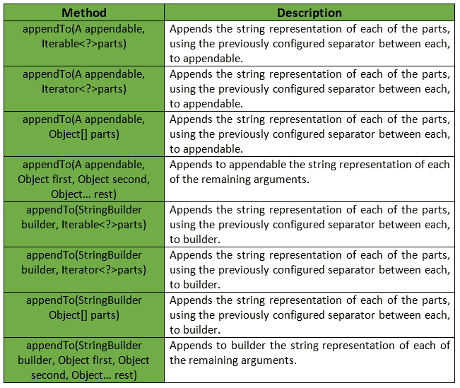
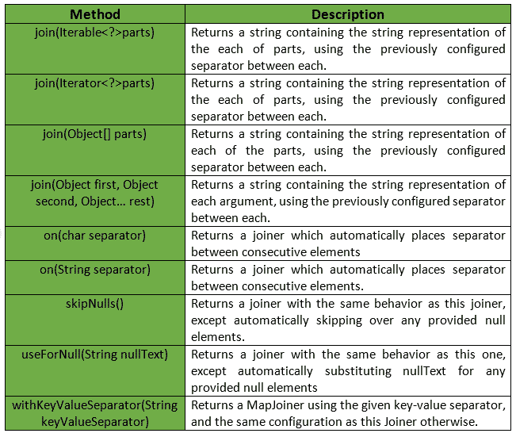

# 细木工类|番石榴|爪哇

> 原文:[https://www.geeksforgeeks.org/joiner-class-guava-java/](https://www.geeksforgeeks.org/joiner-class-guava-java/)

番石榴的 **Joiner 类**提供了各种方法来处理字符串、对象等的连接操作。此类为联接操作提供高级功能。

**声明:**以下是**类的声明:**

```java
@GwtCompatible
public class Joiner
   extends Object

```

下表简要总结了番石榴的儒瓦内类提供的方法:



**示例:**

```java
// Java code to show implementation of
// Guava's Joiner class's method

import com.google.common.base.Joiner;
import java.util.*;

class GFG {

    // Driver's code
    public static void main(String[] args)
    {

        // Creating a string array
        String[] arr = { "one", "two", "three", "four" };
        System.out.println("Original Array: "
                           + Arrays.toString(arr));

        // Use Joiner to combine all elements.
        // ... Specify delimiter in on method.

        // The last part of the Joiner statement, join,
        // can receive an Iterable (like an ArrayList) or
        // an Object array. It returns a String.
        String result = Joiner.on("...")
                            .join(arr);

        System.out.println("Joined String: "
                           + result);
    }
}
```

**Output:**

```java
Original Array: [one, two, three, four]
Joined String: one...two...three...four

```

番石榴的儒瓦内类提供的更多方法有:



**示例:**

```java
// Java code to show implementation of
// Guava's Joiner class's method

import com.google.common.base.Joiner;
import java.util.*;

class GFG {

    // Driver's code
    public static void main(String[] args)
    {

        // Creating a string array
        String[] arr = { "one", "two", null,
                         "four", null, "five" };
        System.out.println("Original Array: "
                           + Arrays.toString(arr));

        // Unlike the standard join method, we can
        // filter elements with a Joiner. With skipNulls,
        // null elements in an array or Iterable are removed.
        // Often null elements are not needed.
        // $ Specify delimiter in on method.

        // The last part of the Joiner statement, join,
        // can receive an Iterable (like an ArrayList) or
        // an Object array. It returns a String.
        String result = Joiner.on('+')
                            .skipNulls()
                            .join(arr);

        System.out.println("Joined String: "
                           + result);
    }
}
```

**Output:**

```java
Original Array: [one, two, null, four, null, five]
Joined String: one+two+four+five

```

**参考:**T2】谷歌番石榴木工类