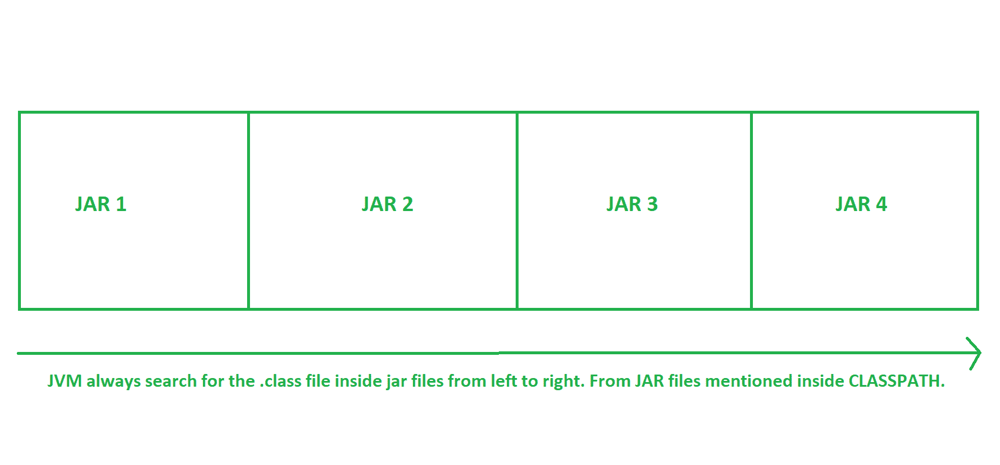

# JPMS : Java 平台模块系统

> 原文:[https://www . geesforgeks . org/jpms-Java-platform-module-system/](https://www.geeksforgeeks.org/jpms-java-platform-module-system/)

**JPMS:** JPMS 即 Java 平台模块系统是 [Java 9](https://www.geeksforgeeks.org/Java-9-features-with-examples/) 中引入的新功能。在 Java 模块系统的帮助下，我们可以将我们的 Java 应用程序和我们的 Java 包打包成 Java 模块。借助于 Java 模块，我们可以指定该模块的哪些包应该对其他 Java 模块可见。一个 Java 模块还必须指定完成其工作所需的其他 Java 模块。
Java 平台模块系统有时也被称为 **Java 拼图**或**项目拼图**视情况而定。Jigsaw 是开发过程中内部使用的项目名称。后来 Jigsaw 更名为 Java 平台模块系统。开发 JPMS 的主要目的是使 [JRE](https://www.geeksforgeeks.org/differences-jdk-jre-jvm/) 更加模块化，即拥有更小的可选罐子和/或我们只能根据需要下载/升级功能。
**JPMS/Jigsaw 项目将解决几个主要问题:**

1.  类路径/JAR 地狱

2.  巨大的单片 JDK

3.  版本冲突

4.  安全问题

让我们详细看看每一个。

*   **ClassPath/JAR Hell:** Java 在运行时搜索类路径上的类和包。假设我们创建了一个应用程序，该应用程序需要几个 jar 文件中的一些类文件，我们将这些 jar 添加到类路径中。在编译时，编译器不会检查 jar 中是否存在所需的类文件。它将运行应用程序，并在运行时转到类路径，检查 jar 文件中是否有所需的类。如果它在那里，那么我们的应用程序将执行良好。但是由于任何原因，如果任何一个类文件不在 jar 中，那么它将抛出 NoClassDefFound 错误。在 Java 9 引入之前，我们一直在遵循这种方法，在运行时使用这种方法有可能会得到 NoClassDefFound 错误，这并不好。
    借助 Java 模块系统，我们可以将我们的 Java 应用和我们的 Java 包打包成 Java 模块。除了**。类文件**，一个 Java 模块多包含一个文件即**module-info.Java 文件**。每个 Java 模块都需要一个名为 module-info.Java 的 Java 模块描述符，它必须位于相应的模块根目录中。然而，创建一个模块相对简单。一个模块通常只是一个 jar 文件，它在根目录下有一个 module-info.class 文件，这就是所谓的模块化 jar 文件。使用模块化 jar 文件需要将 jar 文件添加到 modulepath 中，而不是类路径中。在 module-info.Java，我们可以提到所有的依赖项/在运行时需要哪些模块。现在在编译时，在 module-info.Java 的帮助下，编译器将知道运行应用程序需要什么类，并且在编译时，只有编译器将检查相应的类/包是否存在于模块中。如果所需的类存在，那么代码将成功编译，否则它将仅在编译时抛出编译错误。这就是 Java 模块系统解决类路径/JAR 地狱问题的方法。

*   **巨大的整体式 JDK:** 整体式是指由一大块石头组成。JDK 巨大的整体性导致了几个问题。它不适合小型设备。小型设备不一定有存储所有 JDK 的内存，尤其是当应用程序只使用一小部分内存时。

## Java 语言(一种计算机语言，尤用于创建网站)

```
class Geeksforgeeks {
    public static void main(String[] args)
    {
        System.out.println(
            "Hello, "
            + "Welcome to Geeksforgeeks!!!");
    }
}
```

要运行上面的代码，我们需要几个类，如字符串、系统、对象等。但是我们必须守住整个 JDK，即使我们没有使用整个 JDK 罐子，甚至没有使用其中的 10%。使用这种方法来运行 1KB 的文件，我们需要至少 60MB 的 rt.jar 文件。我们可以和 JPMS 一起解决这个问题。Jigsaw 将 JDK 本身分解成许多模块，例如 [Java.sql](https://www.geeksforgeeks.org/tag/java-sql-package/) 包含熟悉的 sql 类， [Java.io](https://www.geeksforgeeks.org/java-io-packag/) 包含熟悉的 io 类等。根据需要，我们可以使用合适的模块。不需要使用整个 JDK。

*   **版本冲突:**



这里我们在类路径中有 4 个 jar 文件。假设 JAR 4 需要一个**。JAR 3 和 JAR 2 的名为 xyz 的类文件**也包含了。名为 xyz 的类文件。现在 JVM 将从左到右搜索 xyz 类文件，它将获得。JAR 2 中名为 xyz 的类文件。现在 JVM 将在 JAR 4 中分配 JAR 2 的 xyz.class 文件。但是 JAR 4 需要 JAR 3 的 xyz.class 文件。这里我们会得到版本冲突。在 JPMS 的帮助下，我们可以指定我们想要一个特定 JAR 文件的. class 文件。我们必须在 module-info.Java 内部指定如下:

## Java 语言(一种计算机语言，尤用于创建网站)

```
module module4
{
    requires module3;
}
```

*   **安全问题:**假设我们有一个 jar，在这个 JAR 里面有 2 个包。

```
com.geeksforgeeks.demo.api.geeks
com.geeksforgeeks.demo.impl.geeksImpl
```

这两个包本质上都是公开的。在某些时候，我们可能会决定我们的团队应该使用极客包，而不是直接使用极客简单包。但是，没有办法在类路径上强制执行。在 JPMS/Jigsaw 中，一个模块包含一个 module-info.Java 文件，该文件允许我们明确声明哪些内容对其他模块是公共的。

## Java 语言(一种计算机语言，尤用于创建网站)

```
// com.geeksforgeeks.demo.api.geeks is accessible,
// but com.geeksforgeeks.demo.impl.geeksImpl is not

module com.geeksforgeeks.demo
{
    exports com.geeksforgeeks.demo.impl;
}
```