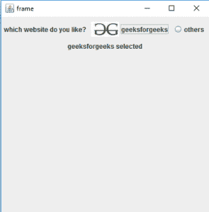

# 【jradiobutton | Java 摇摆】

> 哎哎哎::1230【https://www . geeksforgeeks . org/jradiobutton-Java-swing/

我们使用 JRadioButton 类来创建一个单选按钮。单选按钮用于从多个选项中选择一个选项。它用于填写表格、在线客观试卷和测验。

我们在按钮组中添加单选按钮，这样我们一次只能选择一个单选按钮。我们使用“按钮组”类来创建一个按钮组，并在一个组中添加单选按钮。

**使用的方法:**

1.  JRadioButton():创建一个没有文本的未选中的单选按钮。
    例:

```
JRadioButton j1 = new JRadioButton() 

```

*   创建一个带有特定文本的按钮。
    示例:

    ```
    JButton b1 = new JButton("Button") 

    ```

    *   创建一个带有特定文本的标签。
    示例:

    ```
    JLabel L = new JLabel("Label 1") 

    ```

    *   ButtonGroup():用于创建一个组，我们可以在其中添加 JRadioButton。我们只能在一个按钮组中选择一个按钮。
    **将单选按钮组合在一起的步骤。**
    *   使用“按钮组()”方法创建一个按钮组实例。

        ```
        ButtonGroup G = new ButtonGroup()

        ```

    *   Now add buttons in a Group “G”, with the help of “add()” Method.

        示例:

        ```
        G.add(Button1);
        G.add(Button2);

        ```

        *   isSelected() : it will return a Boolean value true or false, if a JRadioButton is selected it Will return true otherwise false.

    示例:

    ```
    JRadioButton.isSelected()

    ```

    *   Set(…) and Get(…) Methods :
    i) Set and get are used to replace directly accessing member variables from external classes.

    ii)不是直接访问类成员变量，而是定义 get 方法来访问这些变量，并设置方法来修改它们。

    程序中使用的一些功能的描述，在此链接给出:[功能描述](https://www.geeksforgeeks.org/message-dialogs-java-gui/)

    **程序 1 : JRadioButton 无动作监听器**

    ```
    // Java program to show JRadioButton Example.
    // in java. Importing different Package.
    import java.awt.*;
    import javax.swing.*;
    import java.awt.event.*;

    class Demo extends JFrame {

        // Declaration of object of JRadioButton class.
        JRadioButton jRadioButton1;

        // Declaration of object of JRadioButton class.
        JRadioButton jRadioButton2;

        // Declaration of object of JButton class.
        JButton jButton;

        // Declaration of object of ButtonGroup class.
        ButtonGroup G1;

        // Declaration of object of  JLabel  class.
        JLabel L1;

        // Constructor of Demo class.
        public Demo()
        {

            // Setting layout as null of JFrame.
            this.setLayout(null);

            // Initialization of object of "JRadioButton" class.
            jRadioButton1 = new JRadioButton();

            // Initialization of object of "JRadioButton" class.
            jRadioButton2 = new JRadioButton();

            // Initialization of object of "JButton" class.
            jButton = new JButton("Click");

            // Initialization of object of "ButtonGroup" class.
            G1 = new ButtonGroup();

            // Initialization of object of " JLabel" class.
            L1 = new JLabel("Qualification");

            // setText(...) function is used to set text of radio button.
            // Setting text of "jRadioButton2".
            jRadioButton1.setText("Under-Graduate");

            // Setting text of "jRadioButton4".
            jRadioButton2.setText("Graduate");

            // Setting Bounds of "jRadioButton2".
            jRadioButton1.setBounds(120, 30, 120, 50);

            // Setting Bounds of "jRadioButton4".
            jRadioButton2.setBounds(250, 30, 80, 50);

            // Setting Bounds of "jButton".
            jButton.setBounds(125, 90, 80, 30);

            // Setting Bounds of JLabel "L2".
            L1.setBounds(20, 30, 150, 50);

            // "this" keyword in java refers to current object.
            // Adding "jRadioButton2" on JFrame.
            this.add(jRadioButton1);

            // Adding "jRadioButton4" on JFrame.
            this.add(jRadioButton2);

            // Adding "jButton" on JFrame.
            this.add(jButton);

            // Adding JLabel "L2" on JFrame.
            this.add(L1);

            // Adding "jRadioButton1" and "jRadioButton3" in a Button Group "G2".
            G1.add(jRadioButton1);
            G1.add(jRadioButton2);
        }
    }

    class RadioButton {
        // Driver code.
        public static void main(String args[])
        { // Creating object of demo class.
            Demo f = new Demo();

            // Setting Bounds of JFrame.
            f.setBounds(100, 100, 400, 200);

            // Setting Title of frame.
            f.setTitle("RadioButtons");

            // Setting Visible status of frame as true.
            f.setVisible(true);
        }
    }
    ```

    输出:

    **程序 2:带动作监听器的 JRadioButton】**

    ```
    // Java program to show JRadioButton Example.
    // in java. Importing different Package.
    import java.awt.*;
    import javax.swing.*;
    import java.awt.event.*;

    class Demo extends JFrame {

        // Declaration of object of JRadioButton class.
        JRadioButton jRadioButton1;

        // Declaration of object of JRadioButton class.
        JRadioButton jRadioButton2;

        // Declaration of object of JButton class.
        JButton jButton;

        // Declaration of object of ButtonGroup class.
        ButtonGroup G1;

        // Declaration of object of  JLabel  class.
        JLabel L1;

        // Constructor of Demo class.
        public Demo()
        {

            // Setting layout as null of JFrame.
            this.setLayout(null);

            // Initialization of object of "JRadioButton" class.
            jRadioButton1 = new JRadioButton();

            // Initialization of object of "JRadioButton" class.
            jRadioButton2 = new JRadioButton();

            // Initialization of object of "JButton" class.
            jButton = new JButton("Click");

            // Initialization of object of "ButtonGroup" class.
            G1 = new ButtonGroup();

            // Initialization of object of " JLabel" class.
            L1 = new JLabel("Qualification");

            // setText(...) function is used to set text of radio button.
            // Setting text of "jRadioButton2".
            jRadioButton1.setText("Under-Graduate");

            // Setting text of "jRadioButton4".
            jRadioButton2.setText("Graduate");

            // Setting Bounds of "jRadioButton2".
            jRadioButton1.setBounds(120, 30, 120, 50);

            // Setting Bounds of "jRadioButton4".
            jRadioButton2.setBounds(250, 30, 80, 50);

            // Setting Bounds of "jButton".
            jButton.setBounds(125, 90, 80, 30);

            // Setting Bounds of JLabel "L2".
            L1.setBounds(20, 30, 150, 50);

            // "this" keyword in java refers to current object.
            // Adding "jRadioButton2" on JFrame.
            this.add(jRadioButton1);

            // Adding "jRadioButton4" on JFrame.
            this.add(jRadioButton2);

            // Adding "jButton" on JFrame.
            this.add(jButton);

            // Adding JLabel "L2" on JFrame.
            this.add(L1);

            // Adding "jRadioButton1" and "jRadioButton3" in a Button Group "G2".
            G1.add(jRadioButton1);
            G1.add(jRadioButton2);

            // Adding Listener to JButton.
            jButton.addActionListener(new ActionListener() {
                // Anonymous class.

                public void actionPerformed(ActionEvent e)
                {
                    // Override Method

                    // Declaration of String class Objects.
                    String qual = " ";

                    // If condition to check if jRadioButton2 is selected.
                    if (jRadioButton1.isSelected()) {

                        qual = "Under-Graduate";
                    }

                    else if (jRadioButton2.isSelected()) {

                        qual = "Graduate";
                    }
                    else {

                        qual = "NO Button selected";
                    }

                    // MessageDialog to show information selected radion buttons.
                    JOptionPane.showMessageDialog(Demo.this, qual);
                }
            });
        }
    }

    class RadioButton {
        // Driver code.
        public static void main(String args[])
        { // Creating object of demo class.
            Demo f = new Demo();

            // Setting Bounds of JFrame.
            f.setBounds(100, 100, 400, 200);

            // Setting Title of frame.
            f.setTitle("RadioButtons");

            // Setting Visible status of frame as true.
            f.setVisible(true);
        }
    }
    ```

    输出:

    按下按钮“点击”后。

    **程序 3 程序创建一组简单的单选按钮(带图像)并在其中添加项目监听器**

    ```
    // Java Program to create a simple group of radio buttons 
    // (with image )and add item listener to them
    import java.awt.event.*;
    import java.awt.*;
    import javax.swing.*;
    class solve extends JFrame implements ItemListener {

        // frame
        static JFrame f;

        // radiobuttons
        static JRadioButton b, b1;

        // create a label
        static JLabel l1;

        // main class
        public static void main(String[] args)
        {
            // create a new frame
            f = new JFrame("frame");

            // create a object
            solve s = new solve();

            // create a panel
            JPanel p = new JPanel();

            // create a new label
            JLabel l = new JLabel("which website do you like?");
            l1 = new JLabel("geeksforgeeks selected");

            // create Radio buttons
            b = new JRadioButton("geeksforgeeks", new ImageIcon("f:/gfg.jpg"));
            b1 = new JRadioButton("others");

            // create a button group
            ButtonGroup bg = new ButtonGroup();

            // add item listener
            b.addItemListener(s);
            b1.addItemListener(s);

            // add radio buttons to button group
            bg.add(b);
            bg.add(b1);

            b.setSelected(true);

            // add button and label to panel
            p.add(l);
            p.add(b);
            p.add(b1);
            p.add(l1);

            f.add(p);

            // set the size of frame
            f.setSize(400, 400);

            f.show();
        }

        public void itemStateChanged(ItemEvent e)
        {
            if (e.getSource() == b) {
                if (e.getStateChange() == 1) {
                    l1.setText("geeksforgeeks selected");
                }
            }
            else {

                if (e.getStateChange() == 1) {
                    l1.setText("others selected");
                }
            }
        }
    }
    ```

    **输出:**
    

    **注意:以下程序可能无法在联机编译器中运行，请使用脱机 IDE。**