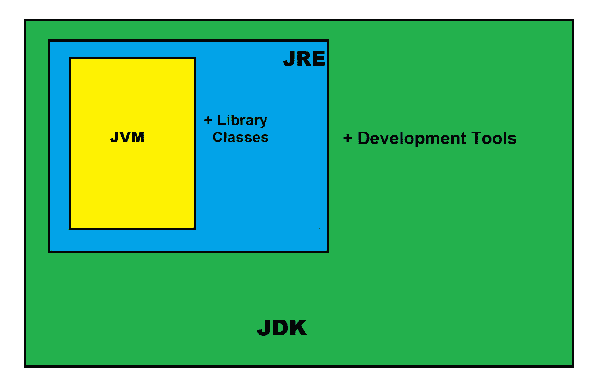

# JRE 完整形式

> 原文:[https://www.geeksforgeeks.org/jre-full-form/](https://www.geeksforgeeks.org/jre-full-form/)

JRE 代表 **JAVA 运行时环境** *。* JRE 是 **JDK** 的子集。JRE 是 Java 环境的一个重要组成部分，它提供了一个执行 Java 程序的环境。JRE 实际上是作为 JVM 的一个实现而存在的。JRE 是 JVM 在运行时使用的一组库和其他文件。JVM 执行由 JRE 制作的程序。

### **JRE 的特性**

**class loader:**JRE class loader 运行时加载运行 java 程序所需的所有类。JRE 使用类加载器在需要时自动执行。基本上，Java 类被加载到内存中。

**字节码验证器:**字节码验证器检查 Java 代码的格式和准确性，然后传递给解释器。在这种情况下，代码避免了完整性或访问权限，该对象集将不会被加载。它将被视为已损坏。

**解释器:**成功加载字节码加载后，java 解释器将 java 字节码转换为()。类文件)很容易被操作系统或 java 解释器理解，创建一个 Java 虚拟机实例，允许 Java 程序在底层机器上本地执行。

JRE 是 JDK 的重要组成部分。它提供了成功执行特定 java 程序所需的类库和其他资源。在 JRE 中，java 程序拥有所需的所有访问和功能，并且这些功能独立于操作系统工作。

### **JRE**包含什么**？**

JRE 是各种其他支持软件工具和功能的组合，它们在您的 Java 应用程序中得到最充分的使用。

**部署解决方案:**

这是 JRE 安装和部署技术的一部分，如 java Plugin 和 java Web start，它们简化了应用程序的激活，并为 Java 更新提供了高级支持。

**开发工具包:**

JRE 还包含了一些工具包，旨在帮助开发人员改进他们的用户界面。这里提到了一些工具包:

*   **JAVA 2D:** 这是一个应用编程接口(API)，用于用 JAVA 语言绘制二维图形。在 Java 的帮助下，2D 开发者可以创建有效的用户界面、特效、游戏和动画。
*   **抽象窗口工具包(AWT)** :也是 JRE 的重要工具。它用于创建对象、按钮、滚动条和窗口。
*   **Swing** : Swing 是另一个轻量级 GUI，用于创建一组小部件，以提供灵活、用户友好的定制。它还包含按钮滚动条、文本字段等组件。我们可以在将所有组件放在一起的帮助下创建一个图形用户界面。

**集成库:**

JRE 提供了许多集成库，帮助开发人员在他们的应用程序和服务之间创建无缝的数据连接。这些库包括:

*   [**Java IDL (CORBA)**](https://www.geeksforgeeks.org/difference-between-rmi-and-corba/) :在 JRE 中，它用于通用对象请求架构，以支持用 Java 编程语言编写的分布式对象。
*   [**Java 数据库连接(JDBC) API**](https://www.geeksforgeeks.org/introduction-to-jdbc/) : JDBC 为开发人员提供了连接数据库、平面文件和电子表格并执行查询的工具。它是 JavaSE (Java 标准版)的一部分。JDBC 使用四种类型的驱动程序。
    *   JDBD-ODBC BridgeDriver，
    *   本地驱动程序，
    *   网络协议驱动程序
    *   瘦驱动程序
*   **Java 命名和目录接口(JNDI): JNDI)** 是一个应用程序编程接口(API)和目录服务，允许客户端创建可移植的应用程序，可以使用命名约定从数据库中获取信息。在 JNDI 的帮助下，我们可以通过名称发现和查找资源。