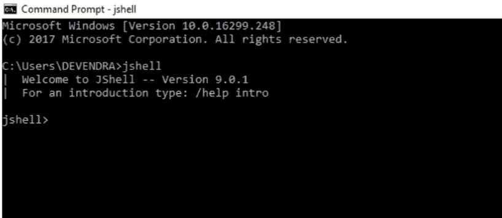
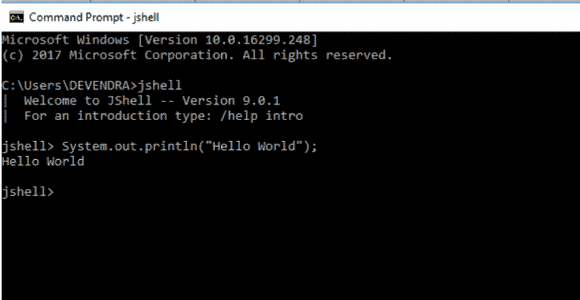

# JShell (Java 9 新特性)

> 原文:[https://www.geeksforgeeks.org/jshell-java-9-new-feature/](https://www.geeksforgeeks.org/jshell-java-9-new-feature/)

**JShell 简介**
Java Shell 工具(JShell)是一个学习 Java 编程语言和制作 Java 代码原型的交互式工具。JShell 是一个读取-评估-打印循环(REPL)，它在输入声明、语句和表达式时对它们进行评估，并立即显示结果。该工具从命令行运行。JShell 是在 java 9 中引入的，因此不能在 java 8 中使用。

**为什么要用 JShell？**
Jshell 减少了运行 Java 程序和测试业务逻辑所需的所有工作。如果不使用 Jshell，Java 程序的创建包括以下步骤。

1.  打开编辑器并编写程序
2.  保存程序
3.  编译程序
4.  如果有编译时错误，请编辑
5.  运行程序
6.  如果有运行时错误，请进行编辑
7.  重复这个过程

Jshell 不需要上述步骤。我们可以评估语句、方法和类，甚至可以在不创建类的情况下编写 hello 程序。
JShell 帮助您在开发程序时尝试代码并轻松探索选项。您可以测试单个语句，尝试方法的不同变体，并在 JShell 会话中使用不熟悉的 API 进行实验。JShell 不会取代 IDE。开发程序时，将代码粘贴到 JShell 中进行试用，然后将 JShell 中的工作代码粘贴到程序编辑器或 IDE 中。

**启动和停止 Jshell**
要启动 JShell，首先我们必须已经安装了 Java 9，然后在 Linux 中打开终端或者在 windows 中打开命令提示符，键入 JShell。它将启动 jshell 会话，并向控制台显示欢迎消息。



**你好 Java 消息**

要显示一条简单的“Hello Java”消息，请在不创建类的情况下编写 print 命令，然后按 enter 键。



要退出 JShell，请输入命令:

```
jshell> /exit
|  Goodbye
```

**Snippets**
JShell 接受 Java 语句；变量、方法和类定义；进口；和表情。这些 Java 代码片段被称为代码片段。
在提示符下输入以下示例语句，并查看显示的输出:

```
jshell> int x = 11
x ==> 11
|  created variable x : int
```

首先，显示结果。可以这样理解:变量 x 的值为 45。因为您处于详细模式，所以还会显示所发生情况的描述。信息性消息以竖线开始。请注意，创建的变量的名称和类型都会显示出来。
当输入没有命名变量的表达式时，会创建一个暂存变量，以便以后引用该值。以下示例显示了表达式和方法结果的临时值。该示例还显示了当一个代码片段需要多行输入才能完成时使用的延续提示(… >):

```
jshell> 8 + 8
$3 ==> 16
|  created scratch variable $3 : int

jshell> String double(String s) {
   ...>    return s + s;
   ...> }
|  created method double(String)

jshell> double("Geeks")
$5 ==> "GeeksGeeks"
|  created scratch variable $5 : String
```

**异常**
在异常回溯中，反馈标识了代码片段以及代码片段中发生异常的位置。

输入 JShell 的代码中的位置显示为#ID:行号，其中代码段 ID 是/list 命令显示的数字，行号是代码段中的行号。在下面的示例中，异常发生在代码片段 1 中，它是 divide()方法，位于该方法的第二行:

```
jshell> int half(int x, int y) {
   ...> return x / y;
   ...> }
|  created method divide(int,int)

jshell> divide(5, 0)
|  java.lang.ArithmeticException thrown: / by zero
|        at divide (#1:2)
|        at (#2:1)

jshell> /list

   1 : int divide(int x, int y) {
           return x / y;
       }
   2 : divide(5, 0)
```

**命令简介**
JShell 命令在一个会话中控制环境和显示信息。

命令与代码片段的区别在于前导正斜杠(/)。有关当前变量、方法和类型的信息，请使用/vars、/methods 和/types 命令。有关输入片段的列表，请使用/list 命令。以下示例基于示例
显示了这些命令

```
jshell> /vars
|    int x = 8
|    int $3 = 16
|    String $5 = "GeeksGeeks"

jshell> /methods
|    double(String)String

jshell> /list

   1 : System.out.println("Hi");
   2 : int x = 8;
   3 : 8 + 8
   4 : String double(String s) {
         return s + s;
       }
   5 : double("Ocean")
```

请注意，将显示变量的类型和值以及方法的类型签名。

JShell 有一个默认的启动脚本，它会在 JShell 启动之前静默自动执行，这样您就可以快速开始工作。启动脚本中的条目不会列出，除非您使用/list -start 或/list -all 命令请求它们:

```
jshell> /list -all

  s1 : import java.util.*;
  s2 : import java.io.*;
  s3 : import java.math.*;
  s4 : import java.net.*;
  s5 : import java.util.concurrent.*;
  s6 : import java.util.prefs.*;
  s7 : import java.util.regex.*;
   1 : System.out.println("Hi");
   2 : int x = 8;
   3 : 8 + 8
   4 : String double(String s) {
         return s + s;
       }
   5 : double("GeeksGeeks")
```

默认启动脚本由几个常见的导入组成。您可以使用/set start 命令个性化您的启动条目。有关此命令的信息，请输入/help /set start。/save -start 命令将当前启动脚本保存为您自己的启动脚本的起始点。

其他重要的命令包括/exit 离开 JShell，/save 保存代码片段，以及/open 从文件中输入代码片段。

输入/帮助获取 JShell 命令列表。

参考文献–[https://docs.oracle.com/javase/9/tools/jshell.htm](https://docs.oracle.com/javase/9/tools/jshell.htm)T2】