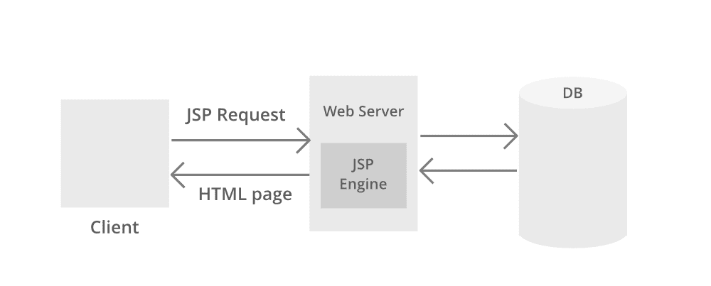
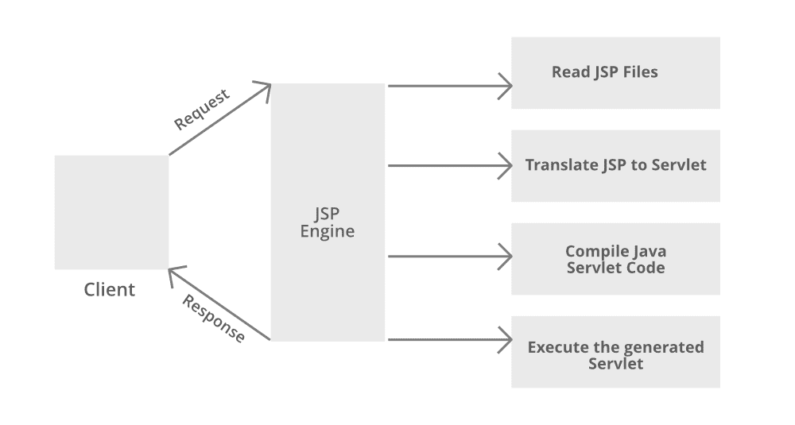

# JSP 架构

> 原文:[https://www.geeksforgeeks.org/jsp-architecture/](https://www.geeksforgeeks.org/jsp-architecture/)

[JSP](https://www.geeksforgeeks.org/introduction-to-jsp/) 架构给出了 JSP 工作的高层视图。JSP 架构是一个三层架构。它有客户端、网络服务器和数据库。客户端是用户端的网络浏览器或应用程序。网络服务器使用 JSP 引擎，即:一个处理 JSP 的容器。例如，Apache Tomcat 有一个内置的 JSP 引擎。JSP 引擎截获对 JSP 的请求，并为 JSP 文件的理解和处理提供运行时环境。它读取、解析、构建 Java Servlet、编译和执行 Java 代码，并将 HTML 页面返回给客户端。网络服务器可以访问数据库。下图显示了 JSP 的体系结构。

现在让我们讨论 JSP，它代表 Java 服务器页面。它是一种服务器端技术。它用于创建 web 应用程序。它用于创建动态网页内容。在这种情况下，JSP 标签用于将 JAVA 代码插入到 HTML 页面中。它是 Servlet 技术的高级版本。它是一种基于网络的技术，帮助我们创建动态的、独立于平台的网页。在这种情况下，Java 代码可以插入到 HTML/ XML 页面中，或者两者都插入。在处理客户端的请求之前，JSP 首先被 JSP 容器转换成一个 servlet。 **JSP 处理**以连续的步骤进行说明和讨论，在此之前，会提供一个图片媒体作为精选，以便更好地理解 JSP 处理，如下所示:

**步骤 1:** 客户端导航到以****[***结尾的文件。jsp 扩展***](https://www.geeksforgeeks.org/difference-between-servlet-and-jsp/) ，浏览器向 web 服务器发起 HTTP 请求。例如，用户输入登录详细信息并提交按钮。浏览器向网络服务器请求 status.jsp 页面。****

******第二步:**如果 web 服务器中存在 JSP 的编译版本，则返回文件。否则，请求将被转发到 JSP 引擎。这是通过识别以**结尾的网址来完成的。jsp** 扩展。****

******第三步:**JSP 引擎加载 JSP 文件，并将 JSP 翻译成 Servlet(Java 代码)。这是通过将所有模板文本转换为 println()语句并将 JSP 元素转换为 Java 代码来实现的。这个过程叫做**翻译。******

******步骤 4:**JSP 引擎将 Servlet 编译成可执行文件**。类**文件。它被转发到 Servlet 引擎。该过程称为**编译**或**请求处理阶段。******

******第五步:****。类**文件由作为 Web 服务器一部分的 Servlet 引擎执行。输出是一个 HTML 文件。Servlet 引擎将输出作为 HTTP 响应传递给网络服务器。****

******第六步:**网络服务器将 HTML 文件转发给客户端的浏览器。****