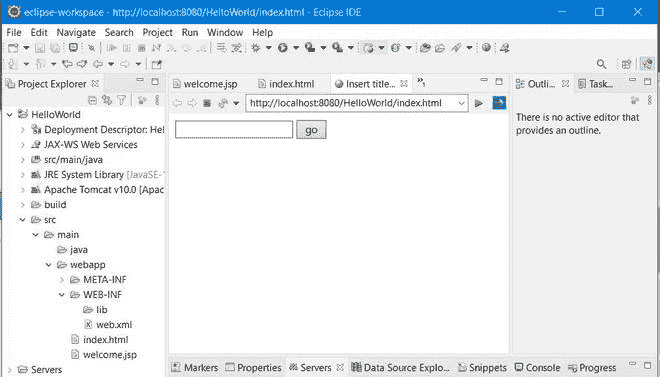
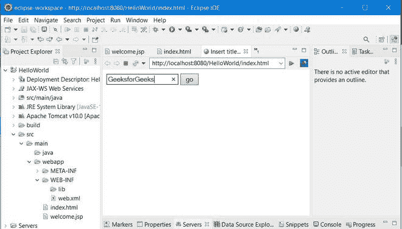
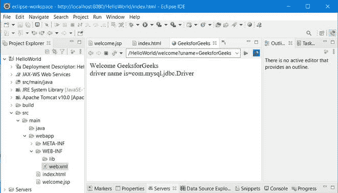

# JSP 配置–隐式对象

> 原文:[https://www.geeksforgeeks.org/jsp-config-implicit-objects/](https://www.geeksforgeeks.org/jsp-config-implicit-objects/)

JSP Config 是一个隐式对象，用于将配置细节传输到 JSP 页面。在 JSP 中，Config 是类型 ***ServletConfig*** 的实例。这个隐式对象用于获取某个 JSP 页面的初始化参数。对于每个 JSP 页面，配置对象都是通过 web 容器生成的。JSP 的 config 对象携带配置信息，如用户名、密码、驱动程序名、servlet 名、servlet 上下文、规范名，它们的值存储在 web.xml(配置文件)中。

> 它是一个类型为 **javax 的对象。** **servlet。ServletConfig** 界面。

通过 **web.xml** 文件将详细信息发送到 JSP 文件。为了获取这个细节，使用了配置对象。通常，它被广泛用于初始化参数，如来自 web.xml 文件的路径或文件位置。

> **注意:** JSP Config 对象的作用域只限于单个 JSP 页面。

ServletConfig 接口的方法与下表中执行的操作并列如下:

<figure class="table">

| 

方法

 | 

说明

 |
| --- | --- |
| servletcontext**【getservletcontext()** | 此方法从会话中提取一个名为的对象。 |
| [字符串 **getInitParameter(字符串名称)**T3】](https://www.geeksforgeeks.org/difference-between-servletconfig-and-servletcontext-in-java-servlet/) | 此方法接收保存在会话中的名为或 null 的对象。 |
| 枚举[**getInitParameterNames()**](https://www.geeksforgeeks.org/difference-between-servletconfig-and-servletcontext-in-java-servlet/) | 在会话中，此方法放置一个具有名称的对象。 |
| [字符串**getServletName()**T3】](https://www.geeksforgeeks.org/classes-of-jsp-api/) | 这个方法返回一个 RequestDispatcher，它在路径上充当资源的掩护。 |

</figure>

**实施:**

我们将直接提出示例，稍后将附加表示 JSP 页面的视觉辅助作为输出。所以 JSP Config 隐式对象的例子如下:

*   在本例中，各种变量及其值包含在“ *web.xml 文件*中。
*   配置对象位于 index.jsp 文件中，该文件检索该信息并将其显示给用户。

**例 1:**index.html 文件

## 超文本标记语言

```java
<!DOCTYPE html>
<html>
<head>
<meta charset="ISO-8859-1">
<title>Insert title here</title>
</head>
<body>

<form action="welcome">
<input type="text" name="uname">
<input type="submit" value="go"><br/>
</form>

</body>
</html>
```

**示例 2:** web.xml 文件

## 可扩展标记语言

```java
<?xml version="1.0" encoding="UTF-8"?>
<web-app xmlns:xsi="http://www.w3.org/2001/XMLSchema-instance" xmlns="http://xmlns.jcp.org/xml/ns/javaee" 
         xsi:schemaLocation="http://xmlns.jcp.org/xml/ns/javaee http://xmlns.jcp.org/xml/ns/javaee/web-app_4_0.xsd" 
         id="WebApp_ID" version="4.0">
  <display-name>HelloWorld</display-name>
  <servlet>
  <servlet-name>welcome</servlet-name>
  <jsp-file>/welcome.jsp</jsp-file>

  <init-param>
  <param-name>dname</param-name>
  <param-value>com.mysql.jdbc.Driver</param-value>
  </init-param>

  </servlet>

  <servlet-mapping>
  <servlet-name>welcome</servlet-name>
  <url-pattern>/welcome</url-pattern>
  </servlet-mapping>

  <welcome-file-list>
    <welcome-file>index.html</welcome-file>
  </welcome-file-list>
</web-app>
```

**示例 3:**‘welcome . JSP’FIle

## 超文本标记语言

```java
<%@ page language="java" contentType="text/html; charset=ISO-8859-1"
    pageEncoding="ISO-8859-1"%>
<!DOCTYPE html>
<html>
<head>
<meta charset="ISO-8859-1">
<title>GeeksforGeeks</title>
</head>
<body>

<%
out.print("Welcome "+request.getParameter("uname"));
String driver=config.getInitParameter("dname");
out.print("<br/>driver name is="+driver);  
%>

</body>
</html>
```

**输出:**

这些是上面 JSP 页面输出的截图。

  