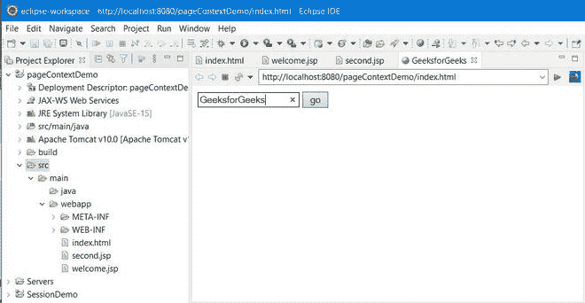
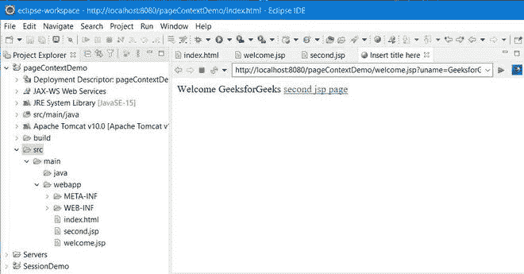
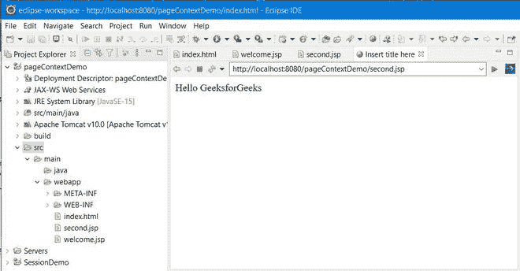

# JSP 页面上下文–隐式对象

> 原文:[https://www . geesforgeks . org/JSP-page context-implicit-objects/](https://www.geeksforgeeks.org/jsp-pagecontext-implicit-objects/)

PageContext 扩展 **JspContext** 以贡献有用的上下文细节，同时 JSP 技术被应用在 Servlet 环境中。页面上下文是一个实例，它允许访问与 JSP 页面相关的所有名称空间，允许访问一些页面属性和应用程序细节的一个层。隐式对象因此连接到页面上下文。


*   **页面上下文类**是一个抽象类，它的形成是为了通过兼容的 JSP 引擎运行时环境来扩展应用程序相关的应用程序。在 JSP 中，pageContext 是***javax . servlet . JSP . page context***的一个实例。
*   整个 JSP 页面由 PageContext 对象表示。这个对象被认为是一种获取页面细节的方法，同时远离大部分执行信息。
*   对于每个请求，响应和请求对象的凭据都由该页面上下文对象保存。通过访问 pageContext 对象的属性，可以获得 out、会话、配置和应用程序对象。
*   这个页面上下文对象还保存了关于提供给 JSP 页面的指令的信息，以及页面范围、缓冲信息和错误页面 URL。
*   通过使用页面上下文对象，您可以设置属性、获取属性并移除不同范围内的属性，如**页面**、**请求**、**会话**和**应用程序**范围，如下所示:

1.  **页面**–范围:页面 _ 上下文
2.  **请求**–范围:请求 _ 上下文
3.  **会话**–范围:会话 _ 上下文
4.  **应用**–范围:应用 _ 上下文

> **注意:**页面范围是 JSP 中的默认范围。

**语法:**

```
public abstract class PageContext
extends JspContext
```

**语法:**使用页面上下文

```
pageContext.methodName(“name of attribute”, “scope”);
```

继续向前，现在让我们讨论一下 pageContext 隐式对象中使用的方法。下面提出了几种在 pageContext 对象中使用的方法，其中最常涉及的方法将在下面单独深入讨论，接下来是干净的 java 程序，以说明 JSP PageContext 类中隐式对象的实现。

> **记住:**它支持 40 多种继承自 **ContextClass 的方法。**

**方法 1:**getAttribute(String AttributeName，int Scope)

**getAttribute** 方法在描述的范围内找到一个属性。例如，getAttribute 方法下面给出的语句在 Session(会话层)的范围内找到属性“GeeksforGeeks”。如果它找到属性，那么它将把属性分配给对象对象，否则它将返回空值。

**语法:**

```
Object obj = pageContext.getAttribute("GeeksforGeeks", PageContext.SESSION_CONTEXT);
```

相应地，该方法也可以用于更多的其他范围，如下所示:

*   object obj = pageContext . GetAttribute(" GeeksForgeks "，page context)。REQUEST _ CONTEXT)；
*   object obj = pageContext . get attributes(" geeksforgeeks "，page context)。PAGE_CONTEXT：
*   object obj = pageContext . GetAttribute(" GeeksForgeks "，page context)。APPLICATION _ CONTEXT)；

**方法 2:** 查找属性(字符串属性名)

findAttribute()方法按照下面列出的顺序在所有四个级别中查找所描述的属性。在任何级别，如果没有找到属性，那么它将返回空值。

```
Page --> Request --> Session and Application
```

**方法 3:** void setAttribute(字符串属性名，对象属性值，整型范围)

此方法在给定的范围内设置属性。例如，考虑下面给出的语句将在应用范围内保存一个属性“数据”，值为“这是数据”。

**语法:**

```
pageContext.setAttribute(“data”, “This is data”, PageContext. APPLICATION_CONTEXT);
```

相应地，该方法将在请求范围内设计一个名为 attr1 的属性，其值“Attr1 值”如下:

```
pageContext.setAttribute(“attr1”, “Attr1 value”, PageContext. REQUEST_CONTEXT);
```

**方法 4:**void remove attribute(String AttributeName，int Scope)

在命令到从给定范围移除属性时，使用此方法。例如，考虑下面给出的 JSP 语句将从页面范围中移除属性“属性”。

**语法:**

```
pageContext.removeAttribute(“Attr”, PageContext. PAGE_CONTEXT);
```

最后，让我们通过演示页面上下文隐式对象的 HTML 代码示例来实现

**例 1:**index.html

第 1 页:在这个 HTML 页面中，我们只是要求用户输入姓名。

## 超文本标记语言

```
<!DOCTYPE html>
<html>
<head>
<meta charset="ISO-8859-1">
<title>GeeksforGeeks</title>
</head>
<body>

<form action="welcome.jsp">  
<input type="text" name="uname">  
<input type="submit" value="go"><br/>  
</form>

</body>
</html>
```

**页面 2:** 这是一个 JSP 页面，我们正在使用带有会话范围的 pageContext 隐式对象保存用户名，这意味着我们将能够访问详细信息，直到用户的会话处于活动状态。

**例 2:**welcome.jsp**T3】**

## 超文本标记语言

```
<%@ page language="java" contentType="text/html; charset=ISO-8859-1"
    pageEncoding="ISO-8859-1"%>
<!DOCTYPE html>
<html>
<head>
<meta charset="ISO-8859-1">
<title>Insert title here</title>
</head>
<body>

<%   

String name=request.getParameter("uname");  
out.print("Welcome "+name);  

pageContext.setAttribute("user",name,PageContext.SESSION_SCOPE);   

%> 

<a href="second.jsp">second jsp page</a> 

</body>
</html>
```

**第 3 页:**在这个 JSP 页面中，我们正在使用 getAttribute 方法检索保存的属性。这里需要考虑的一点是，我们已经保存了具有会话范围的属性，因此我们需要将范围声明为会话，以便检索这些属性的值。

**例 3:**second.jsp

## 超文本标记语言

```
<%@ page language="java" contentType="text/html; charset=ISO-8859-1"
    pageEncoding="ISO-8859-1"%>
<!DOCTYPE html>
<html>
<head>
<meta charset="ISO-8859-1">
<title>Insert title here</title>
</head>
<body>

<%   

String name=(String)pageContext.getAttribute("user",PageContext.SESSION_SCOPE);  
out.print("Hello "+name);  

%> 

</body>
</html>
```

**输出:**

一个我们接收用户名的网页。



**B** JSP 页面连同详细信息页面链接。



**C** 用户凭据显示页面，我们已经通过页面上下文实例从 html 页面移动到该页面。

