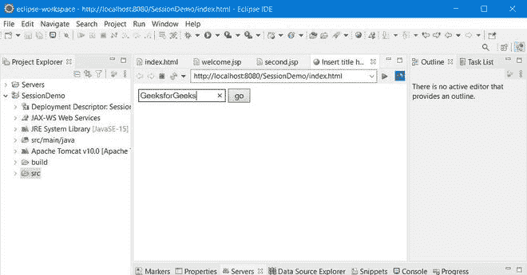
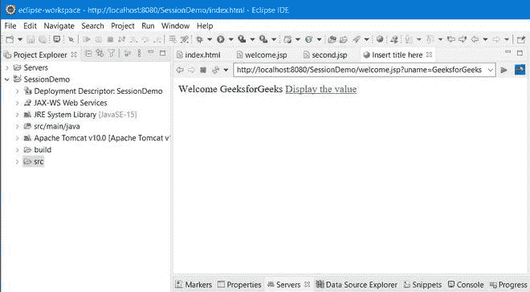
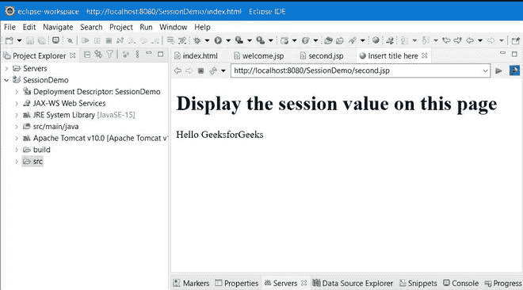

# JSP 会话–隐式对象

> 原文:[https://www.geeksforgeeks.org/jsp-session-implict-object/](https://www.geeksforgeeks.org/jsp-session-implict-object/)

在 JSP 中，会话是最常用的隐式对象类型 ***HttpSession*** 。它主要用于接近用户的所有数据，直到用户会话处于活动状态。

**会话隐式对象中使用的方法如下:**

**方法 1:** isNew():该方法用于检查会话是否是新的。它返回布尔值(真或假)。它主要用于跟踪客户端是否启用了 cookies。如果 cookies 未启用，则 **session.isNew()** 方法应始终返回 true。

**方法 2:** getId():创建会话时，servlet 容器为会话分配一个独特的字符串标识符。这个独特的字符串标识符由 **getId** 方法返回。

**方法 3:** getAttributeNames():会话中存储的所有对象都由 **getAttributeNames** 方法返回。从根本上说，这个方法导致对象的枚举。

**方法 4:** getCreationTime():会话创建时间(会话变为活动或会话开始的时间)由 **getCreationTime** 方法返回。

**方法 5:** getAttribute(字符串名称):使用 **getAttribute** 方法，从会话中检索由 setAttribute()方法存储的对象。例如，如果需要在每个 jsp 页面上访问 userid，直到会话处于活动状态，并且需要时可以使用 getAttribute()方法访问它，那么我们需要使用 setAttribute()方法在会话中存储“userid”。

**方法 6:** 设置属性(字符串，对象):**设置属性**方法用于通过为对象分配唯一的字符串来存储会话中的对象。稍后，通过使用相同的字符串，可以从会话中访问该对象，直到会话处于活动状态。在 JSP 中，在处理会话时，setAttribute()和 getAttribute()是最常用的两种方法。

**方法 7:**getMaxInactiveInterval():getMaxInactiveInterval 返回会话的最大不激活时间间隔(以秒为单位)。

**方法 8:**getlasaccessedtime:getlasaccessedtime 方法主要用于通知会话的最后访问时间。

**方法 9:** removeAttribute(字符串名称):使用 **removeAttribute(字符串名称)**方法，可以从会话中移除存储在会话中的对象。

**方法 10:**invalid():**invalid()**方法结束一个会话，并断开该会话与所有存储对象的连接。

**实施:**

下面给出的“**页面将显示一个文本框和一个 go 按钮。单击“执行”按钮，控制将转移到 welcome.jsp 页面。最后附上所有的输出。**

****例 1:**index.html**

## **超文本标记语言**

```java
<!DOCTYPE html>
<html>
<head>
<meta charset="ISO-8859-1">
<title>Insert title here</title>
</head>
<body>

<form action="welcome.jsp">
<input type="text" name="uname">
<input type="submit" value="go"><br/>
</form>

</body>
</html>
```

> **用户在索引页面中输入的名称显示在**welcome.jsp**页面上，它将相同的变量保存在会话对象中，以便可以在任何页面上检索该变量，直到会话变为非活动状态。**

****例 2(A):**welcome.jsp**

## **超文本标记语言**

```java
<%@ page language="java" contentType="text/html; charset=ISO-8859-1"
    pageEncoding="ISO-8859-1"%>
<!DOCTYPE html>
<html>
<head>
<meta charset="ISO-8859-1">
<title>Insert title here</title>
</head>
<body>

<%
String name=request.getParameter("uname");
out.print("Welcome "+name);

session.setAttribute("user",name);
%>

<a href="second.jsp">Display the value</a>

</body> 
</html>
```

> **在**second.jsp**页面，从进程中检索变量值并显示。**

#### **例 2(乙)second.jsp**

## **超文本标记语言**

```java
<%@ page language="java" contentType="text/html; charset=ISO-8859-1"
    pageEncoding="ISO-8859-1"%>
<!DOCTYPE html>
<html>
<head>
<meta charset="ISO-8859-1">
<title>Insert title here</title>
</head>
<body>

<h1>Display the session value on this page</h1>

<%
String name=(String)session.getAttribute("user");
out.print("Hello "+name);
%>

</body>
</html>
```

****输出:**依次如下:**

**  **