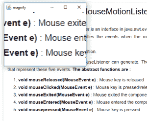

# JSwing |使用 Java 机器人创建一个放大工具

> 原文:[https://www . geesforgeks . org/jswing-create-放大镜-工具-使用-java-robot/](https://www.geeksforgeeks.org/jswing-create-magnifying-tool-using-java-robot/)

Java 机器人是 Java AWT(抽象窗口工具包)包的一部分。Java Robot 用于生成本机系统输入事件，用于测试自动化、自运行演示以及其他需要控制鼠标和键盘的应用程序。使用 Java Robot 的目的是获得对鼠标、键盘等输入事件的控制。
在本文中，我们将使用 JAVA Robot 创建一个放大工具。
**使用的方法:**

1.  **getPointerInfo() :** 返回一个表示鼠标指针当前位置的 PointerInfo 实例。
2.  **getLocation() :** 返回一个表示位置的点实例
3.  **创建屏幕捕捉(矩形 r) :** 捕捉矩形 r 内的屏幕部分
4.  **绘制图像(图像 I，int x，int y，ImageObserver o) :** 在屏幕上的 x，y 位置绘制图像，指定图像观察者
5.  **绘制图像(图像 I，int x，int y，，int w，int h，ImageObserver o) :** 在指定图像观察者的屏幕上，在 x，y 位置和指定的宽度和高度绘制图像

**Java 程序创建一个放大工具使用 Java 机器人**

## Java 语言(一种计算机语言，尤用于创建网站)

```java
// Java program to create a Magnifying tool
// using Java Robot

import java.awt.event.*;
import javax.swing.*;
import java.awt.*;
class magnify extends JFrame {

    // object
    static magnify m;

    // image
    Image i;

    // default constructor
    magnify()
    {
        // create a frame
        super("magnify");

        // set size of frame
        setSize(200, 220);
        show();

        // function to magnify the image
        work();
    }

    // main function
    public static void main(String args[])
    {

        // object of class
        m = new magnify();
    }

    public void work()
    {
        try {
            // create a robot
            Robot r = new Robot();

            // while the frame is visible
            while (isVisible()) {
                // get the position of mouse
                Point p = MouseInfo.getPointerInfo().getLocation();

                // create a screen capture around the mouse pointer
                i = r.createScreenCapture(new Rectangle((int)p.getX() - 30,
                                                        (int)p.getY() - 30, 150, 150));

                // repaint the container
                repaint();
            }
            // exit the program
            System.exit(0);
        }
        catch (Exception e) {
            System.err.println(e.getMessage());
        }
    }

    // paint function
    public void paint(Graphics g)
    {

        // draw the image
        g.drawImage(i, 0, 0, 300, 300, this);
    }
}
```

**输出:**



**注意:以下程序可能无法在联机编译器中运行，请使用脱机 IDE。请使用最新版本的 java**