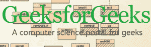
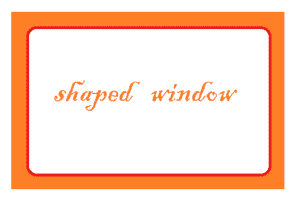
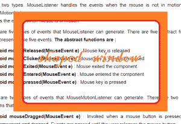

# JSwing |用 Java 创建半透明和成型的窗口

> 原文:[https://www . geesforgeks . org/jswing-create-半透明状-windows-java/](https://www.geeksforgeeks.org/jswing-create-translucent-shaped-windows-java/)

每像素半透明允许程序员控制特定像素的半透明性。我们将使用该属性创建一个异形窗口。
在本文中，我们将尝试在 java 中实现 shaped window，方法是创建一个透明窗口，然后绘制面板，然后将 panel 添加到窗口中。

*   setBackground(颜色 c)方法用于将背景颜色设置为颜色 c。
*   颜色类用于创建所需透明度的颜色。

 **方法:**

1.  **设置背景(颜色 c) :** 将背景颜色设置为颜色 c 的方法
2.  **颜色(int r，int g，int b，int alpha) :** 用指定的红、绿、蓝和 alpha 值创建新颜色。其中 alpha 是半透明值，其中 255 是不透明的，0 是透明的。
3.  **getRGB(int x，int y) :** 返回坐标 x，y 的 RGB 值
4.  **设置颜色(颜色 c) :** 将图形的颜色设置为 c。

**示例:**

1.  **Example 1**

    **输入:**

    

    **输出:**

    

2.  **Example 2**

    **输入:**

    

    **输出:**

    

3.  **例 3 :
    **输入:**
    ** 
     **输出 3 :
    **

**解释:**在这里，在输入中我们可以看到背景是透明的，而极客的
符号仍然保持原样。透过透明的背景，我们可以看到下面的窗户。我们已经将徽标从背景中分离出来，并将其画在透明的窗户上。
**下面的程序将说明如何使用每像素半透明创建一个成型窗口。**

## Java 语言(一种计算机语言，尤用于创建网站)

```
// Java Program to implement the shaped window
import javax.swing.*;
import java.awt.*;
import java.awt.image.*;
import java.io.*;
import javax.imageio.*;
class solve extends JFrame {

    // main class
    public static void main(String[] args)
    {
        // try block
        try {

            // create a window
            JWindow w = new JWindow();

            // set a transparent  background of the window
            w.setBackground(new Color(0, 0, 0, 0));

            // read the image
            BufferedImage i = ImageIO.read(new File("f:/gfg.png"));

            // create a panel
            JPanel p = new JPanel() {

                // paint the panel
                public void paintComponent(Graphics g)
                {
                    // extract the pixel of the image
                    for (int ii = 1; ii < i.getHeight(); ii++)
                        for (int j = 1; j < i.getWidth(); j++) {
                            // get the color of pixel
                            Color ty = new Color(i.getRGB(j, ii));

                            // if the color is more than 78 % white ignore it keep it transparent
                            if (ty.getRed() > 200 && ty.getGreen() > 200 && ty.getBlue() > 200)
                                g.setColor(new Color(0, 0, 0, 0));
                            // else set  the color
                            else
                                g.setColor(new Color(i.getRGB(j, ii)));

                            // draw a pixel using a line.
                            g.drawLine(j, ii, j, ii);
                        }
                }
            };

            // add panel
            w.add(p);

            // set the location
            w.setLocation(350, 300);

            // set the size of the window
            w.setSize(900, 900);

            // set the visibility of the window
            w.setVisible(true);
        }
        // catch any exception
        catch (Exception e) {

            // show the error
            System.err.println(e.getMessage());
        }
    }
}
```

**Input 1 :** **产出 1:**  **输入 2:**  **产出 2:**  **Input 3 :
**  **Output 3 :
** **注意:** I have chosen the color white as the background so I have separated it from the image and made it transparent. Its upon the discretion of the programmer to choose the background of the image .

**注意:**上述程序可能无法在在线编译器中运行，请使用离线 IDE。
建议使用最新版本的 java 运行上述程序，如果使用较旧版本的 java，用户可能会遇到问题。