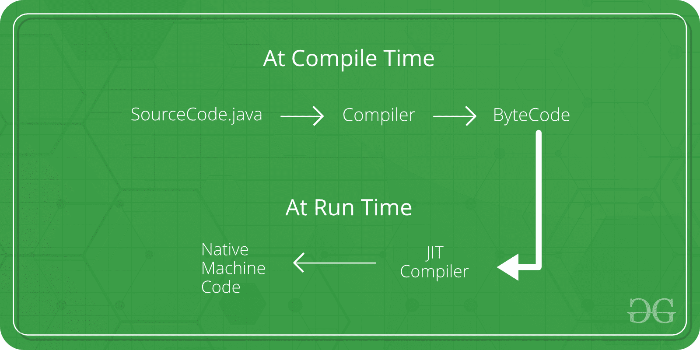

# 及时编译器

> 原文:[https://www.geeksforgeeks.org/just-in-time-compiler/](https://www.geeksforgeeks.org/just-in-time-compiler/)

准时制(JIT)编译器是 JRE(即 java 运行时环境)的重要组成部分，它负责在运行时优化基于 Java 的应用程序的性能。编译器是决定应用程序性能的关键因素之一，对于最终用户和应用程序开发人员来说都是如此。

**Java JIT 编译器:概述**

字节码是 java 最重要的特性之一，有助于跨平台执行。将字节码转换为本机机器语言以供执行的方式对其速度有着巨大的影响。这些字节码必须根据指令集体系结构解释或编译成适当的机器指令。此外，如果指令体系结构是基于字节码的，这些指令可以直接执行。解释字节码会影响执行速度。
为了提高性能，JIT 编译器在运行时与 Java 虚拟机(JVM)进行交互，将合适的字节码序列编译成本机机器码。当使用 JIT 编译器时，硬件能够执行本机代码，相比之下，让 JVM 重复解释相同的字节码序列会给翻译过程带来开销。这随后导致执行速度的性能提升，除非编译后的方法执行频率降低。
JIT 编译器能够在将一系列字节码编译成本机机器语言的同时执行某些简单的优化。JIT 编译器执行的一些优化是数据分析、通过寄存器分配减少内存访问、从堆栈操作到寄存器操作的转换、消除公共子表达式等。优化程度越高，JIT 编译器在执行阶段花费的时间就越多。因此，它负担不起静态编译器所能做的所有优化，因为额外的开销增加了执行时间，而且它对程序的看法也受到限制。

**JIT 编译器的工作**

Java 遵循面向对象的方法，因此它由类组成。这些由字节码组成，字节码是平台中立的，由 JVM 跨不同的架构执行。

*   在运行时，JVM 加载类文件，确定每个文件的语义，并执行适当的计算。与本机应用程序相比，解释过程中额外的处理器和内存使用使得 Java 应用程序执行缓慢。
*   JIT 编译器通过在运行时将字节码编译成本机机器代码来帮助提高 Java 程序的性能。
*   当一个方法被调用时，JIT 编译器始终处于启用状态，同时被激活。对于已编译的方法，JVM 直接调用已编译的代码，而不是解释它。从理论上讲，如果编译不需要任何处理器时间或内存使用，本机编译器和 Java 编译器的速度将是相同的。
*   JIT 编译需要处理器时间和内存使用。当 java 虚拟机首次启动时，会调用数千个方法。编译所有这些方法会显著影响启动时间，即使最终结果是非常好的性能优化。