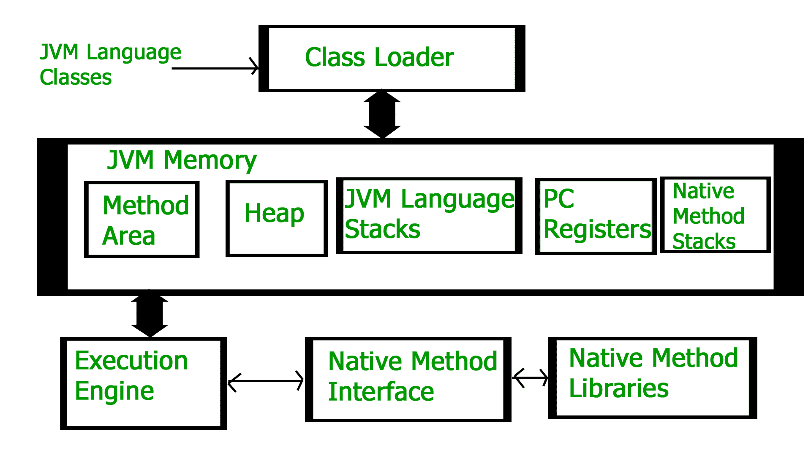
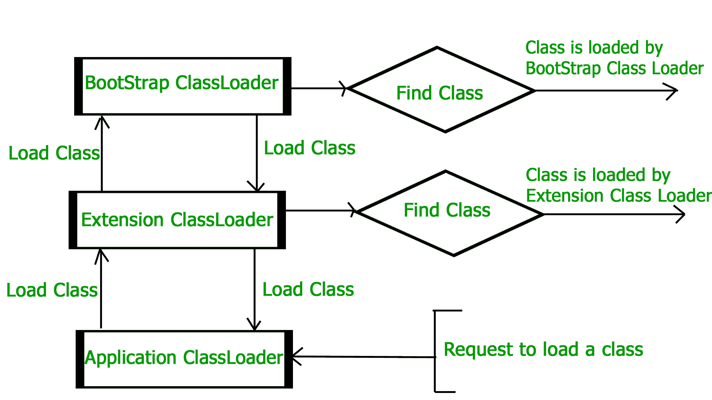
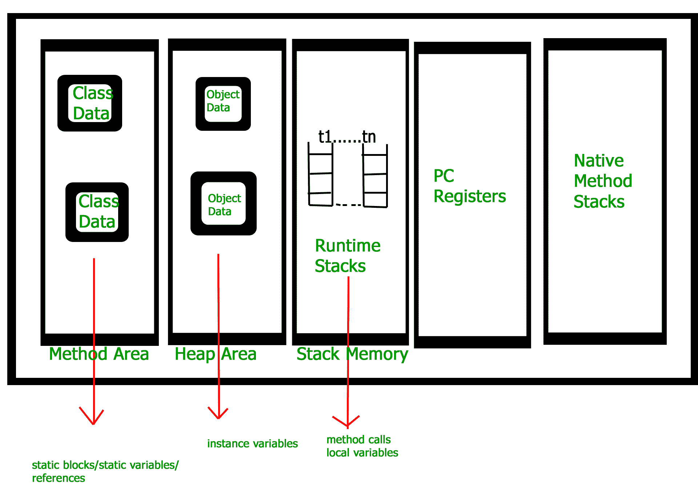

# JVM 如何工作——JVM 架构？

> 原文:[https://www.geeksforgeeks.org/jvm-works-jvm-architecture/](https://www.geeksforgeeks.org/jvm-works-jvm-architecture/)

JVM(Java 虚拟机)充当运行 Java 应用程序的运行时引擎。JVM 实际上是调用 java 代码中存在的 **main** 方法。JVM 是 Java 运行时环境的一部分。

Java 应用程序被称为 WORA(写一次运行在任何地方)。这意味着程序员可以在一个系统上开发 Java 代码，并可以期望它在任何其他支持 Java 的系统上运行，而无需任何调整。这都是可能的，因为有了 JVM。

当我们编译一个*的时候。java* 文件，*。类*文件(包含字节码)与*中的类名相同。java* 文件均由 java 编译器生成。这个*。类*文件在运行时会进入不同的步骤。这些步骤一起描述了整个 JVM。



**类装载机子系统**

它主要负责三项活动。

*   装货
*   连接
*   初始化

**加载:**类加载器读取”。*类“*文件，生成相应的二进制数据并保存在方法区。对于每一个“*”。类"*文件，JVM 在方法区存储以下信息。

*   加载的类及其直接父类的完全限定名。
*   是否*。类“*文件与类或接口或枚举相关。
*   修饰符、变量和方法信息等。

加载“*”后。类"*文件，JVM 创建一个 class 类型的对象来表示堆内存中的这个文件。请注意，该对象的类型是在 *java.lang* 包中预定义的类。程序员可以使用这些类对象来获取类级别的信息，如类名、父名称、方法和变量信息等。为了得到这个对象引用，我们可以使用[对象](https://www.geeksforgeeks.org/object-class-in-java/)类的 *getClass()* 方法。

## Java 语言(一种计算机语言，尤用于创建网站)

```java
// A Java program to demonstrate working
// of a Class type object created by JVM
// to represent .class file in memory.
import java.lang.reflect.Field;
import java.lang.reflect.Method;

// Java code to demonstrate use
// of Class object created by JVM
public class Test {
    public static void main(String[] args)
    {
        Student s1 = new Student();

        // Getting hold of Class
        // object created by JVM.
        Class c1 = s1.getClass();

        // Printing type of object using c1.
        System.out.println(c1.getName());

        // getting all methods in an array
        Method m[] = c1.getDeclaredMethods();
        for (Method method : m)
            System.out.println(method.getName());

        // getting all fields in an array
        Field f[] = c1.getDeclaredFields();
        for (Field field : f)
            System.out.println(field.getName());
    }
}

// A sample class whose information
// is fetched above using its Class object.
class Student {
    private String name;
    private int roll_No;

    public String getName() { return name; }
    public void setName(String name) { this.name = name; }
    public int getRoll_no() { return roll_No; }
    public void setRoll_no(int roll_no)
    {
        this.roll_No = roll_no;
    }
}
```

**Output**

```java
Student
getName
setName
getRoll_no
setRoll_no
name
roll_No

```

**注:**每装一个“*”。类“*文件中，只创建了类的**一个**对象。

```java
Student s2 = new Student();
// c2 will point to same object where 
// c1 is pointing
Class c2 = s2.getClass();
System.out.println(c1==c2); // true
```

**链接:**执行验证、准备和(可选)解析。

*   *验证*:保证*的正确性。类*文件，即检查该文件是否正确格式化，是否由有效的编译器生成。如果验证失败，我们会得到运行时异常*。这个活动由组件字节码验证器完成。一旦这个活动完成，类文件就可以编译了。*
*   *准备* : JVM 为类变量分配内存，并将内存初始化为默认值。
*   *解析*:是用直接引用替换类型中符号引用的过程。这是通过搜索方法区域来定位被引用的实体来完成的。

**初始化:**在这个阶段，所有静态变量都被赋予了它们在代码和静态块(如果有的话)中定义的值。这在类中从上到下执行，在类层次结构中从父级到子级执行。
一般有三类装载机:

*   *引导类加载器*:每个 JVM 实现都必须有一个引导类加载器，能够加载可信类。它加载存在于“*JAVA _ HOME/JRE/lib”*目录中的核心 java API 类。这条路径通常被称为引导路径。它是用 C、C++等本机语言实现的。
*   *扩展类加载器*:是引导类加载器的子级。它加载扩展目录“*JAVA _ HOME/JRE/lib/ext”*(扩展路径)或由 java.ext.dirs 系统属性指定的任何其他目录中存在的类。它是由*sun . misc . launcher $ ExtClassLoader*类在 java 中实现的。
*   *系统/应用类加载器*:是扩展类加载器的子级。它负责从应用程序类路径加载类。它在内部使用映射到 java.class.path 的环境变量，也由*sun . misc . launcher $ appclass loader*类在 java 中实现。

## Java 语言(一种计算机语言，尤用于创建网站)

```java
// Java code to demonstrate Class Loader subsystem
public class Test {
    public static void main(String[] args)
    {
        // String class is loaded by bootstrap loader, and
        // bootstrap loader is not Java object, hence null
        System.out.println(String.class.getClassLoader());

        // Test class is loaded by Application loader
        System.out.println(Test.class.getClassLoader());
    }
}
```

**Output**

```java
null
jdk.internal.loader.ClassLoaders$AppClassLoader@8bcc55f

```

**注意:** JVM 遵循委托-层次原则加载类。系统类加载器将加载请求委托给扩展类加载器，扩展类加载器将请求委托给引导类加载器。如果在引导路径中找到一个类，则加载该类，否则请求再次传输到扩展类加载器，然后传输到系统类加载器。最后，如果系统类加载器加载类失败，那么我们得到运行时异常*Java . lang . class notfoundexception*。



**JVM 内存**

1.  **方法区:**在方法区，类名称、直接父类名、方法和变量信息等所有类级信息。包括静态变量。每个 JVM 只有一个方法区域，它是一个共享资源。
2.  **堆区:**所有对象的信息都存储在堆区。每个 JVM 还有一个堆区。它也是一种共享资源。
3.  **栈区:**对于每个线程，JVM 创建一个运行时栈，存储在这里。这个堆栈的每个块都被称为激活记录/堆栈帧，它存储方法调用。该方法的所有局部变量都存储在相应的框架中。线程终止后，其运行时堆栈将被 JVM 销毁。它不是共享资源。
4.  **PC 寄存器:**存储线程当前执行指令的地址。显然，每个线程都有单独的个人电脑寄存器。
5.  **本机方法堆栈:**对于每个线程，都会创建一个单独的本机堆栈。它存储本机方法信息。



**执行引擎**

执行引擎执行“*”。类“*”(字节码)。它逐行读取字节码，使用各种存储区域中的数据和信息，并执行指令。它可以分为三个部分:

*   *解释器*:逐行解释字节码，然后执行。这里的缺点是，当一个方法被多次调用时，每次都需要解释。
*   *准时制编译器(JIT)* :用于提高解释器的效率。它编译整个字节码，并将其更改为本机代码，因此每当解释器看到重复的方法调用时，JIT 都会为该部分提供直接的本机代码，因此不需要重新解释，从而提高了效率。
*   *垃圾收集器*:销毁未引用的对象。关于垃圾收集器的更多信息，请参考[垃圾收集器](https://www.geeksforgeeks.org/garbage-collection-java/)。

**Java 本机接口(JNI) :**

它是一个与本机方法库交互的接口，并提供执行所需的本机库(C，C++)。它使 JVM 能够调用 C/C++库，并被特定于硬件的 C/C++库调用。

**本地方法库:**

它是执行引擎所需的本机库(C，C++)的集合。

本文由**高拉夫·米格拉尼**供稿。如果你喜欢 GeeksforGeeks 并想投稿，你也可以使用[write.geeksforgeeks.org](https://write.geeksforgeeks.org)写一篇文章或者把你的文章邮寄到 contribute@geeksforgeeks.org。看到你的文章出现在极客博客主页上，帮助其他极客。
如果发现有不正确的地方，或者想分享更多关于上述话题的信息，请写评论。