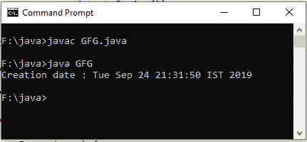
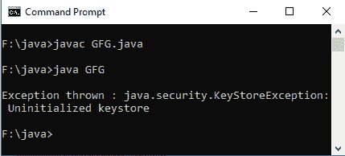

# Java 中 KeyStore getCreationDate()方法，示例

> 原文:[https://www . geesforgeks . org/keystore-getcreationdate-method-in-Java-with-examples/](https://www.geeksforgeeks.org/keystore-getcreationdate-method-in-java-with-examples/)

**java.security.KeyStore** 类的 **getCreationDate()** 方法用于在指定别名的帮助下获取指定条目的创建日期。

**语法:**

```java
public final Date getCreationDate(String alias)
    throws KeyStoreException
```

**参数:**此方法接受**别名**的名称作为要获取其创建日期的参数。

**返回值:**该方法返回所请求别名的**创建日期**(如果存在)。

**异常:**如果不初始化这个密钥库，这个方法抛出**密钥库异常**。

**注意:**本文中的所有程序都不会在联机 IDE 上运行，因为不存在“privatekey”密钥库。您可以在系统的 Java 编译器上检查这些代码。要检查此代码，请在您的系统上创建一个密钥库“privatekey”，并设置您自己的密钥库密码来访问该密钥库。

以下是说明 **getCertificateChain()** 方法的示例:

**例 1:**

```java
// Java program to demonstrate getCreationDate() method

import java.security.*;
import java.security.cert.*;
import java.util.*;
import java.io.*;

public class GFG {
    public static void main(String[] argv)
    {
        try {

            // creating the object of KeyStore
            // and getting instance
            // By using getInstance() method
            KeyStore sr = KeyStore.getInstance("JKS");

            // keystore password is required to access keystore
            char[] pass = ("123456").toCharArray();

            // creating and initializing object of InputStream
            InputStream is
                = new FileInputStream(
                    "f:/java/private key.store");

            // initializing keystore object
            sr.load(is, pass);

            // getting date of Creation
            // using getCreationDate() method
            Date date
                = sr.getCreationDate("ftpkey");

            // display the result
            System.out.println("Creation date : "
                               + date.toString());
        }

        catch (NoSuchAlgorithmException e) {

            System.out.println("Exception thrown : " + e);
        }
        catch (NullPointerException e) {

            System.out.println("Exception thrown : " + e);
        }
        catch (KeyStoreException e) {

            System.out.println("Exception thrown : " + e);
        }
        catch (FileNotFoundException e) {

            System.out.println("Exception thrown : " + e);
        }
        catch (IOException e) {

            System.out.println("Exception thrown : " + e);
        }
        catch (CertificateException e) {

            System.out.println("Exception thrown : " + e);
        }
    }
}
```

**Output:**[](https://media.geeksforgeeks.org/wp-content/uploads/20191118172820/Output122.png)

**示例 2:** 适用于*密钥库异常*

```java
// Java program to demonstrate getCreationDate() method

import java.security.*;
import java.security.cert.*;
import java.util.*;
import java.io.*;

public class GFG {
    public static void main(String[] argv)
    {
        try {

            // creating the object of KeyStore
            // and getting instance
            // By using getInstance() method
            KeyStore sr = KeyStore.getInstance("JKS");

            // keystore password is required to access keystore
            char[] pass = ("123456").toCharArray();

            // creating and initializing object of InputStream
            InputStream is
                = new FileInputStream(
                    "f:/java/private key.store");

            // initializing keystore object
            // sr.load(is, pass);

            // getting date of Creation
            // using getCreationDate() method
            Date date
                = sr.getCreationDate("ftpkey");

            // display the result
            System.out.println("Creation date : "
                               + date.toString());
        }
        catch (FileNotFoundException e) {

            System.out.println("Exception thrown : " + e);
        }
        catch (NullPointerException e) {

            System.out.println("Exception thrown : " + e);
        }
        catch (KeyStoreException e) {

            System.out.println("Exception thrown : " + e);
        }
    }
}
```

**Output:**[](https://media.geeksforgeeks.org/wp-content/uploads/20191118170055/Output115.png)

**参考:**[https://docs . Oracle . com/javase/9/docs/API/Java/security/keystore . html # getCreationDate-Java . lang . string-](https://docs.oracle.com/javase/9/docs/api/java/security/KeyStore.html#getCreationDate-java.lang.String-)