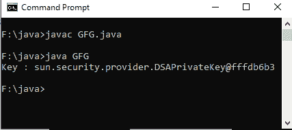

# Java 中 KeyStore getKey()方法，示例

> 原文:[https://www . geesforgeks . org/keystore-getkey-in-Java-method-with-examples/](https://www.geeksforgeeks.org/keystore-getkey-method-in-java-with-examples/)

**java.security.KeyStore** 类的 **getKey()** 方法用于获取与给定别名相关联的密钥，并使用给定的密码对其进行恢复。

**语法:**

```java
public final Key getKey(String alias, char[] password)
    throws KeyStoreException, 
           NoSuchAlgorithmException, 
           UnrecoverableKeyException
```

**参数:**该方法接受以下参数:

*   **别名:**是用来检查密钥的别名
*   **密码:**是恢复要检查的密钥的密码

**返回值:**该方法返回所请求别名的**键**(如果存在)。

**异常:**该方法抛出以下异常

*   **密钥库异常**:如果没有加载密钥库。
*   **NoSuchAlgorithmException** :如果算法缺失

**注意:**本文中的所有程序都不会在联机 IDE 上运行，因为不存在“privatekey”密钥库。您可以在系统的 Java 编译器上检查这些代码。要检查此代码，请在您的系统上创建一个密钥库“privatekey”，并设置您自己的密钥库密码来访问该密钥库。

以下是说明 **getKey()** 方法的例子:

**例 1:**

```java
// Java program to demonstrate getKey() method

import java.security.*;
import java.security.cert.*;
import java.util.*;
import java.io.*;

public class GFG {
    public static void main(String[] argv)
    {
        try {

            // creating the object of KeyStore
            // and getting instance
            // By using getInstance() method
            KeyStore sr = KeyStore.getInstance("JKS");

            // keystore password is required to access keystore
            char[] pass = ("123456").toCharArray();

            // creating and initializing object of InputStream
            InputStream is
                = new FileInputStream(
                    "f:/java/private key.store");

            // initializing keystore object
            sr.load(is, pass);

            // getting the Key
            // using getKey() method
            Key key = sr.getKey("ftpkey", pass);

            // display the result
            System.out.println("Key : "
                               + key);
        }

        catch (NoSuchAlgorithmException e) {

            System.out.println("Exception thrown : " + e);
        }
        catch (NullPointerException e) {

            System.out.println("Exception thrown : " + e);
        }
        catch (KeyStoreException e) {

            System.out.println("Exception thrown : " + e);
        }
        catch (FileNotFoundException e) {

            System.out.println("Exception thrown : " + e);
        }
        catch (IOException e) {

            System.out.println("Exception thrown : " + e);
        }
        catch (CertificateException e) {

            System.out.println("Exception thrown : " + e);
        }
        catch (UnrecoverableKeyException e) {

            System.out.println("Exception thrown : " + e);
        }
    }
}
```

**Output:**[](https://media.geeksforgeeks.org/wp-content/uploads/20191118171037/Output117.png)

**示例 2:** 适用于*密钥库异常*

```java
// Java program to demonstrate getKey() method

import java.security.*;
import java.security.cert.*;
import java.util.*;
import java.io.*;

public class GFG {
    public static void main(String[] argv)
    {
        try {

            // creating the object of KeyStore
            // and getting instance
            // By using getInstance() method
            KeyStore sr = KeyStore.getInstance("JKS");

            // keystore password is required to access keystore
            char[] pass = ("123456").toCharArray();

            // creating and initializing object of InputStream
            InputStream is
                = new FileInputStream(
                    "f:/java/private key.store");

            // initializing keystore object
            // sr.load(is, pass);

            // getting the Key
            // using getKey() method
            Key key = sr.getKey("ftpkey", pass);

            // display the result
            System.out.println("Key : "
                               + key);
        }
        catch (FileNotFoundException e) {

            System.out.println("Exception thrown : " + e);
        }
        catch (NullPointerException e) {

            System.out.println("Exception thrown : " + e);
        }
        catch (KeyStoreException e) {

            System.out.println("\nException thrown : " + e);
        }
        catch (UnrecoverableKeyException e) {

            System.out.println("Exception thrown : " + e);
        }
        catch (NoSuchAlgorithmException e) {

            System.out.println("Exception thrown : " + e);
        }
    }
}
```

**Output:**[](https://media.geeksforgeeks.org/wp-content/uploads/20191118170055/Output115.png)

**参考:**[https://docs . Oracle . com/javase/9/docs/API/Java/security/keystore . html # getKey-Java . lang . string-char:A-](https://docs.oracle.com/javase/9/docs/api/java/security/KeyStore.html#getKey-java.lang.String-char:A-)