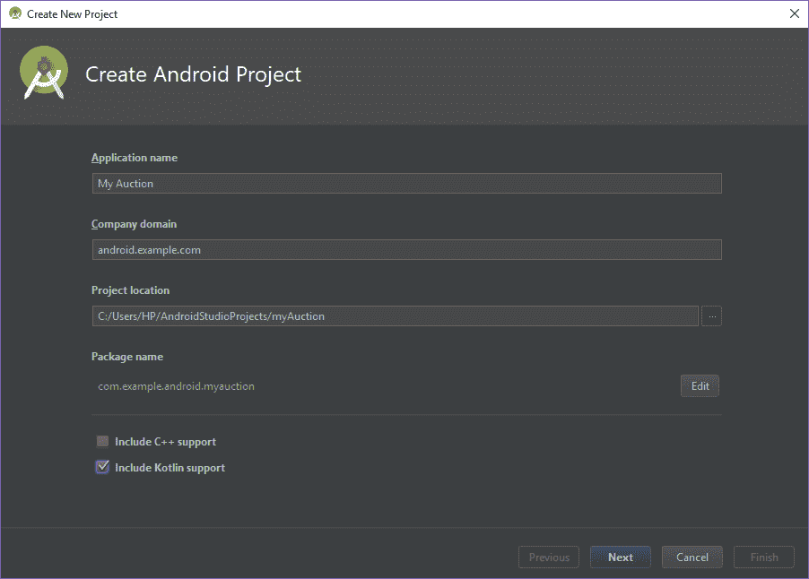
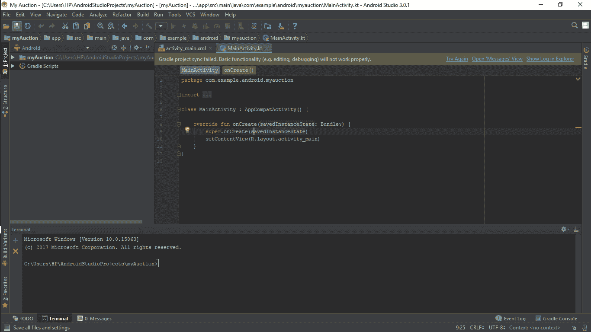

# 为什么 Kotlin 会取代 Java 进行安卓应用开发

> 原文:[https://www . geesforgeks . org/kot Lin-will-replace-Java-Android-app-development/](https://www.geeksforgeeks.org/kotlin-will-replace-java-android-app-development/)

我们的编程语言家族中有一个新成员，不是别人，正是科特林。在谷歌 I/O '17 中，他们终于宣布了对安卓的官方一级支持将给予 Kotlin。我们几乎可以说，Kotlin 正式加入了 android 开发，java 几乎被挤出了框架。虽然 java 通常是世界上几乎所有应用程序开发人员的首选，但 java 可能不是安卓工作室最佳编程语言的原因有很多。

1.  称 java 为一种有据可查的语言并不总是有利的。它有许多无穷无尽的尝试-捕获块，可扩展性差，不安全(臭名昭著的 NullPointerException)，并且缺少函数式编程特性。虽然 Java 开始增加一些函数式编程元素，但其核心仍然是过程语言。
2.  Java 的语法太笨拙了，特别是当我们将其与其他现代编程语言进行比较时。例如，我们知道，即使制作一个简单的“Hello World”应用程序，我们也必须编写额外的代码，包括类的声明，声明其他函数，如 onClickListener()等。那么多的代码应该在幕后运行，而不是在程序员面前。这应该由后端软件来处理，比如编译器或解释器。
3.  缺少 lambda 函数也是 java 从 android studio 终止的主要原因之一。最终，随着时间的推移，我们发现 lambda 函数是任何其他编程语言都可以拥有的最美丽的优势。所有其他现代语言，如 Python 和 Swift，都非常支持 lambda 函数，而如果我们谈论 java，它的设计者仍然试图在其中添加它们。

# 科特林的优势

您可能已经考虑过许多编程语言，它们是为在 Java 虚拟机上运行而设计的。虽然有许多语言可以编译 java 字节码，但是 Kotlin 很少有比其他语言更好的特性。

1.  **与 Java 的互换性:**这意味着在处理一个新的 Kotlin 项目时，您可以使用 Java 库和框架。这可以通过使用高级框架来实现，而不需要在 Java 中更改整个项目。Kotlin 和 Java 类在同一个项目中并行存在是可能的。我们可以在其他一些安卓工作室项目中装备 Kotlin 代码，而不用专门为 Kotlin 做一个全新的项目。
2.  它是一个优秀的开源开发平台，帮助开发人员更快地开发应用程序。由于其简单而简短的语法，与 Java 相比，它需要少 20%的编码。
3.  Kotlin 的一个重要特性是，它旨在从代码中消除空引用，也称为“十亿美元错误”。Java 有一个缺陷，就是访问空引用的成员，导致空引用异常。在 Java 中，它被称为空指针异常。Kotlin 的类型系统区分了可以保存 null 值的引用和不能保存 null 值的引用。
4.  **优秀的安卓工作室支持:** Kotlin 由 JetBrains 开发，正是 IntelliJ 背后的公司——安卓工作室所基于的 IDE。看到安卓工作室对柯特林的出色支持是相当令人惊讶的。你所需要做的就是安装 Kotlin 插件，Android Studio 会让你项目中的 Kotlin 配置像打开几个菜单一样简单。

随着安卓工作室第 3 版的推出，Kotlin 将会上市，并准备好供开发者使用。对于每个安卓爱好者来说，如果他们想开始学习安卓应用程序开发，这是最完美的时机，因为虽然 Kotlin 是一种新语言，但对于安卓开发来说，它绝对是新鲜和新的。